= True Compiler Generation
Efficient Implementation of a Closed Theory
Jochen Demuth | Stephan Weber | Sönke Kannapinn | Mario Kröplin
:revnumber: Report 1997 / 6
:version-label!:
:revremark: Recommended for publication by Prof. Dr. Bleicke Eggers
:toc:
:toclevels: 5
:figure-caption!:

German Title:

Echte Compilergenerierung +
Effiziente Implementierung einer abgeschlossenen Theorie

Jochen Demuth, Stephan Weber, Sönke Kannapinn, Mario Kröplin

Bericht 1997 / 6

Zur Veröffentlichung empfohlen von Prof. Dr. Bleicke Eggers

====
This work is licensed under link:http://creativecommons.org/licenses/by-nc-sa/4.0/?ref=chooser-v1[Attribution-NonCommercial-ShareAlike 4.0 International] 
image:https://mirrors.creativecommons.org/presskit/icons/cc.svg?ref=chooser-v1[cc,22,22]
image:https://mirrors.creativecommons.org/presskit/icons/by.svg?ref=chooser-v1[by,22,22]
image:https://mirrors.creativecommons.org/presskit/icons/nc.svg?ref=chooser-v1[nc,22,22]
image:https://mirrors.creativecommons.org/presskit/icons/sa.svg?ref=chooser-v1[sa,22,22]
====

NOTE: This document has been automatically translated from German and was only slightly reviewed.

// page i

== Abstract

Today, compiler construction is so well-understood that it is more and more unreasonable why programming language descriptions are still not given completely formally, so that even compilers could be generated automatically. The attribute grammars used for the description are unsatisfactory as they lean on a programming language each: Therefore, a Babylonian confusion among the numerous existing generator systems has emerged; and, worse still, respective "specifications" incorporate large sets of programs. A promising alternative is offered by the closed calculus of two-level grammars, which are solely based on the principle of the context-free grammars. For the analysis-orientedly restricted Extended Affix Grammars, this report comprises the documentation and full implementation of a system generating e ective compilers. Accompanying examples in the appendices shall demonstrate the expressiveness of the specication formalism.

// Page iii

== Preface

A program is usually represented as a sequence of characters. However, it is based on a hierarchical structure, according to which components (declarations, instructions, expressions, ...) are formed and composed. For the finite description of the components and their composition a simultaneous-inductive definition proves to be appropriate. Sufficient simple simultaneous-inductive definitions can be given pragnantly in the formalism of context-free grammars. If this is taken into account when designing a programming language a context-free grammar can be used in the report for the mediation of the construction of programs as well as the reconstruction of the structure. of programs as well as the reconstruction of the structure of programs. Therefore can context-free grammars can be regarded as fundamental for the whole of computer science, in that they make a useful finite description of infinite sets possible and further form a prerequisite for the understanding of programs.

On the other hand must be printed apart from the structure of programs also context dependencies (e.g. identifier identification and type call) must be printed. In principle the context-free language is too large opposite the programming language: A strongly reduced example is the set of all strings _w c w_, which is in contrast to the comprehensive set of all strings _w c w'_ cannot be described by a context-free grammar, if _w_ and _w'_ are arbitrary sequences of the letters _a_ and _b_. The informal addition of context dependencies, as it is usually practiced, seems to fail already for simple programming languages <<ReiWi>>. to fail. On the other hand, a formal description by the more powerful context-sensitive grammars is difficult to understand even for the trivial example, and moreover the structure is lost. is lost in the process. The crucial idea is, since the informally to the components of a program (e.g., environment and type) are formally taken up as parameters of the symbols of the context-free grammar.

In attribute grammars, these parameters are called attributes, and after building the structure tree gema of the context-free grammar, the parameter computation is done using additionally specified attribute evaluation rules. Thus, the semantics of a context-free language can be by considering the value of an attribute of the start symbol as a translation, for example.  and, in addition, constraining context conditions can be formally expressed. However, attribute grammars form a so-called open calculus, insofar as the description of the attribute evaluation rules requires a further formalism. Usually a (possibly special) programming language is used for this, so that efficient compilers can be generated automatically, which essentially execute the given routines in the correct order. For the instruction of programming languages however appropriate attribute grammars are unsuitable due to their operational character, particularly since the understanding of the programming language used is presupposed. programming language is assumed.

Not to put calculations, but the values of the parameters in the foreground then distinguishes the opposite approach. With it context dependencies can be considered from the outset by considering symbols of the underlying context-free grammar together with suitable parameter values as the actual symbols. From a finite many rule patterns, an infinite number of context-free rules can be generated above the actual rules can be generated, which then directly describe the language restricted by context conditions. language restricted by context conditions. The simplest means to influence the generation of the rules for corresponding parameters The simplest way to influence the generation of rules for corresponding parameters is the requirement of consistent replacement of variables occurring several times within a rule pattern (by the same values). In two-level grammars the parameter values are also described by context-free grammars, so that alone with the consistent substitution, minimally with respect to the used formalisms, a closed calculus results. A two-level grammar thus enables the finite description of a

//page iv

infinite context-free rule system and on this way an indirect description of an infinite language.

In the following, for the example of the strings _w c w_, a two-level grammar will be presented without first introducing any notation. Every context-free grammar for the description all sequences of the letters _a_ and _b_ can be the basis for the parameter rules as well as for the rule patterns. for the rule patterns. With the generated rules, a symbol parameterized with a sequence of letters should then describe just this sequence of letters, i.e., the associated rule patterns must express an elevation of the described sequence to the level of the parameters. Finally, for a rule pattern for the strings _w c w'_ the consistent substitution is used to achieve the required equality of the character strings _w_ and _w'_ is achieved. Such two-level grammars are understandable at first sight with a little practice; but already a required inequality of the two sequences of letters cannot be formulated in pure calculus elegantly in pure calculus.

Nevertheless, the consistent substitution is sufficient to express more complicated contextual dependencies, since the generated rules can reflect not only the structure of the described strings but also the structure of the parameter values (e.g. for searching a symbol table). A clear separation of the two levels is supported by the concept of pradicates: These are those symbols of the underlying context-free grammar that describe only the empty string, so that in the associated rule patterns "computations\ can be isolated. The view, these rule patterns as horn formulas regard, eronet now the possibilities of the logical programming. Consequently all countable languages can be described by two-level grammars. languages can be described. However, the calculus can be abused as well, by denoting a programming language by a compiler, which is available as a logical program for this purpose.

While two-level grammars provide an excellent foundation for the denition of programming languages, the transition to usable implementations is arbitrarily indeterminate. Thus, a naive interleaving of the two-step payment of rules and strings is unsuccessfully inefficient, and, moreover, the termination cannot be guaranteed for theoretical reasons. cannot be guaranteed for theoretical reasons. On the other hand, from the long development of the over- systematic methods for classical syntax analysis as well as for attribute evaluation are available. attribute evaluation are available. In order to be able to profit from them, the simplest means is a transformation of two-level grammars into corresponding attribute grammars. For this the formalism of extended axiom grammars can be used to specify analysis-oriented restricted two-level grammars can be specified in the formalism of extended axi grammars. To simplify the transformation, it is explicitly defined for each parameter whether it is to be treated as input or output parameter. The restriction, since only sentence forms are allowed on the parameter positions in rule patterns, is to simplify additionally the attribute evaluation rules which can be generated, by thereby the Syntax analysis of the parameter values into the transformation can be brought forward.

A transformation of extended affix grammars into attribute grammars is conceptually difficult, if the inevitably occurring problematic traps are simply excluded. are excluded. Instead of logical programming, only functional dependencies between input and output parameters are supported, since the necessary backtracking beyond individual attribute evaluation rules is not necessary. individual attribute evaluation rules does not fit into the concept. Furthermore an attribute grammar for the original extended affix grammar still represents a, possibly non-contractual, language description. Language description represents. In order to be able to abstract now with the compiler generation on the basis of extended affix grammars from the transformation and at all from attribute grammars certain well-formedness conditions must be kept. Powerful sufficient conditions for it, since the described language is preserved under the transformation, are related to undecidable problems (in particular uniqueness and termination) and therefore cannot be directly checked automatically.

On the basis of understanding well-formedness constraints in the above sense for the first time, the development of the Eta compiler generator at the Technische Universitat Berlin was decisively
// page v
favored by the choice of very powerful conditions along with the consequence, as their compliance should be the responsibility of the user. Furthermore, the transformation was simplified by the introduction of an intermediate language, for which an easily understandable normal form of Extended Affix Grammars was denoted. However, it is not enough to implement only the transformation, because neither generally accepted generator systems for attribute grammars are available, nor can errors in terminology of extended axi grammars be reported in this way. With the complete implementation of a core system, however, it was possible to demonstrated by various specifications for subsets of programming languages, since the since the required restrictions often prohibit only curious formulations and since the marking of the information The labeling of the information by directions of the parameters is very helpful. In a subsequent growth phase, the modularly structured prototype was extended to include the more restrictive methods for generating more efficient compilers. more efficient compilers. The legacy was finally a too large system on dying hardware.

A porting of selected components is however inappropriate in this situation, since substantial Ezienzeinbuen are to be led back straight on it, since already the interfaces of the Eta generator system are based on the too simple normalized Extended Affix Grammars. Besides it was recognized, how deficits in the expression comfort can be repaired, by e.g. replacing the inequality mentioned above by a special notation, which can be understood as an abbreviation and thus and thus preserving the purity of the calculus. A necessary redesign led in the group diploma thesis of two of the authors (J. Demuth and S. Weber) to a core system for the generation of practical compilers, which is presented in this report. is presented. We are now hoping to use this approach to present the promising approach that has been developed at the University of Berlin due to lack of personnel and lack of interest, to a broader public. Influenced by the work with the Oberon system of Prof. Wirth, we join his criticism of the dimensions of common software systems. So we follow his example and print the source code of our implementation commented and complete in the original. We consider this is indispensable for an assessment of the complexity of a system and thus of its adequacy. system and thus its appropriateness; also a discussion of different programming techniques can only be can only take place on the basis of such publications. This procedure affects itself unquestionably also strongly on the form of the implementation. On the one hand an easily readable programming language is required, on the other hand the algorithms used must be implemented concisely and be implemented. As a consequence, the usually presented " abstract algorithms\ can be omitted, which in any case largely obscure the existing optimization possibilities. For the reasons mentioned above, we consider the source code as an essential aspect of the publication.

The documentation starts with a short critique of the traditional compiler design and an introduction to the underlying calculus of the implementation. Chapter 2 presents the redesign of our compiler generator _Epsilon_ in comparison to Eta. The chapter 3 introduces the description of the implementation with an overview.  In the following chapters 4, 5, 6 and 7 the individual modules are treated in detail, structured according to the following main tasks the main tasks reading of a specification, generation of scanner and parser as well as of two alternative evaluators. Chapter 8 offers an outlook.

In the appendix the specification language of Epsilon and a reduced example are presented; additional larger examples shall clarify the possibilities of expression; afterwards the operation of the generator is explained. A demonstration of the goodness of the generated error handling concludes the appendix.

Berlin, March 1997

Jochen Demuth, Stephan Weber, Sönke Kannapinn, Mario Kröplin

// page 1

== Introduction

=== Motivation

The development of compiler construction in the last decades led to a standard modularization of translators and to methods for the realization of these modules. Partly even "tools" are used for the generation of single modules, but these are inconsistent and in complicated areas (context conditions, code generation) without intimate knowledge of the details. with difficulty understandable. Finally, the automation of the "translator construction by hand" is at least questionable.

A more systematic approach for a generation of translators is the formal description of a programming language by means of a calculus. of a programming language with the help of a calculus. As an example for this the van Wijngaarden grammars may be mentioned, a form of form of two-suggested grammars. Such a grammar was used for the first time to denote the context conditions of the language Algol 68. however this calculus is not suitable for the generation of appropriate compilers. In contrast to it the well-known attribute grammars are implementation-nearer; they represent an open Kalkul, in that they require the use of a further specification or programming language. Thus they are on the one hand more difficult to understand, on the other hand this openness led to a multiplicity different realizations.

The analysis-oriented _extended affix grammars_ proposed by Watt combine the advantages of both classes of grammars <<Watt>>; as a closed calculus they offer the possibility of the description of programming languages with their translations and form the basis of our compiler generator. basis of our compiler generator.

The principal suitability of this calculus for the automatic production of translators was already demonstrated by the compiler generator Eta <<Schröer>>, which was developed in 1984. has been used with many extensions in the context of courses. The choice of languages for implementation on a mainframe computer as well as the sheer size of the system made system made maintenance or porting almost impossible. Thus, only one system was transferred to modern UNIX computers; in addition, the outdated conception of the system outdated conception blocks substantial optimizations.

With _Epsilon_, a _small_ experimental system with greater flexibility and controllability was to be designed and implemented from scratch. compilers from a uniform, formal specification.

// page 2

=== Extended Affix Grammars

In the following, it is assumed that the reader is already familiar with the principle of two-eyed grammars. since the terms needed later are introduced here only informally. In the foreground stands the textual naming of essential contents for the clarification of the conceptual level as well as the introduction of a procedure model as operational semantics, which is sufficient and especially helpful for the understanding of the implementation. A formal definition of EAGs can be found for example in <<Schröer>>.

An _Extended Affix Grammar_, called _EAG_ for short, is a two-level grammar: It consists of a context-free grammar whose non-terminals are enriched by parameters (the _hyper-grammar_), and a set of context-free rules (with their own terminals and non-terminals) to describe the parameter values (the _meta-grammar_).

For each parameter of a hyper-non-terminal, a direction (input, output) and by a meta-non-terminal (the _value range symbol_); the sequence of the directions and value range symbols of all parameters of a hyper-non-terminal is called its _signature_. In the hyper rules, each parameter position has an _affix form_ for the respective value range symbol. This is a record form to this meta non-terminal, in which each non-terminal occurring in it with a number possibly following it is combined to a so called _variable_.

In the following, it is assumed that the reader is already familiar with the principle of two-eyed grammars.
since the terms needed later are introduced here only informally. In the foreground stands the textual naming of essential contents for the clarification of the conceptual level as well as
the introduction of a procedure model as operational semantics, which is sufficient and especially helpful for the understanding of the implementation. A formal definition of EAGen
can be found for example in <<Schröer>>.

An Extended Affix Grammar, called EAG for short, is a two-level grammar: It consists of a context-free grammar whose non-terminals are enriched by parameters
(the hyper-grammar), and a set of context-free rules (with their own terminals and
non-terminals) to describe the parameter values (the meta-grammar).

For each parameter of a hyper-non-terminal, a direction (input, output) and by
a meta-non-terminal (the _value range symbol_); the sequence of the
directions and value range symbols of all parameters of a hyper-non-terminal is called its _signature_. In the hyper rules, each parameter position has an _affix form_ for the respective value range symbol. This is a record form to this meta non-terminal, in which each non-terminal occurring in it with a number possibly following it is combined to a so called _variable_. 

If one removes the parametrization from the hyper-grammar, one obtains a usual context-free grammar, the _skeleton grammar_; however, this is for EAGs usually ambiguous, since certain computations are formulated with hyper-non-terminals (the _pradicates_), which can be which are only derivable by empty (and this in general ambiguous), but which consequently contribute nothing to the context-free part of the source language. If one deletes also the pradicates, the _basic grammar_ of the EAG is obtained; if this is unambiguous, then a parser can be created according to classical methods of syntax analysis, which for correct inputs supplies the _appropriate derivation tree_ for correct input.

The large expression power of EAGs results however from the parametrization of the HyperGrammar. An implementation can be made by it, since each hyper-non-terminal is realized by a _procedure_. The parameters of the non-terminals are converted into procedure parameters, and the direction and type are transferred accordingly. Each affix form describes the syntactic structure of a parameter, which is checked (_analysis_) or built up (_synthesis_) according to the direction. Equal variables in affix forms of a hyper-rule stand for the same values (_consistent substitution_). This must be checked in the implementation if necessary by _comparisons_. For the structural checks is required, since the meta-grammar for a value range symbol, for which analyses or comparisons are performed, is unambiguous.

The calculation of the parameters belonging to the basic grammar is carried out according to the given directions on the basis of the derivation tree by analyses and syntheses. For pradicates the the parameter values are calculated analogously, but the derivation is determined by backtracking. Context errors show up in the failure of an analysis or a comparison or a pradicate.

The _language_ of an EAG is the set of all words, which are contained in the language of the basic grammar and for which the parameter calculation can be performed successfully. The start symbol of each EAG has no input parameters and exactly one output parameter. At the end calculations, the value of the output parameter can be used as a _translation_ of the input parameter This falls thus rather besides and is not separately supported.

If one loses the presented procedure model, then for the parameter computation all evaluation procedures well-known from attribute grammars can be used. An EAG

// page 3

can be regarded as an attribute grammar whose attributes are typed according to the value range symbols, and whose computational rules are given by the structure trees of the affix forms as well as the pradicates.

// page 5

== Revision and redesign

=== Previous implementations

Already in 1984 the compiler generator Eta <<Schröer>> was developed at the TU-Berlin, which can look back on a use of many years in the context of lectures.

The compilers generated by Eta consist basically of three successive phases. phases. In the first phase a source text is transferred by a fixed scanner into a token sequence. into a token sequence. In the second phase, a generated parser checks this token sequence for syntactic correctness with respect to the context-free basic grammar and generates the link derivation of the source text.  In the third phase, this is processed by an evaluator, which detects context errors and in the error-free case creates and outputs the translation of the source program. The Data transfer between the phases takes place over files.

The generation of a compiler always takes place in four phases. In the first phase the data stored in language COLA is converted into a standardized EAG after checking for correctness.  EAG, on the basis of which the compiler is generated. In this non-trivial AFFIxforms occur at the most in the so-called primitive pradicates created by the normalization. created by normalization. In the second phase a parser is generated. In the third and fourth phase an evaluator is generated. In the third phase, program code is generated for the non-terminals specified as pradicates and for the primitive pradicates. In the fourth phase the generation of the evaluator using the already generated pradicate code.

=== Increase of the expression comfort

Under Eta, EAGs are described in the specification language COLA. For the new implementation, extensions have been made to this language with the goal of increasing expressive convenience. These language extensions represent abbreviation mechanisms, but they also provide hints for optimizations in the implementation. In particular the calculus of the EAGs is not abandoned.

To be able to require the inequality of variable values in COLA analogous to the consistent substitution the formulation of unequal radicals is necessary. The avoidance of the extensive naive formulation leads thereby to a complicated specification. In addition a large part of the resources in the implementation, which leads to inefficient compilers. leads. Provided that the meta-grammar is unambiguous, a well-formed unequal predicate can be generated automatically. The implementation of this pradicate is, however, more favorable as a negation of the primitive equal-radical. As a new means of expression we provide in Epsilon the inequality sign "`#`" as a new means of expression. If it is prefixed to the identifier of a variable, then this expression designates a new variable, which is compared with the original variable by the inequal-pradicate. On deffining positions different occurrences of the different occurrences of the new variable must receive the same values. For simplification and for practical relevance, no more than one unequal operator may be applied to an identifier. Complements of affix forms as well as the general negation are not supported.

The context-free structure of programming languages is usually given in language reports in EBNF notation. In order to be able to use this as a basis for a specification, the EBNF operators for alternatives, options and repetitions are introduced in Epsilon. Their meaning is determined by specifying a transformation into context-free rules. The direct transformation of each grouping into a new non-terminal proves to be proves to be favorable.

On hyper-rules such a transformation is carried over by adding the parameterization of the anonymous non-terminals is described additionally. This is the subject of tables 2.1 and 2.2. In these, the parameters of the left-hand side are given by i , the parameters of the nonterminals of the right side are indicated by the i.

If an EBNF operator occurs in the nontrivial context, an anonymous nonterminal is introduced, as shown in table 2.1. If in the original rule an EBNF operator occurs without context occurs in the original rule, we speak of a named EBNF operator. This is then transformed according to Table 2.2.

table-2.2-transformation-of-EBNF-operators-without-context.PNG

In contrast to COLA, however, the signatures for anonymous non-terminals, i.e. the directions and value range symbols of the parameters, can no longer be assigned to an identifier, which is why these properties are specified together with the parameterization within the rules. However, such formal parameter lists are only used if they are in the transformed rules belong to left pages. Thus these properties are generally specified several times. This specification is extended to all non-terminals for consistency. A special section of the specification, in which the signatures of the hyper-non-terminals is no longer necessary. Analogous to programming languages without FORWARD declarations, however, the verification of the affix forms is then is not already possible when reading in the specification.

Furthermore anonymous non-terminals, which are to be treated as Pradikate particularly, cannot be be listed in a section of the specification. Moreover, there is no explicit distinction of pradicates is appropriate to their controversial role. A determination of the pradicates can be determined by the generator, whereby different implementations are conceivable.

In meta-rules the use of EBNF operators is not reasonable, because an inductive construction and deconstruction of affixes with anonymous meta-non-terminals cannot be formulated. Thus, in meta-rules a restriction is made to the operator "|" to summarize alternatives.

The separation of meta- and hyper-rules is also removed. For the distinction of meta- and hyper-rules, different characters are used to separate the left and right rule sides. rule pages are used.

=== Redesign of the compiler generator

The strict separation of the three phases in the compilers generated by Eta is to be removed. be abolished. Remaining data transfers from the parser to the evaluator shall be done efficiently in memory. A confusion of the lexical and the syntactical analysis is realized in Epsilon because the splitting of the source text is not done in one go, but token by token is done.

Provided that the hyper-grammar rules transformed in section 2.2 are left-defining, the parser and evaluator can also be scrambled. In this case then true one-pass compilers can be generated on the model of eccentric compilers, which are based on recursive descent parsers. The code for the computation of the parameter values is inserted into the procedures of the parser.

A separate evaluation is performed on the basis of a derivation tree, which is built up by the parser in memory. The output of a left derivation is no longer necessary.

The calculation of the parameter values is no longer done by primitive pradices as in Eta, but is done directly in the procedures generated for the non-terminals. Thus procedure calls can be saved and further optimizations can be carried out.

The lexical analysis is implemented similarly as under Eta by a fixed, parameterized scanner. In order to be able to generate one-pass compilers, the syntactic analysis is carried out according to the LL(1) method. For an efficient implementation of repetitions in loops, the LEAG condition must be restricted. As an example of a more powerful evaluation procedure, a separate single sweep evaluator is provided.

For the generation the normalization of an EAG and the introduction of primitive predicates is is rather a hindrance, since the structure of the affix forms is lost. The data transfer between the the phases in the generator is also efficient, because an internalization of the speci is permanently present in the memory.

// page 9

== General information about the implementation

=== The implementation language 

For the implementation of the Epsilon compiler generator a simple imperative programming language should be chosen, in order to be able to formulate the essential algorithms on the one hand efficiently and on the other hand well readable. well readable on the other hand. At present the language _Oberon_ appears to us, which is also suitable for the which is touted as the successor of Pascal and Modula, also with regard to the publication of extensive <<ReiWi>>, as the most suitable.

Another reason for the choice of Oberon is the operating system of the same name, which has a simple window interface whose use in Epsilon requires almost no programming effort. The Oberon system has been ported to many platforms in the meantime and is made available free of charge by the ETH Zurich <<WiGu>> <<Reiser>>.

Also on a long-term basis Oberon seems to be a reasonable choice, since the small language extent and the strict type calling makes a possible later transfer of Epsilon to another imperative language imperative language seems to be relatively easy. As generator target language was chosen, in order to be able to use the Oberon system as a uniform working and test environment.

In the following still two modules are presented, which provide fundamental basic functions. One serves Epsilon as an interface to the operating system, in the other arbitrarily large sets of natural numbers are implemented as an abstract data type.

==== The interface to the operating system

The module `eIO` serves as an interface to the operating system, in order to limit changes to this module for porting to other platforms.  Conceptually it is on the (text-oriented) window interface the Oberon system, but its peculiarities are isolated to such an extent that, for example that, for example, a version for UNIX can be realized without the window surface can be realized. 

The module provides the functions needed by Epsilon and the generated compilers for sequential reading and writing of texts and binary files as well as for accessing parameters of commands.

// page 10
----
    DEFINITION eIO;

        CONST eol = 0DX;

        TYPE
            TextIn = POINTER TO RECORD END;
            Position = RECORD END;
            TextOut = POINTER TO RECORD END;
            File = POINTER TO RECORD END;
        
        VAR
            Msg : TextOut;
            UndefPos : Position;

        PROCEDURE OpenIn(VAR In : TextIn; Name : ARRAY OF CHAR;
        VAR Error : BOOLEAN);
        PROCEDURE CloseIn(VAR In : TextIn);
        PROCEDURE Read(In : TextIn; VAR c : CHAR);
        PROCEDURE Pos(In : TextIn; VAR Pos : Position);
        PROCEDURE PrevPos(In : TextIn; VAR Pos : Position);

        PROCEDURE CreateOut(VAR Out : TextOut; Name : ARRAY OF CHAR);
        PROCEDURE CreateModOut(VAR Out : TextOut; Name : ARRAY OF CHAR);
        PROCEDURE CloseOut(VAR Out : TextOut);
        PROCEDURE Write(Out : TextOut; c : CHAR);
        PROCEDURE WriteInt(Out : TextOut; i : LONGINT);
        PROCEDURE WriteIntF(Out : TextOut; i : LONGINT;
                            Len : INTEGER);
        PROCEDURE WriteString(Out : TextOut; Str : ARRAY OF CHAR);
        PROCEDURE WriteText(Out : TextOut; Str : ARRAY OF CHAR);
        PROCEDURE WriteLn(Out : TextOut);
        PROCEDURE WritePos(Out : TextOut; Pos : Position);
        PROCEDURE Show(Out : TextOut);
        PROCEDURE Update(Out : TextOut);
        PROCEDURE Compile(Out : TextOut; VAR Error : BOOLEAN);
        
        PROCEDURE OpenFile(VAR F : File; Name : ARRAY OF CHAR;
                           VAR Error : BOOLEAN);
        PROCEDURE CreateFile(VAR F : File; Name : ARRAY OF CHAR);
        PROCEDURE CloseFile(VAR F : File);
        PROCEDURE GetLInt(F : File; VAR i : LONGINT);
        PROCEDURE GetSet(F : File; VAR s : SET);
        PROCEDURE PutLInt(F : File; i : LONGINT);
        PROCEDURE PutSet(F : File; s : SET);
        
        PROCEDURE InputName(VAR Name : ARRAY OF CHAR);
        PROCEDURE IsOption(c1 : CHAR) : BOOLEAN;
        PROCEDURE IsLongOption(c1, c2 : CHAR) : BOOLEAN;
        PROCEDURE NumOption(VAR Num : LONGINT);
        PROCEDURE StringOption(VAR Str : ARRAY OF CHAR);
        
        PROCEDURE TimeStamp() : LONGINT;
    
    END eIO.
----
// page 11

For the input there are procedures for opening and closing of a text, for sequential reading of single and for the determination of positions. The encapsulation of positions requires an additional procedure for accessing the immediately preceding position as well as a (constant) variable a (constant) variable `UndefPos`, which can be used as initialization.

For the output there are procedures for creating and closing texts; the procedure `CreateModOut` adds an extension to the text name that matches the compiler used. Furthermore characters, numbers (possibly formatted), strings, line endings and positions can be written. can be written. In order to facilitate the writing of special characters, in the procedure `WriteText` during the output similar to the programming language C the sequences \t,\n,\' and \\ are converted into a tabulator, an end of line, a double quote character and the backslash respectively. backslash. To display a text, call `Show`; attachments to a visible text are displayed at the latest after calling `Update`. The exported text `Msg` is by default and can be used for messages. If a text is an Oberon module, this can be translated with `Compile`, using the procedure `StringOption` described below. procedure StringOption described below and pass it to the compiler if necessary.

Access to binary files is provided by procedures for opening, creating and closing files as well as procedures for reading files. and procedures for reading and writing for the data types `LONGINT` and ` SET`.

The data types `TextIn`, `TextOut` and `File` are designed as pointers, so that variables of these types can be copied by simple assignments and then the original and copies can be used mixed in the corresponding procedure calls.

By means of the procedures `InputName`,  `IsOption`, `IsLongOption`, `NumOption` and `StringOption` can be used to query command parameters. Spacing (spaces, tabs, etc.) separates them from each other and therefore is not allowed inside parameters. Parameters that begin with a hyphen or a backslash indicate options. This first character may be followed by a string of letters, an integer or a string enclosed in double quotes. enclosed in double quotes. `IsOption` returns `TRUE` if in a string of characters the occurs in a letter string without a following uppercase letter, `IsLongOption` returns `TRUE` if the specified lowercase letter is followed by the specified uppercase letter. `NumOption` returns the first number specified as an option; if none is specified, the value zero is returned. zero is returned. `StringOption` returns the first string specified as an option, without the quotes; if none is given, an empty string is returned. The first parameter that does not specify any options is interpreted as the input name. Parameters after the input name are ignored.

Ideally, the `TimeStamp` procedure returns a new value each time it is called. used to check the coherence of created compilers and control files.

This module is not printed because implementations are system specific.

==== Sets

The module `eSets` provides sets of natural numbers with common operations on them as an abstract data type.

// page 12
----
    DEFINITION eSets;
    
        TYPE
           OpenSet = POINTER TO ARRAY OF SET;
    
        PROCEDURE New(VAR s0 : OpenSet; MaxElem : INTEGER);
    
        PROCEDURE Empty(VAR s0 : OpenSet);
        PROCEDURE Incl(VAR s0 : OpenSet; n : INTEGER);
        PROCEDURE Excl(VAR s0 : OpenSet; n : INTEGER);
        PROCEDURE Assign(VAR s0 : OpenSet; s1 : OpenSet);
        PROCEDURE Union(VAR s0 : OpenSet; s1, s2 : OpenSet);
        PROCEDURE Intersection(VAR s0 : OpenSet; s1, s2 : OpenSet);
        PROCEDURE Difference(VAR s0 : OpenSet; s1, s2 : OpenSet);
        PROCEDURE SymmetricDifference(VAR s0 : OpenSet; s1, s2 : OpenSet);
        PROCEDURE Complement(VAR s0 : OpenSet; s1 : OpenSet);
        
        PROCEDURE IsEmpty(s1 : OpenSet) : BOOLEAN;
        PROCEDURE Equal(s1, s2 : OpenSet) : BOOLEAN;
        PROCEDURE Disjoint(s1, s2 : OpenSet) : BOOLEAN;
        PROCEDURE Included(s1, s2 : OpenSet) : BOOLEAN;
        PROCEDURE In(s1 : OpenSet; n : INTEGER) : BOOLEAN;
        
        PROCEDURE nSetsUsed(s1 : OpenSet) : INTEGER;
        PROCEDURE ConvertToSET(s1 : OpenSet; Index : INTEGER) : SET;
    
    END eSets.
----
The `New` procedure dynamically creates a new, initially empty set. In this set numbers in the range  `[0 ... MaxElem]` may be entered. The procedures which expect several sets as parameters, only sets of the same size may be passed. `Empty` deletes all elements from a set, with `Assign` the second set is copied into the first set. is copied. Also with the further procedures, which continue the operations on the basic type SET on arbitrarily the first parameter is the target of the set operation. Beside the set operations, some function procedures for querying properties are available.

The procedures  `nSetsUsed` and `ConvertToSET` serve the conversion of a set of the type `OpenSet` into a sequence of sets of the basic type `SET`. The procedure `nSetsUsed` returns the number of required sets. of the required sets, the procedure `ConvertToSET` returns the set specified in the second parameter. The first set (with index zero) contains the elements of the range `[0 ... MAX(SET)]`, the second one contains the elements of `[MAX(SET) + 1 ... 2 * MAX(SET) + 1]` and so on.

=== Overview of Epsilon

The Epsilon compiler generator is a modular system, the components of which are shown in Figure 3.1 in a module hierarchy. a module hierarchy. The arrows in it indicate the main import relations are indicated. Since the EAG module is imported by all other modules, these relationships are only indicated.

A compiler specification is read in by the `analyzer` using a `scanner` for the subsequent generation and stored in corresponding data structures of the module `EAG`.

// page 13

.Figure 3.1: Module hierarchy of epsilon
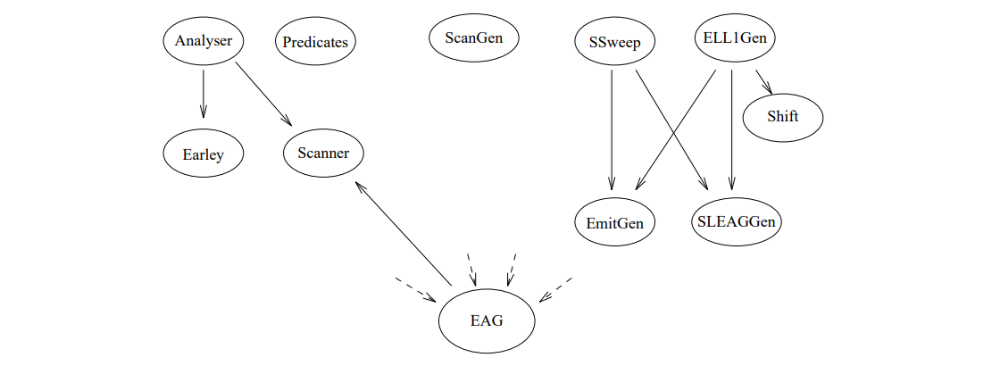

This uses an extended `Earley` parser to create derivation trees for affix forms specified on parameter positions. `Predicates` exports a command for determination of the pradicates of the speciation.

As the first step of generation, the `ScanGen` module can now be used to create a scanner can be used. The module  `ELL1Gen` is the implementation of an ELL(1) parser generator, which can be used to generate real one-pass compilers. For this purpose, procedures exported from the `SLEAGGen` module are used to embed the corresponding evaluation code into the parser code. The module `EmitGen` serves the production of output procedures for the so generated compiler.

Using the `Shift` module, the parser generator can also be used to generate a parser which builds only a static derivation tree. Such a parser forms together with an evaluator generated by the `SSweep` module a compiler which performs the parameter calculation according to the single sweep method.

To avoid naming confl In order to avoid naming conflicts in the Oberon system, all module names were prefixed with the letter "e" in front of all module names.

=== Generally used programming techniques

In this section special programming techniques and conventions are introduced, which are common to all modules. 

An essential and with few exceptions maintained programming technique is the renunciation of the dynamic allocation of single required data objects; in general, objects of one type are combined in a large field instead. In general, objects of one type are combined in a large field instead, which is much more memory and runtime efficient. In addition, each object can be designated by its index, which is suitable for easy handling in sets. A data type extension (especially in other modules) is now easy and again memory efficient by creating parallel fields. possible. For each field `A` there exists a constant `firstA`, which points to the first used entry and a variable `NextA`, which points to the first free entry.

However, the advantages mentioned above are bought with the loss of type safety. 

// page 14

To avoid large constraints, each field is dynamically allocated and accesses are made via a global pointer variable. Before entries are made, a test for overflow of the field is always performed, This is handled by calling a procedure `Expand`, in which a corresponding field of greater length is allocated. the previous entries and the reference to the new field is entered into the global pointer variable. In each module there is only one such `expand` procedure, which performs a which can perform a reduction for all used fields.

In references to objects stored in such fields, the constant `nil` is used analogously to the pointer value `NIL`. This constant is usually defined as the value zero; this allows to use the allows to distinguish references to two different fields by the sign. For this the first entry remains unused in most fields, because a reference to this entry would be interpreted as `nil`.

// page 15

== The internalization

=== The internal representation of the EAG

The module `EAG` provides the whole compiler generator with an internal representation of the specification. to the entire compiler generator. For this purpose, this module contains exposed data structures for efficient access to components of the meta- and hyper-grammar. Furthermore there are associated constructor procedures for the construction of the internal representation as well as simple output procedures for messages in terminology of the specification.

Following the transformation in section 2.2, for the internal representation of hyper-rules, anonymous non-terminals are introduced, but the EBNF constructs are preserved. Such an intermediate form can then be viewed and treated as both an EBNF grammar and a transformed Grammar and treated as such. The constructor procedures are constructed and named according to a uniform scheme. A function procedure `FindA` returns the index of a corresponding entry in a field `A`. For this purpose, the field is searched linearly; with the searched value as sentinel in the next free entry, the termination condition is simplified. entry, the termination condition is simplified, and this entry is completed for new values. A procedure `AppA` extends a field A in each case by a new entry. Otherwise, components of data structures are created and possibly included by procedures `New...` possibly included.

As an example for the explanation of the internal representation the following simple specification serves:
----
    N = 'i' N j .
    S <+ N: N>:
      <N> f <+ 'i' N: N> 'a' <N> g <+ : N>
      <N> f <- 'i' N: N> 'b' <N> g <- : N>.
----

==== Meta grammar

The meta-terminals, -non-terminals as well as -rules are represented in the fields `MTerm`, `MNont` resp. `MAlt` and `MembBuf` respectively (see Figure 4.1).

// page 16
----
    VAR
        MNont: POINTER TO ARRAY OF RECORD
          Id, MRule: INTEGER;
          IsToken: BOOLEAN
        END;
    
        MTerm: POINTER TO ARRAY OF RECORD
          Id: INTEGER
        END;
    
        MAlt: POINTER TO ARRAY OF RECORD
          Left, Right, Arity, Next: INTEGER
        END;
        MaxMArity: INTEGER;
    
        MembBuf: POINTER TO ARRAY OF INTEGER;
    
    PROCEDURE AppMemb (Val: INTEGER);
    PROCEDURE FindMNont (Id: INTEGER): INTEGER;
    PROCEDURE FindMTerm (Id: INTEGER): INTEGER;
    PROCEDURE NewMAlt (Sym, Right: INTEGER): INTEGER;
----
Here the components `Id` refer to the textual representations in the `Scanner` module. The component `IsToken` says, since the non-terminal in the specification with the character "*" for the output was marked as a token. The component `MRule` refers to the (textual) first alternative of a non-terminal; the next alternative can be reached via the `Next` component. The right side of an alternative is described by a range in the field `MembBuf` which is terminated with the value `nil`. Meta-terminals are described by negative numbers, meta-nonterminals by positive numbers; the amount then points to the field to the `MTerm` or `MNont` field. For the Earley parser, the entry after the field is used to refer to the corresponding alternative (in `MAlt`).

.Figure 4.1: Internal representation of the meta grammar
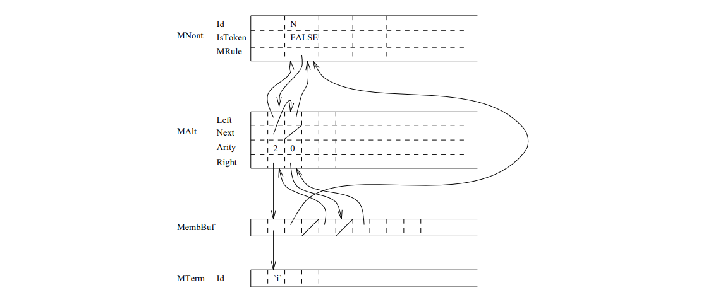

// page 17 

==== Hyper-terminals and -non-terminals
----
    TYPE
        Rule = POINTER TO RuleDesc;
        RuleDesc = RECORD Sub: Alt END;
        Grp = POINTER TO RECORD (RuleDesc) END;
        Opt = POINTER TO RECORD (RuleDesc)
            EmptyAltPos: eIO.Position;
            Scope: ScopeDesc;
            Formal: ParamsDesc
        END;
            Rep = POINTER TO RECORD (RuleDesc)
            EmptyAltPos: eIO.Position;
            Scope: ScopeDesc;
            Formal: ParamsDesc
        END;
        StartSym: INTEGER;
        
    VAR
        HNont: POINTER TO ARRAY OF RECORD
            Id, NamedId, Sig: INTEGER;
            Def: POINTER TO RuleDesc;
            IsToken: BOOLEAN
        END;
    
        HTerm: POINTER TO ARRAY OF RECORD
            Id: INTEGER
        END;
    
        DomBuf: POINTER TO ARRAY OF INTEGER;
    
    PROCEDURE FindHNont (Id: INTEGER): INTEGER;
    PROCEDURE FindHTerm (Id: INTEGER): INTEGER;
    PROCEDURE NewAnonymNont (Id: INTEGER): INTEGER;
    PROCEDURE AppDom (Dir: CHAR; Dom: INTEGER);
    PROCEDURE SigOK (Sym: INTEGER): BOOLEAN;
    PROCEDURE WellMatched (Sig1, Sig2: INTEGER): BOOLEAN;
    PROCEDURE NewGrp (Sym: INTEGER; Sub: Alt);
    PROCEDURE NewOpt (Sym: INTEGER; Sub: Alt; Formal: ParamsDesc;
              Pos: eIO.Position);
    PROCEDURE NewRep (Sym: INTEGER; Sub: Alt; Formal: ParamsDesc;
              Pos: eIO.Position);
----
Hyper non-terminals are represented by a unique entry in the `HNont` field. A positive entry in the `Id` component identifies a named non-terminal and refers to its textual representation in the `Scanner` module. A negative entry describes an anonymous non-terminal. The `NamedId` component refers to the name of the corresponding named non-terminal in case of anonymous non-terminals, otherwise the entries in `Id` and `NamedId` are identical. The component `IsToken` says, since the non-terminal in the specification with the character "*" as token was marked. In the component `Def` is referred to the definition of a non-terminal is referred to. The component `Sig` refers to the signature of a non-terminal represented in the field `DomBuf` represented signature of a non-terminal.

// page 18 

The `Sub` component of the `Rule` data type refers to the hyper-rules of a non-terminal. Any non-terminal (i.e., even a named one) can represent an EBNF operator, which is expressed by is expressed by the `Grp`, `Opt` and `Rep` extensions of this datatype. An optional resp. a repetition have an empty alternative, for which the `Formal` component takes the formal parameter list.

.Figure 4.2: Explanation of the pointer structure of hyper nonterminals

The signature of a hyper-non-terminal is described by a sequence of entries in the field `DomBuf` field. A negative entry indicates an input parameter, a positive entry indicates an output parameter. In both cases, the absolute value refers to the `MNont` field and thereby identifies the value range symbol of a parameter. The entry `nil` terminates a signature. The function procedures `SigOk` and `WellMatched` ensure the consistency of signatures. 

A hyper terminal is represented by a unique entry in the `HTerm` field. The `Id` component also refers to the textual representation. 

The variable `StartSym` points to the start symbol of the hyper-grammar.

==== Hyper rules
----
    CONST
        firstHAlt = 0; firstHFactor = 0;
    
    TYPE
      Alt = POINTER TO RECORD
        Ind, Up: INTEGER; Next: Alt;
        Sub, Last: Factor;
        Scope: ScopeDesc;
        Formal, Actual: ParamsDesc;
        Pos: IO.Position
      END;
    
      Factor = POINTER TO FactorDesc;
      FactorDesc = RECORD
        Ind: INTEGER;
        Prev, Next: Factor
      END;
----
// page 19
----
    Nont = POINTER TO RECORD (FactorDesc)
        Sym: INTEGER;
        Actual: ParamsDesc;
        Pos: eIO.Position
    END;
    Term = POINTER TO RECORD (FactorDesc)
        Sym: INTEGER;
        Pos: eIO.Position
    END;
    
    VAR
        NextHAlt: INTEGER; NextHFactor: INTEGER; NONont: INTEGER;
        All, Reach, Prod, Null, Pred: eSets.OpenSet;
    
    PROCEDURE NewAlt (VAR A: Alt; Sym: INTEGER; Formal,
            Actual: ParamsDesc; Sub,Last: Factor; Pos: eIO.Position);
    PROCEDURE NewNont (VAR F: Factor; Sym: INTEGER; Actual: ParamsDesc;
            Pos: eIO.Position);
    PROCEDURE NewTerm (VAR F: Factor; Sym: INTEGER; Pos: eIO.Position);
----
The transformed EBNF rules are represented together with parameters in the data structures `Alt` and `Factor` data structures.

.Figure 4.3: Explanation of the pointer structures of a hyper rule
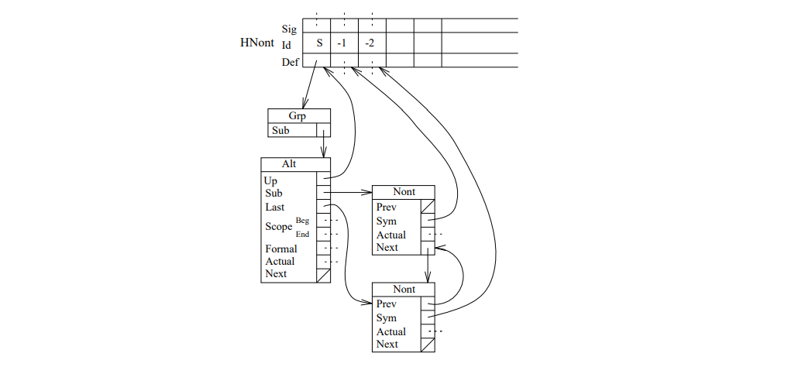

A hyper-nonterminal occurs on the left side of one or more hyper-rules (or also-alternatives) represented by the type `Alt`. In it, the `Up` component specifies this left-hand side non-terminal. Furthermore, an alternative has formal parameters represented by the component `Formal`. To the alternatives of a repetition exist recursion parameters, which are represented by the component `Actual`. If there are several alternatives for a non-terminal, they are concatenated by the component `Next`. The components `Sub` and `Last` refer to the first and last factor of the alternative. factor of the alternative.

// page 20

A hyper-alternative consists of a (possibly empty) sequence of factors represented by the type `Factor`. Each factor is either a terminal or a (possibly anonymous) non-terminal. This is described by the extensions `Nont` and `Term` of this data type. Their component Sym refers accordingly to an entry in `HNon` or `HTerm`. A non-terminal has current parameters. The factors of a rule are doubly concatenated by the components `Next` and `Prev` components. 

The components Ind of the alternatives and factors each contain a unique index. The variables `NextHAlt` and `NextHFacto` indicate the next index value to be assigned. The variable `NONont` contains the number of nodes of the type `Nont`. 

For an EAG the sets of the reachable, productive and empty derivable hypernonterminals as well as the quantity of the pradicates are stored. Since gaps can occur in the field `HNont` for technical reasons (see page 24), the quantity of denoted entries is described by `All`.

==== Parameters
----
    TYPE
        ParamsDesc = RECORD
            Params: INTEGER;
            Pos: eIO.Position
        END;
    
        ScopeDesc = RECORD
            Beg, End: INTEGER
        END;
    
    VAR
        ParamBuf: POINTER TO ARRAY OF RECORD
            Affixform: INTEGER;
            Pos: IO.Position;
            isDef: BOOLEAN
        END;
    
        NodeBuf: POINTER TO ARRAY OF INTEGER;
    
        Var: POINTER TO ARRAY OF RECORD
            Sym, Num, Neg: INTEGER;
            Pos: eIO.Position;
            Def: BOOLEAN
        END;
    
        PROCEDURE AppParam (Affixform: INTEGER; Pos: eIO.Position);
        PROCEDURE FindVar (Sym, Num: INTEGER; Pos: eIO.Position;
                    Def: BOOLEAN): INTEGER;
----
A parameter list is described by the `ParamDesc` type. The `Pos` component of this record specifies the position in the source code where the opening parenthesis of a parameter list is located. The component `Params` refers to a sequence of parameters, which is represented in the field `ParamBuf`. If this sequence is empty, the `Params` component has the value `empty`.

An entry in `ParamBuf` points to the tree representation of an affix form. This derivation tree consists of nodes representing the application of a meta-rule and variables.

// page 21

.Figure 4.4: Explanation of the pointer structure of the parameters
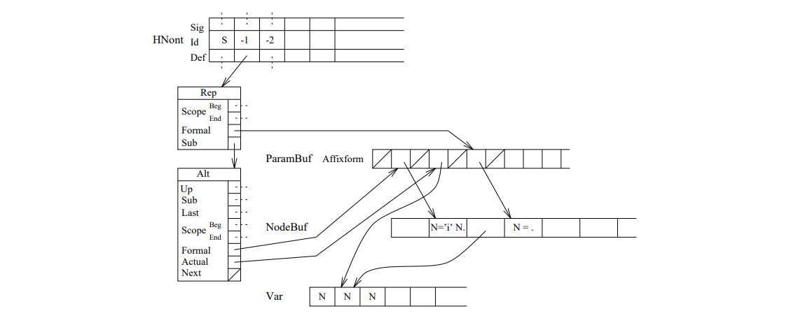

The nodes of a derivation tree are represented in the `NodeBuf` field, variables in the Var field. If the component `Affixform` has a negative value, the affix form consists of a variable; the absolute value refers to an entry in the `Var` field. If the component  `Affixform` component has a positive value, it refers to an entry in `NodeBuf`. The component `isDef` indicates whether the affix form terminates on denoting or applying affix position is located.

Nodes of a derivation tree are represented by consecutive entries in the NodeBuf field. `NodeBuf[i]` denotes the applied meta alternative, `NodeBuf[i+j]` denotes the j-th subtree. If `NodeBuf[i+j]` is a negative value, it denotes a variable.

A variable is described by an entry in the `Var` field. A reference to this entry uniquely identifies a variable of a scope. A validity range includes the parameters of a transformed hyper-rule. The variables of a scope form related entries. The component `Sym` points to a meta-non-terminal in the `MNont` field. The `Num` component contains a variable number. A negative entry indicates a variable with "#" operator. The `Neg` component points to the negated form of the variable, if it is form of the variable, if it occurs in the validity range. Otherwise this entry has the value `nil`.

The `Scope` data type identifies the variables of a scope. They are specified in the field `Var` in the entries from `Beg` to `End - 1`.

==== Miscellaneous
----
    CONST
        BaseNameLen = 18;
    VAR
        BaseName: ARRAY 18 OF CHAR;
----
// page 22

.Figure 4.5: Explanation of the scope data type
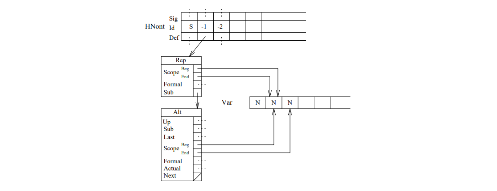
----
    CONST
        analysed = 0; predicates = 1;
        parsable = 2; isSLEAG = 3;
        isSSweep = 4; hasEvaluator = 5;
    VAR
        History: SET;
    
    PROCEDURE Performed (Needed: SET): BOOLEAN;
    
    PROCEDURE Init;
    
    PROCEDURE WriteHNont (VAR Out: eIO.TextOut; Nont: INTEGER);
    PROCEDURE WriteHTerm (VAR Out: eIO.TextOut; Term: INTEGER);
    PROCEDURE WriteNamedHNont (VAR Out: eIO.TextOut; Nont: INTEGER);
    PROCEDURE WriteVar (VAR Out: eIO.TextOut; V: INTEGER);
----

The variable `BaseName` contains the name of the EAG, which can be used by the individual processing steps for identification (e.g. as file name). The length of the name is limited by the constant `BaseNameLen`.

The variable `History` reflects the processing state of the EAG. As entries are the values `analyzed`, `predicates`, `parsable`, `isSLEAG`, `isSSweep` and `hasEvaluator`. The function procedure `Performed` allows to query a minimum status. If this is not reached, error messages are output as side effects.

The procedures `WriteX` allow a uniform output of objects of the data type X.

=== The reading of specifications

The analyzer internalizes the textual representation of an EAG and stores its internal representation in the base `EAG` module.

// page 23 
Since in the Epsilon specification language (see Section A) the signatures of the hyper-nonterminals and the meta-rules are not specified in their own sections separate from the hyper-rules, they are generally not known when the hyper-rules are read in. Since they must be available, for example, for the syntactic analysis of the affix forms, two passes are necessary for the internalization. In the _first_ pass the syntactic analysis is carried out as far as possible and the signatures are as well as the meta-rules are determined. In the internal representation internal representation, errors may occur, since ambiguities in the context-free grammar may cause in the context-free grammar, the current parameters cannot be assigned unambiguously without knowledge of the signature. Also it cannot be decided during the reading, whether for an operator an anonymous non-terminal must be generated or not, because the context is not yet known. Since affix forms cannot be edited, they are stored internally as a token sequence. The _second_ pass takes place over the internal representation, because in this This is because the parameters are essentially checked and the structure is corrected. Here, as described in section 4.4, the parsing of the affix forms is done according to Earley's algorithm. For error messages, position information is stored. After an error-free internalization typical properties of the context-free skeleton grammar are calculated.

==== First pass

Syntactic analysis is performed by a recursive descending parser with a pregriss symbol. Syntactic units are recognized by procedures of the same name. The structure of the internal representation is done in these procedures by the constructor statements provided in the module EAG. constructor statements. A conflict in the context-free grammar is that an identifier has both a hyper identifier introduces both a hyper-rule and a meta-rule. This conflict is solved by Factorization in the `Specification` procedure. Another conflict ict arises from the fact that both actual and formal parameters are introduced by the character "<" character. To solve this problem, the recognition of formal and current parameters is combined in the procedure `Params`. If formal parameters are recognized, they are passed in the procedure parameter  `Formal` otherwise in `Actual`. This procedure recognizes the abbreviated notation for formal parameters described in is recognized in this procedure. 

Due to the following ambiguities in the context-free grammar, the actual parameters indicated by < ... > in the examples cannot be unambiguously assigned.

1. A: B <...> (...).
2. A: f... B <...>g.

In the first case, the current parameters can belong to both `B` and the subsequent EBNF operator. In the second case, they can represent the current parameters of `B` or the so-called recursion parameters of a repetition. In these cases either `B` or the non-terminal of the corresponding EBNF operator must not have any parameters. signature. However, since this is generally not available, the current parameters are assigned to the (textual) earliest position in the first pass. In the second passport a correction is made after a check if necessary. 

If the hyper-rule for a non-terminal consists of an EBNF-operator without context, the transformation according to table 2.2. However, since in the first pass a posterior context is still is not known in the first pass, an anonymous non-terminal is introduced for EBNF operators according to table 2.1. In the second pass, the resulting structure is corrected if necessary.

Formal parameters on the left side of the rule are recognized as abbreviated notation therefor, since the affix forms of the formal parameters of the following alternatives are identical. In this case, the following alternatives must not have any formal parameters; each of these alternatives will receive a copy of the parameters through the `Distribute` procedure.

// page 24

The parser provides error handling that continues with the recognition after syntax errors.

==== Second pass

In the second pass, the structures that were created incorrectly due to ambiguity are first are corrected. After that the parametrization and further context conditions are checked. 

Since all hyper-rules are known, the internal structure can be used to check whether a named non-terminal exists. This is the case if a non-terminal has no formal parameters internally and the only factor of the and the only factor of the only alternative of this non-terminal has no current parameters and an EBNF current parameters and is an EBNF operator. It is then used by the procedure Shrink the rule of the named non-terminal is deleted and that of the anonymous one is moved (see Figure 4.6).

.Figure 4.6: Example of a reduction by the procedure Shrink
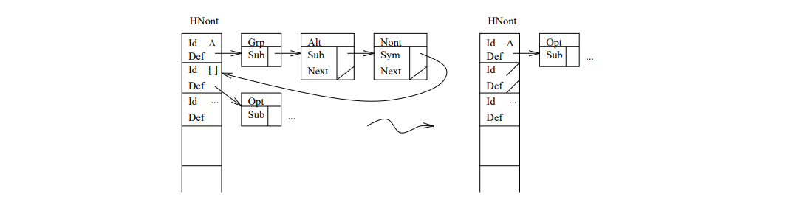

This creates gaps in the `EAG.HNont` field. Therefore there is the set `EAG.All` which contains those indices in `EAG.HNont` which actually represent a hyper-non-terminal. 

Due to the ambiguities described above, a wrong structure may have been created. Internally mu in both cases a current parameter list is swapped with an empty one. The procedures `CheckActual` and `CheckRep` check the structure and correct it if necessary. 

==== Analysis of the Skeleton Grammar

In the following, we discuss the computation of the sets of reachable, empty-derivable, and productive hyper-nonterminals.

The set of reachable nonterminals consists of the start symbol and all nonterminals that occur as a factor of a rule of a reachable nonterminal. `EAG.Reach` is computed by traversing the grammar using the recursive procedure `ComputeReach`.

A hyper-nonterminal is empty-derivable if there is a terminal derivation to that nonterminal through the base grammar representing the empty word. Thus all non-terminals are empty derivable, which have an alternative without factors, as well as options and repetitions; also all non-terminals are empty derivable, which have an alternative in which all factors are empty derivable. The induction step can be performed by iteratively loosing the nonterminals in alternatives and testing whether an alternative is empty. This is done symbolically in the implementation by decrementing a numerator, which represents the number of non-terminals of an alternative (`Deg`), and comparing it to 0. The initial set is represented by a stack
(`stack`). For the calculation of the empty derivable non-terminals, alternatives with terminals are hidden. So that the algorithm is linear, in the field Edge a structure is built in the Edge field, in which non-terminals are referred to their occurrences. The first entries of this field are used as entry points.

Hyper-terminals are productive, and a hyper-non-terminal is productive if it has an alternative in which all factors are productive. As in the computation of empty-derivative non-terminals, an iterative deletion into alternatives is performed, but in this case additionally all terminals are deleted. This is also implemented by corresponding decrementing of the numerator is implemented. Concretely, the determination of the productive non-terminals is carried out as a continuation of the determination of the empty derivable ones by deleting the terminals.

=== The Scanner

The scanner is used for character-by-character reading of epsilon specifications. It decomposes an input text on the basis of the regular language parts used there and returns a corresponding token sequence; for strings, identifiers and numbers it abstracts from their textual representation. It provides the following interface:
----
    CONST
        eot = 0X; str = 22X; ide = "A"; num = "0";
    
    VAR
        Val : INTEGER;
        Pos : eIO.Position;
        ErrorCounter : INTEGER;
    
    PROCEDURE Get(VAR Tok : CHAR);
    PROCEDURE Init(Input : eIO.TextIn);
    PROCEDURE WriteRepr(Out : eIO.TextOut; Id : INTEGER);
    PROCEDURE GetRepr(Id : INTEGER; VAR Name : ARRAY OF CHAR);
----
After the initialization of the scanner to an input text the procedure `Get` can be used to obtain the next token. of the next token, whose initial position is then available via the variable Pos variable. For strings, identifiers and numbers the parameter Tok is set to the token constants `str`, `ide` and `num`. The end of input is indicated by the constant `eot`   constant. All other (readable) characters are represented by themselves, except for the character "~" , which is interpreted as the end of input in strings and comments.

When a number is recognized, its value is assigned to the variable `Val`, when strings and identifiers are recognized, a unique reference to their textual representation is stored there. Identical strings or identifiers receive identical references. With the help of the procedures `WriteRepr` and `GetRepr` the textual representations of the corresponding tokens can be output or of the corresponding tokens can be written or copied into a character field of sufficient length.

Spaces (blanks, tabs, line breaks, ... ) and comments separate tokens and are read over. and will be read over. Numbers outside the valid range as well as unclosed strings and comments are reported as errors; the number of detected errors is stored in the variable `ErrorCounter`.

The implementation of the `Get` procedure requires a single prefix character in a global variable `c`. After reading over the space and comments, this prefix is used to determine the token to be recognized. The recognition of strings, identifiers, numbers, 
// page 26
and comments is done in corresponding subprocedures. For the storage of the textual The following data structures are used to store the textual representations:
----
    CharBuf : POINTER TO ARRAY OF CHAR; NextChar : INTEGER;
    
    Ident : POINTER TO ARRAY OF RECORD
            Repr : INTEGER;
            HashNext : INTEGER
        END;
    NextIdent : INTEGER;
    
    HashTable : ARRAY 97 OF INTEGER;
----
In `CharBuf`, the characters of all previously recognized identifiers and character strings are stored consecutively. In the case of character strings, only the leading character is stored for easier recognition of identical entries. the opening character is stored, the closing character is appended again by the output procedures. added by the output procedures. An entry in `Ident` stands for an identifier or a string; the `Repr` component points to the beginning of the corresponding string in `CharBuf`, the length is given by the from the `Repr` component of the next entry. Both fields are expandable to avoid unnecessary restrictions.

When identifiers and strings are recognized, their textual representation is placed behind the already recorded representations in `CharBuf`. For the assignment of a unique reference the recognized character string must be compared afterwards with all previous entries. If it is new, it is added to the field `Ident` and the index there is assigned to the variable `Val`. Otherwise the reference of an old entry will be used and the new string is deleted by simply resetting `NextChar` "deleted".

To reduce the effort of searching for strings, a hash value is calculated for each recognized identifier or string. The corresponding entry in `HashTable` points to the head of the list of all previous strings with this hash value; the search can be restricted to this list. The lists are implemented in the `Ident` field by the component `HashNext`.

The presented technique is extremely efficient and allows the storage of unlimited long strings. Figure 4.7 illustrates the use of the data structures.

.Figure 4.7: Situation after recognition of the tokens Ab Str Id Str and Ab
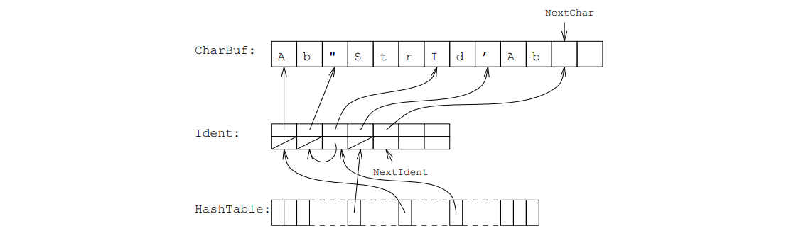

// page 27

=== The Earley parser

The affix forms specified as parameters in hyper-rules must be checked for syntactic correctness during internalization by the analyzer. with regard to algorithms used later, it makes sense not to use a flat, textual representation of the affix forms in the `EAG` module, but rather their derivation trees, from which the required structural structure information can be read off. The module `Earley` presented here covers these both tasks.

Syntactically correct are affix forms, if they are sentence forms to the respective value range symbol in which variables occur instead of meta-non-terminals. A check must be possible for arbitrary, possibly also ambiguous meta-grammars and is done here as in Eta by a universal parser proposed by Earley <<Earley>>, which does not require a generation but is directly controlled by a grammar. In the further description of this module we have to assume the reader's knowledge of the original algorithm, since a comprehensive explanation of the procedure would go beyond the given framework. An Earley parser can be regarded as a parallel bottom-up parser; while the input is read token by token, -- starting from the start symbol -- bottom up all possible partial derivation trees for the input prax read so far are kept in parallel in so-called _item lists_.For correct inputs finally a complete derivation tree is available.

Since the original Earley parser cannot recognize sentence forms, but only sentences, this problem was solved in Eta. problem was brought back to the word problem in Eta by extending the meta-grammar with rules in which the in which the meta-non-terminals appear as new terminals. This leads to an increased complexity and also inconsistency, because the original algorithm can be extended to the recognition of sentence forms by a trivial change in the scanner step. A second extension of the Earley parser serves not only to check the correctness of axes of affix forms, but also to build the corresponding derivation trees.

The module provides the following interface:
----
    PROCEDURE Init;
    PROCEDURE Finit;
    
    PROCEDURE StartAffixform() : INTEGER;
    PROCEDURE AppMSym(Sym, Num : INTEGER; Pos : eIO.Position);
    PROCEDURE EndAffixform(Pos : eIO.Position);
    PROCEDURE CopyAffixform(From : INTEGER; VAR To : INTEGER);
    
    PROCEDURE Parse(Dom, Affixform : INTEGER; VAR Tree : INTEGER;
                    Def : BOOLEAN);
----
Initially the module can be initialized by calling `Init`, finally the dynamically created data structures can be released with Finit. the dynamically created data structures can be released.

While the affix forms are being read in, they can be transferred to a buffer in this module with the procedures `StartAffixform`, `AppMSym` and `EndAffixform`. `StartAffixform` returns a unique reference to the stored affix form. The procedure `CopyAffixform` procedure is used by the analyzer when resolving the abbreviated specification of parameters on the left to duplicate affix forms.

If all meta rules are available in the `EAG` module, the procedure `Parse` can be used to check a previously entered affix form and to build a corresponding derivation tree. The procedure expects, beside the affix form to be treated, a value range symbol as well as a marker as input, which indicates whether the affix form in question is based on defining
// page 28
or applying position. This marker is stored unseen to newly created variables and will be used later by the analyzer. As output a reference to the tree, which was built in the fields NodeBuf and Var of the module EAG.

For the intermediate storage of the Afxforms and the parsing by the algorithm of Earley's algorithm, the following global data structures are used:
----
    CONST
        end = MIN(INTEGER);
        nil = EAG.nil;
    
    VAR
        MSymBuf : POINTER TO ARRAY OF RECORD
                    Sym, Num : INTEGER;
                    Pos : IO.Position
        END;
    NextMSym : INTEGER;
    
    ItemBuf : POINTER TO ARRAY OF RECORD
                Dot, Back, Left, Sub : INTEGER
            END;
    NextItem, CurList, PrevList : INTEGER;
    
    Predicted : POINTER TO ARRAY OF BOOLEAN;
----
In `MSymBuf`, affix forms are stored in consecutive entries. Each affix form is terminated by an add`itional entry whose component `Sym` is set to `end`. Here the constant `nil` must not be used, since the Earley parser extends the meta grammar for the respective value range symbol by a new start rule, in which `end` occurs as a new terminal.

In Earley's algorithm, a list of items is created for each token of an affix form; the eciency of an implementation is determined almost exclusively by the representation of these item lists. Here, item lists are realized in successive entries of the `ItemBuf` field. The end of a list is indicated by an additional entry whose component `Dot` is set to `nil`. A separate data structure for the lists themselves is not necessary, since a list can be identified by a reference to its first element. The beginning of the current and the previous item list is stored in the variables `CurList` and `PrevList`.

An item consists conceptually of originally only two components. The one contains a Meta rule, in which by insertion of a point the already recognized portion is marked. This is realized here by the component `Dot`, which simply points into the field `EAG.Memb`, where the the meta-rules are stored in a way tailored to the Earley parser. The second component of an item, the so-called back-pointer, points to the item list in which the recognition of the rule was started. Here, the first item of this list is simply referenced.

To be able to build derivation trees with the Earley parser, the items are extended by the two components `Left` and `Sub`. `Left` points to the "operator" , i.e. the item, where the dot is one symbol to the left; if the dot is already at the beginning of an item, it was If the point is already at the beginning of an item, i.e. if it was inserted in a predictor step, `Left` is set to `nil`. The SubPointer of an item is set if it is inserted in the Completer step. In this case `Sub` points to the item in the same list where the item is at the very end and which thus the Completer step. So this component ultimately points to a "subtree".

// page 29  

After recognition of a correct affix form, the last item list consists of only one item, from which a recognition path can be traced backwards via the `left` and `sub` chaining. can be traced. The items which can be reached from the last item via these two components form together with these components themselves as edges a tree, from which in a traversal a derivation tree can be created. For an ambiguous meta-grammar, this derivation tree reflects the first derivation found; in particular, it is relevant that for an trivial affix form, which consists of `only` one meta-variable, this trivial derivation is recognized. To facilitate the tree construction, the variables to be created for an affix form are already variables to be created for an affix form are already created in `EAG.Var` during the recognition in the scanner step. References to them are stored as negative numbers in the components `Sub` and transferred later into the derivation tree.

Figure 4.8 shows a small grammar and derivation tree of an affix form with variables. Figure 4.9 shows the items created by the Earley parser for this and accessible from the root via `Left` and `Sub` in the tree representation mentioned above. `Left`-pointers are shown as arrows pointing to the left arrows, `sub`-pointers as arrows pointing to the right. The three dotted arrows are references to variables that have already been created.

.Figure 4.8: Meta grammar and derivation tree for an affix form
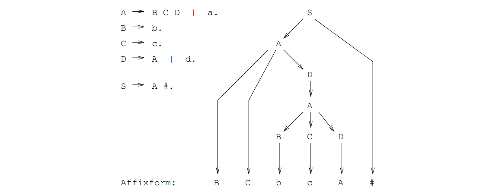

In this implementation, some significant optimizations have been added. So a token is used to avoid unnecessary additions of items to the current list; an item is not list; an item will not be inserted if the symbol behind the point is a terminal and does not match the next input symbol. This leads not only to a speedup, but also to sometimes significantly smaller item lists. In particular hashing when searching for items, since the constant effort of initializing the hash table in the of initializing the hash table when creating a new list now -- for common affix forms and meta grammars -- is greater than the savings in searching in these lists.

Furthermore, the boolean `Predicted` field is used to perform the Predictor step at most once -- for each non-terminal per item list.

A last optimization resulted from the analysis of common EAGs: Almost 90% of all affix forms consist either trivially only of the value range symbol itself or simply of a right rule page. The recognition and the construction of the associated derivation trees can be done directly much faster than with the Earley parser. This treatment of simple affix forms is described in

// page 30

.Figure 4.9: Tree representation of items of the Earley parser
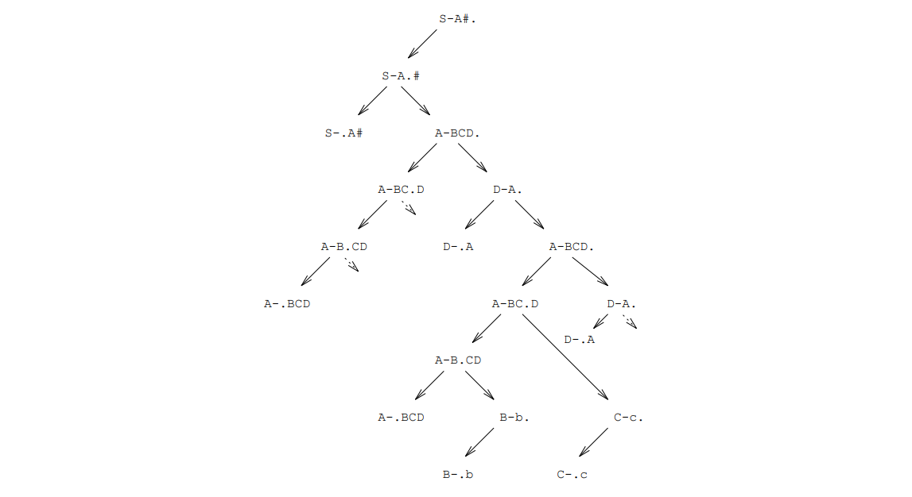

of the procedure `SimpleParse` is implemented. The Earley parser is only called after a failure of this procedure.

=== The determination of the predicates

In the module  `Predicates.Mod` the pradicates of an EAG are determined. Pradicates are those hyper-non-terminals, which can be derived context-free up to the empty word. Also, the pradicates should be productive. 

To determine this set, the complement of the set of pradicates is computed. This set consists of the complement of the set of empty derivable non-terminals extended by the non-terminals with terminals on the right side of the rule. If a non-terminal from the complement of the pradicates on the right side, then the non-terminal of the left side also belongs to this set.

In the implementation, the calculation of the pradicates is done in the procedure `Check`. The calculation of the complement set is done in two steps. In the first step, which is carried out by the procedure `BuildEdge`, the initial set is calculated, which is represented by a `stack`. is computed. In order for the algorithm to be linear, a structure is built in the `Edge` field, in which non-terminals are referred to their occurrences. In the second step in the procedure `ClearStack` for each non-terminal on the basement all non-terminals, on whose right rule side it occurs, are taken up into the complement set of the pradicates and put on the cellar. The set of pradicates is now obtained by complementation. The number of calculated pradicates is output.

// page 31

After the calculation of the predicates, they can be output with the `List` command.

// page 32

=== Implementations

// page 55

== Scanner and Parser Generator

=== The Scanner Generator

Efficient scanner generation is difficult. This applies in particular for the scanner generation from an EAG, since here the regular components of a source language are described by parts of the context-free basic grammar. Therefore in Epsilon despite the resulting the recognition of the real regular parts of speech as well as the corresponding parameter calculation is additionally performed by the generated parser and only the constant part of speech described by the hyper-terminals is recognized by a scanner.

The recognition of the real regular parts of speech is based on the tokens recognized by the scanner, which abstract from the representation of the hyper non-terminals. If the token recognition, the parser will not recognize identifiers as it does in high-level programming languages, since the scanner may not recognize them in the source code. longest possible character strings are recognized as tokens by the scanner in the source code. For example the string "BEGINNING" the closing word "BEGIN" can be recognized, which makes the recognition of the identifier "BEGINNING" by the parser. In order for the parser to recognize the regular structures of identifiers and strings as in (e.g.) the programming languages Oberon and Modula-2, the source code is parsed by the scanner into identifiers, symbols, strings and comments. In order to simplify this decomposition, the token representations are divided into the classes of key words and symbols: A keyword consists of a sequence of letters and digits, a symbol consists of a sequence of the "writeable" characters. The non-writeable characters mark the space in between.

Symbols are recognized by the scanner according to the longest-match principle.

A sequence of letters and digits that represents a keyword is recognized by the scanner as a token. Otherwise, this represents an identifier that is recognized by the parser. For this the scanner returns a token for each character of this sequence.

A string consists as in Modula-2 of an arbitrary string, which is separated by the characters " ' " or " " ". Because the recognition of strings is done by the parser, the scanner recognizes tokens character by character after such a delimiter until either a corresponding delimiter terminates the string or the end of the line or text is reached. To avoid the recognition of blank characters in a string, a single blank character is allowed as a token. 

Comments are arbitrary strings that are " nested\ by the symbols " (* " and " \*) " symbols. If the symbol "(* " does not occur explicitly as a token, comments
// page 56
treated by the scanner as an intermediate space.

To reduce the generation effort, a parametric scanner was designed. This is parameterized with pairs of token values and representations of hyper-terminals. There is a unique assignment between tokens and their representations.

==== The Parametric Scanner

Decision trees are used to analyze the finite language of token representations of an EAG. Since the realization of these trees is quite simple, a table to be created by the generator can be avoided. by the generator can be avoided, by parameterizing the scanner by inserted  procedure calls, which builds the trees during initialization (see Fig. 5.1). The recognition of a token representation then starts at the root of the associated decision tree. In each step, the character read in is compared with that of the node. In case of equality a transition to the son (vertical arrows) takes place together with the reading of the next character. In case of inequality, the current character is passed to the brother (horizontal arrows). If there is no son left, a token representation is fully recognized. On the other hand, the unsuccessful search of all brothers indicates that the current character does not belong to the token representation. However, a beginning of the read string can already be completely recognized at a string may have been recognized completely. This reflects an existing token value.

.Figure 5.1: Example of a decision tree
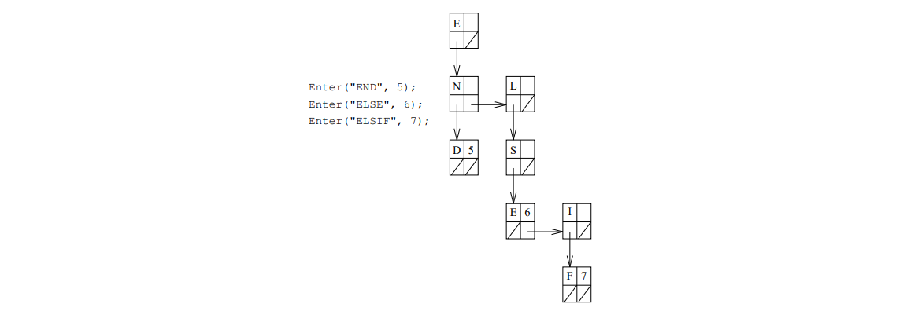

When recognizing a symbol, the longest-match principle is realized by choosing the last node with a token value. For possibly over characters the recognition starts again at the root of a decision tree.

On the other hand the recognition of key words must be explicitly excluded, because they only form the beginning of an identifier, i.e., after the complete recognition the read in character must be neither a letter nor an ornament. The failure of the recognition leads here to the fact, that the overread beginning together with the following letters and ornaments as single characters will be into token values. This deviating behavior is indicated in the global variable Mode global variable. The recognition of strings is done accordingly.

Spacing separates regular structures. The parser, which recognizes regular structures, normally does not have this information available, because the interspace is read over by the scanner. Therefore, the parametric scanner can recognize it as a token.

// page 57
----
    CONST
        nil = 0;
        eot = 0; undef = 1; whitespace = 2; comment = MIN(INTEGER);
    VAR
        Node: POINTER TO ARRAY OF RECORD
              Ch: CHAR;
              Tok, Next, Sub: INTEGER
            END;
        ReprTab: ARRAY maxTok, maxTokLen OF CHAR;
        IsWhitespace, IsIdent: ARRAY 256 OF BOOLEAN;
    CONST (* Mode *)
        string = 0; ident = 1; none = 2;
    VAR
        Ch, StringCh: CHAR;
        Mode: INTEGER;
        Pos*: IO.Position; Get*: PROCEDURE (VAR Tok: INTEGER);
    
    PROCEDURE Enter(Tok: INTEGER; Repr: ARRAY OF CHAR);
    PROCEDURE WriteRepr*(VAR Out: IO.TextOut; Tok: INTEGER);
    PROCEDURE Symbol(VAR Tok: INTEGER);
    PROCEDURE Keyword(VAR Tok: INTEGER);
    PROCEDURE Comment;
    PROCEDURE Get2*(VAR Tok: INTEGER);
    PROCEDURE Get3*(VAR Tok: INTEGER);
    PROCEDURE Init*;
----
The decision trees are represented in the `Node` field; the `Sub` component refers to the son of a node, `Next` to the brother. So that to each character directly to the root of the tree for each character, the first entries of the field are reserved. These entries are also used for the character by character conversion into token values.

The procedures `Get2` and `Get3` recognize tokens in a source text after an initialization of the scanner. source text. While `Get2` reads over intermediate space, this is supplied by `Get3` as token. A uniform call is possible by the procedure variable `Get`. As a side effect the position of the recognized token in the source text is assigned to the global variable `Pos`. The recognized token is passed in `Tok`. The token values `eot`, `undef` and `whitespace` are predefined.

In the two cases described above (partial replacement for symbols or full replacementfor symbols or full reset for identifiers) the input characters are traced; otherwise the input is read Otherwise the input is read unpunished. The following data structures are available for this purpose.
----
    VAR
        ChBuf: ARRAY 512 OF CHAR;
        PosBuf: ARRAY LEN(ChBuf) OF IO.Position;
        CurCh, NextCh: INTEGER;
    
    PROCEDURE CopyBuf;
    PROCEDURE GetCh(VAR Ch: CHAR);
    PROCEDURE GetBufCh(VAR Ch: CHAR);
    PROCEDURE GetPos;
----
The buffer is represented in the `ChBuf` field. Start and end of the puer are marked by the indices `CurCh` and `NextCh`. The corresponding positions for error messages are

// page 58

are stored in parallel in the `PosBuf` field.

The buffered reading of the input is implemented by the procedure `GetBufCh`, the unbuffered reading by the procedure `GetCh`. Both procedures read characters primarily from the buffer. To reset the input after buffered reading only the initial index `CurCh` must be reset. If an overflow threatens, the buffer is shifted by the procedure `CopyBuf` to the beginning of the field `ChBuf`. For checking one query per token is sufficient, because the maximum token length is known.

==== The Generator

The creation of a scanner consists in this implementation only of the parameterization of a fixed scanner body. As with the parser generation the constant parts from a text file into the scanner to be generated. At the insertion marks "$" the variable parts are inserted. These are the module name, the length of the longest token and the number of the tokens. In the procedure `BuildTree` of the generated scanner furthermore initialization calls for all hyper-terminals of the EAG, which make their textual representation and their token number known to the scanner.

The implementation of the scanner results in the following well-formedness conditions for token representations:

Allowed is only

- a single space character,
- a single single or double quotation mark,
- a non-empty sequence of uppercase and lowercase letters and numerals,
- a non-empty string containing no characters less than the space character and none of the characters already mentioned above.

All terminals of the EAG are checked for these conditions and Verstoe is reported as an errorand the scanner will not be generated in this case.

=== The Parser Generator

This implementation of the EAGs assumes the conceptual separation of syntax analysis and affix evaluation. The syntax analysis is performed classically on the basis of the context-free basic grammar. Special attention must be paid to the EBNF constructs (alternatives, options and repetitions), which are to be implemented for Ezienzgrunden by appropriate instructions. On the other hand, derivation trees are formally introduced using the transformation from Section 2.2. To create a static derivation tree for arbitrary evaluation strategies the parser must be extended by appropriate constructor instructions. For a restricted evaluation strategy the affix evaluation (parameter calculation) can be done directly in the inserted instructions. In the case of an extended LL(1) parser corresponds this the handwritten compilers after the method of the recursive descent, whereby the derivative tree is dynamically in the form of procedure calls. Thus now a parser, which can be generated as a special one-pass compiler, whose specification corresponds to the specialization of this compiler is automatically generated according to the mentioned transformation.

// page 59

Bottom-up methods are unsuitable for interleaving syntax analysis and affix evaluation in the generated bottom-up procedures are unsuitable, since an efficient evaluation results in a too strongly restricted strategy. Already the reporting of conflicts is not easy to design in a user-friendly way, and the handling of EBNF constructs seems to be rather problematic.

==== The Generated Parsers

We generate parsers using the method of recursive descent with a pregriss symbol in the generator target language Oberon. As usual, a procedure is generated for each (non-anonymous) non-terminal. procedure is generated. The evaluator generator embeds the evaluation code directly into this procedure, which promises a substantial speed advantage in relation to the Auslagerung into own procedures. promises. Furthermore a user-friendly error handling is implemented. Because of their effect on the parser structure this is presented first.

===== Error Handling

The parsers have an automatic error handling according to an implementation suggestion of Grosch <<Grosch>> following the procedure of Röhrich <<Röhrich>>. All information can be read from the grammar by the generator and incorporated into the parser. no additional information by the specifier is required. Syntax errors are not only detected and reported, but also repaired according to the grammar. The evaluation code can therefore always rely on formally correct derivation trees.

During the LL(1) syntax analysis, trap situations are to be treated as error situations, since with analysis of a terminal the current input token is different from the expected terminal, since when analyzing alternatives, the input token is not contained in any director set, and since when analyzing options or repetitions the input token is neither in the first nor in the follow set of the construct. For a good error handling the test must be performed in time, so that the option or repetition can still be used for repair. retry can still be used for repair.

When a syntax error occurs, the error position is reported along with a subset of the tokens that were a correct input continuation (Expected set). Subsequently the set of all tokens is calculated, which can serve as restart points (recovery set). The shortest token sequence up to one of these tokens is overread and the recovery point is reported. The parsing is now continued in the repair mode. The parser with affix evaluation instructions behaves as usual, except that no tokens are read from the input. but a "simple" token sequence is determined as insertion and reported. The parser remains in this mode until the current input token can be accepted. The input text can be considered repaired if the overread tokens are replaced by the ones reported as inserted; a tool can actually perform these modifications.

The exact follow sets as well as the expect and recovery sets are dependent on the context and thus on the dynamic call hierarchy. To determine them it is necessary to information about them during parsing. For the analysis of correct inputs the union over all contexts is sufficient as (too large) follow set. With incorrect errors are detected textually as early as possible, but the state of the parser may be so far but the parser state can be already so far advanced, since no more all continuations are possible and only a subset of the exact expect set can be reported.

For efficiency reasons the too large follow sets are used as usual. Furthermore only the subsets of the expected tokens are reported, which can already be determined at the generation time. These sets are calculated by the generator for each possible error position.

// page 60

The recovery sets, however, must be exact for a meaningful behavior of the error handling. Their calculation can take up a considerable part of the runtime. For reasons of efficiency a rule-local recovery set for each factor of all alternatives is precalculated at generation time and stored in a field in the generated parser. At runtime of the parser, a runtime cellar is simulated, which contains the index of the corresponding rule-local recovery set in this field for each procedure incarnation of the respective call hierarchy. The global recovery set consists of the union of the local recovery sets. As long as no error occurs, it is sufficient, before calling a procedure that analyzes a non-terminal, the index of the corresponding local recovery set to the cellar and remove it afterwards. again afterwards. The complex computation of the union is delayed in such a way and executed only in case of an error.

The error handling repairs each incorrect input by overreading and inserting tokens into a syntactically correct one. The tokens are inserted simply by continuing the parsing as if the parsing is continued as if there was no error. If a terminal is expected, which is different input token, it is reported as inserted. If an alternative is parsed and the input token is not contained in any director set, an alternative specified by the generator is selected. The restriction to non-recursive alternatives guarantees the termination of the procedure. The evaluation or tree constructor statements are executed as usual during the error repair.

The two procedures RecoveryTerminal and ErrorRecovery are used to initiate error repair when a terminal or an EBNF construct is analyzed. They issue an error message, calculate the global recovery amount, read over tokens up to the recovery point and finally switch to the recovery mode. and finally switch to repair mode. In the repair mode no errors are reported or tokens are overread, instead only the inserted tokens are reported. As soon as the analysis of a terminal is successful, the error handling is finished and this mode is left again.

===== Overview of the generated parsers 

The generated parsers consist of one module. The structure can be seen in the program fragment can be seen. The essential procedures of the error handling are indicated with.
----
    MODULE Parsername;
    IMPORT scanner := scanner name;
     CONST tokSetLen = ...;
           firstRecStack = ...;
    
    TYPE TokSet = ARRAY tokSetLen OF SET;
    
    (* global data structures *)
    VAR Tok : INTEGER;
        Set : ARRAY ... OF TokSet;
        RecStack : POINTER TO ARRAY OF INTEGER; RecTop : INTEGER;
        IsRepairMode : BOOLEAN;
        ...
    
    (* global procedures of the parser and the inserted evaluator *)
    PROCEDURE SkipTokens(Recover : INTEGER);
        VAR GlobalRecoverySet : TokSet; i, j : INTEGER;
    BEGIN
        GlobalRecoverySet := Set[Recover];
        FOR i := firstRecStack TO RecTop - 1 DO
            FOR j := 0 TO tokSetLen - 1 DO
                GlobalRecoverySet[j] := GlobalRecoverySet[j] +
                                          Set[RecStack[i]][j]
    
            END
        END;
        WHILE ~ (Tok MOD (MAX(SET) + 1) IN
                GlobalRecoverySet[Tok DIV (MAX(SET) + 1)]) DO
            Scanner.Get(Tok)
        END;
        RestartMessage(Scanner.Pos);
        IsRepairMode := TRUE
      END SkipTokens;
    
    PROCEDURE ErrorRecovery(Expected, Recover : INTEGER);
    BEGIN
      IF ~ IsRepairMode THEN
        ErrorMessageTokSet(Scanner.Pos, Set[Expected]);
        SkipTokens(Wiederherstellen)
      END
    END ErrorRecovery;
    
    PROCEDURE RecoveryTerminal(ExpectedTok, Recover : INTEGER);
    BEGIN
      IF ~ IsRepairMode THEN
        ErrorMessageTok(Scanner.Pos, ExpectedTok);
        SkipTokens(Wiederherstellen)
      END;
      IF Tok # ExpectedTok THEN RepairMessage(Scanner.Pos, ExpectedTok)
      ELSE IF Tok # endTok THEN Scanner.Get(Tok) END; IsRepairMode := FALSE
      END
    END RecoveryTerminal;
    ...
    
    PROCEDURE P0(VAR V1 : HeapType); (* Startsymbol *)
    ... (* Analysiert die Eingabe, benutzt weitere Prozeduren *)
    END P0;
    
    (* ... weitere Prozeduren für Nichtterminale: P1, P2, P3, ... *)
    ...
    
    PROCEDURE Emit(Ptr : HeapType);
    ... (* Gibt die Ubersetzung der Eingabe aus *)
    END Emit;
    
    PROCEDURE Kompilieren*;
        VAR V1 : HeapType;
    BEGIN
        EvalInit; ParserInit; Scanner.Init; Scanner.Get(Tok);
        P0(V1); Emit(V1)
    END Compile;

BEGIN ReadParserTab("Parsername.Tab")
END Parsername.
----
The required first, follow, expected and recovery sets are read from a parser table in the module body immediately from a parser table when loading the parser. Only the parameterless procedure Compile (command) is exported, which calls the procedure of the start symbol of the basic grammar after initializations. This procedure analyzes the entire input; the included evaluator code checks the static semantics by affix calculations during parsing and generates the translation of the input, which is passed to the output procedure by the variable `V1`. 

===== Code Schemes

The conversion of symbol occurrences and EBNF constructs on right rule pages into Oberon statements can be described by the following code schemes:
----
    (* Terminal t *)
    IF Tok # t THEN RecoveryTerminal(t, lokale Recoverymenge von t)
    ELSE Scanner.Get(Tok); IsRepairMode := FALSE
    END;

    (* Nichtterminal N *)
    Synthese der Eingabeparameter zu N
    IF RecTop >= LEN(RecStack^) THEN ParserExpand END;
    RecStack[RecTop] := lokale Recoverymenge von N; INC(RecTop);
    N(...);
    DEC(RecTop);
    Analyse der Ausgabeparameter zu N

    (* Prädikat N *)
    Synthese der Eingabeparameter zu N
    IF ~ N(...) THEN Fehlerbehandlung END;
    Analyse der Ausgabeparameter zu N

    (* Alternative A = A1 j : : : j An *)
    LOOP
        CASE Tok OF
        | Direktormenge von A1 :
            Analyse der Eingabeparameter der linken Seite von A1
            Code fur A1
            Synthese der Ausgabeparameter der linken Seite von A1
            EXIT
            .
            .
            .
        |  Direktormenge von An :
            Analyse der Eingabeparameter der linken Seite von An
            Code fur An
            Synthese der Ausgabeparameter der linken Seite von An
            EXIT
        ELSE
          IF IsRepairMode THEN
            Analyse der Eingabeparameter der linken Seite von Adef ault
            Code fur Adef ault
            Synthese der Ausgabeparameter der linken Seite von Adef ault
            EXIT
          END;
          ErrorRecovery(Expectedmenge von A, lokale Recoverymenge von A)
        END
    END;
    
    (* Option N = [X] *)
    LOOP
      IF Tok 2 f irst(X) THEN Code fur X; EXIT
      ELSIF Tok 2 f ollow(N) OR IsRepairMode THEN
        Analyse der Eingabeparameter fur den Abbruch
        Synthese der Ausgabeparameter fur den Abbruch
        EXIT
      END;
      ErrorRecovery(Expectedmenge von N, lokale Recoverymenge von N)
    END;
    
    (* Wiederholung N = fXg *)
    LOOP
      IF Tok 2 f irst(X) THEN Code fur X
      ELSIF Tok 2 f ollow(N) OR IsRepairMode THEN EXIT
      ELSE ErrorRecovery(Expectedmenge von N, lokale Recoverymenge von N)
      END
    END;
    Analyse der Eingabeparameter fur den Abbruch
    Synthese der Ausgabeparameter fur den Abbruch
----
The LOOP statement is a real loop only in case of repetition, otherwise it only serves to avoid having to write the body twice in succession. With the standard alternatives this duplication is not avoided and can also occur nested.

Occurrences of only after empty derivable non-terminals -- the so-called pradicates of an EAG omitted in the basic grammar -- on right rule pages are converted into calls of Boolean function procedures, which are generated by the evaluator generator. Pradicates do not contribute to the context-free denition of the source language; the code scheme is only given here for the sake of completeness.

// page 64

In many places, optimization possibilities differ from the above schemes.

For example, the Oberon statements for terminals are often in the context of alternatives, options, or repetitions. Guarantee their token queries, because at the runtime of the parser at a program only the expected token or never the expected token is possible, then the IF-query of the IF-query of the terminal scheme can be omitted; either the THEN-part or the ELSE-part is the ELSE part is simply executed directly.

In the implementation of non-terminals the runtime cellar must be called only at the first occurrence of a non-terminal in an alternative. In addition, if two or more non-terminals in an alternative stand directly behind each other, then also the successive  decrement and increment operations can be avoided.

Oberon statements for alternatives need only be present for real alternatives with at least two traps must be present. The LOOP-loop as well as the ELSE-part of the CASE-statement are furthermore are only necessary if it is possible at runtime at this point, because the current input token is not contained in any of the director sets.

For options and repetitions, the test whether the input token is contained in the first or follow set can be coded as a direct comparison for small sets (especially one-element sets). can be coded.

===== Saving the First and Follow Sets

In the Oberon statements for options and repetitions it is tested whether the current input token is contained in the first or follow set. input token is contained in the first or follow set. For each non-terminal N these sets are usually stored in an `ARRAY OF SET`; a test for being contained in, for example, the for example the ridge set is then implemented as follows:
----
First : ARRAY MaxNont, MaxTok DIV 32 + 1 OF SET;
Tok 2 f irst(N) (Tok MOD 32) IN First[N][Tok DIV 32]
----
This expression requires two divisions at runtime. Grosch [Grosch] remarks that since it is much more advantageous not to store for each nonterminal its ridge set, but for each token the set of nonterminals whose ridge set contains it. This corresponds to transposing the relation _first_ [0 ... _MaxNont_] [0 ... _MaxTok_]. This results in the following conversion:
----
First : ARRAY MaxNont DIV 32 + 1, MaxTok OF SET;
Tok 2 f irst(N) (N MOD 32) IN First[N DIV 32][Tok]
----
The two divisions are now constant and can already be performed by the generator. The storage of the follow sets is done analogously.

===== The Generator

The parser generator is divided into the following subtasks:

. Calculation of the first-, follow- and from there the director sets. Here all conflicts and errors are detected and reported.
. Collection of information for error handling.
// page 65
.. Determination of the continuation grammar for error correction.
.. Calculation of the expected and recovery sets for error messages and the finding of
of recovery points after errors.
. Generation of the parser module.
. Generation of a parser table (auxiliary file) using data calculated above.

Since we do not have a suitable scanner generator, we have favored as a provisional solution to use the parser. solution to let the parser read not only the context-free, but also the regular language part, as it was already practiced in simple form under Eta. For this a parameterizable scanner is used, which however only recognizes all terminals as tokens and splits an input text into a sequence of such tokens according to fixed rules. The actually regular parts of the language, such as names or numbers, are parsed as a sequence of letter tokens or ornamental tokens. Spaces (blanks, line breaks, tabs, ...) were therefore allowed within these parts of speech and could not be used to separate the intended tokens. To solve this problem, markers were introduced to mark non-terminals as tokens by the specifier. The scanner and parser generator have been extended in that the tokenized nonterminals are terminated by intervening space and some tokenized nonterminals are thus superseded. conflict messages that have become conflict messages are suppressed. Additional well-formedness conditions for these non-terminals are also checked in the parser generator. The behavior of the generated parsers is in many practically relevant cases no longer distinguishable from a real scanner-parser combination.

===== Data Structures

The following global data structures are filled in the course of the generation and are finally used to create the parser module and table:
----
    Nont : POINTER TO ARRAY OF RECORD
            First, Follow, IniFollow : Sets.OpenSet;
            DefaultAlt : EAG.Alt;
            Edge : INTEGER;
            AltRec, OptRec, AltExp, OptExp : INTEGER;
            FirstIndex, FollowIndex : INTEGER;
            Anonym : BOOLEAN
        END;
    
    Alt : POINTER TO ARRAY OF RECORD
            Dir : Sets.OpenSet
          END;
    
    Factor : POINTER TO ARRAY OF RECORD
            Rec : INTEGER
          END;
    
    Edge : POINTER TO ARRAY OF RECORD
            Dest, Next : INTEGER
          END;
    NextEdge : INTEGER;
----

// page 66
----
GenSet : POINTER TO ARRAY OF Sets.OpenSet; NextGenSet : INTEGER;
GenSetT : POINTER TO ARRAY OF Sets.OpenSet; NextGenSetT : INTEGER;
----
The `Nont`, `Alt`, and `Factor` fields contain information about each non-terminal, alternative, and factor of the base grammar. `Nont` is created as a parallel field to `EAG.HNont` for alternatives and factors, the `Ind` component of these EAG data structures is the index of the associated information.

For each non-terminal, its first and follow set is stored, as well as an initial follow set, which is included in the expect set. iet. As information for the error correction a default alternative (`DefaultAlt`) and, if necessary, the indices of the first and follow sets as well as the local recovery and expected sets for the EBNF constructs alternative and option or repetition are stored. The sets required in the generated parser are stored in the generator in the fields `GenSet` and `GenSetT` and finally written into the parser table. The components `AltRec`, `OptRec`, `AltExp`, `OptExp` as well as `FirstIndex` and `FollowIndex` refer to these fields and are entered into the generated parser code as fixed numbers. in the generated parser code.

The `Edge` component in `Nont` is used to store outgoing edges in corresponding graphs; `Edge` is the index of the first list entry in the `Edge` field, in which the adjacency lists of a (multi-) graph are represented. `Anonymous` is just an easier to read label anonymous non-terminals (`EAG.HNont[N].Id` < 0).

For alternatives their director set is stored, for factors the index of the local recovery set.

Furthermore, the following variables are used to control the generator:
----
TestNonts, GenNonts, RegNonts, ConflictNonts : Sets.OpenSet;
nToks : INTEGER;
Error, Warning, ShowMod, Compiled, UseReg : BOOLEAN;
----
The sets `TestNonts` and `GenNonts` ( `TestNonts`) contain the non-terminals for which the LL(1) tests are performed and possible conflicts are reported or for which code is generated in the parser. The background is, since the generation is based on the productive and reachable non-terminals of the basic grammar, for which in particular non-recursive alternatives are guaranteed. The variable `nToks` contains the number of tokens; all token sets are created dynamically in this size. The token numbers are assigned in ascending order starting from zero. for the special tokens "input" , "Undeniert" and "interspace" (`endTok`, `undefTok`, `sepTok`) and afterwards for the terminals of the basic grammar.

`Error`, `Warning`, `ShowMod`, `Compiled` and `UseReg` control the behavior of the parser generator. Only an occurred error prevents the generation of a parser. `ShowMod` controls whether the generated parser is displayed or compiled immediately; `Compiled` is needed to coordinate the message output with the compiler used for this purpose. `UseReg` switches the modi of the generator to eliminate interspaced problems. The set `RegNonts` contains the regular non-terminals to be handled and `ConflictNonts` the subset of them, where some conflicts are underprinted at the end.

The procedure `Init` creates all these structures and initializes them, the procedure Finit returns the dynamically created data at the end.

The fields `Edge`, `GenSet` and `GenSetT` are expandable, the size of which is not fixed a priori.

// page 67

===== Calculation of the First, Follow and Director Sets

The calculation of these sets takes place in the procedure `ComputeDir`, first that of the Firstmengen, then that of the follow sets, whereby the initial follow sets are stored likewise. Finally, the director sets for the alternatives are created from these sets.

The ridge sets The ridge set of a non-terminal _N_ is the set of all tokens with which a word derived from _N_ can begin. Since left recursion is forbidden, ridge sets can be computed by a recursive procedure, where first the ridge sets of the factors at the beginning of all alternatives. A flag to prevent multiple computations can also be used to detect calculations can also be used to detect left recursion.

We have chosen a more powerful solution that not only detects left recursion, but allows the entire left recursive cycle to be reported, and even in this case calculates correct ridge sets even in this case.

To do this, we build a directed graph whose nodes are all non-terminals of the set `TestNonts`; an edge runs from a non-terminal _N~1~_ to _N~2~_ if _N~2~_ is at the beginning of an alternative of _N~1~_. alternative of _N~1~_, which means that all factors before _N~2~_ are empty derivable nonterminals.

An extension of the SCC algorithm is applied to this graph to determine strictly related components. A direct left recursion is recognizable by a loop an indirect left recursion leads to a non-trivial strictly related component. This trap is recognized and the whole strictly related component is output in an error message, i.e. all nonterminals involved in the left recursion; at the same time this suppresses the generation of a parser.

Additionally, the ridge set of each non-terminal is calculated by merging its initial ridge set with the ridge sets of the direct successors calculated during the ascent. For non-trivial components a post-treatment is performed. The initial ridge set of a non-terminal is the set of the respective first terminals of its alternatives, provided that these are in the above sense are at the beginning.

The adjacency lists of the graph are represented in the `Edge` field. The roots of these lists are entered into the `edge` components in the field `Nont`. To avoid the linear search when joining of edges, the graph is realized as a multigraph, i.e. multiple edges are allowed.

The Follow Sets The follow set of a non-terminal _N_ is the set of all tokens, which are can stand behind a word derived from _N_ in the grammar. For the computation of the follow sets we use the same algorithm as for the first set computation, only the the graph represents a different relation, and cycles are allowed here.

Again, all non-terminals of the set `TestNonts` are the nodes of the graph; however, one edge this time, however, runs from a nonterminal _N~1~_ to _N~2~_ if _N~1~_ is at the end of an alternative of _N~2~_, which means that all factors after _N1_ are empty-derivable nonterminals.

The initial follow set of a non-terminal _N_ consists of all tokens with which a word which can be derived from a factor following _N_ in any rule of the grammar, where between them only empty derivable non-terminals are allowed. Given the ridge sets, the initial follow sets can be determined in one pass over the grammar, if the right rule pages are read from right to left (there is a corresponding chaining). there is a corresponding concatenation). These initial follow sets are stored in the `IniFollow` component. This restricted follow set takes into account the grammar-global

// page 68

connections, which are caused by the occurrence of non-terminals at the end of alternatives.

The computation of the follow sets is now analogous to that of the ridge sets.

The director sets The director sets are used by the parser to select the suitable alternative in dependence of the current input token to a non-terminal. They are formed from terminals at the beginning of alternatives or, in the case of non-terminals, from their ridge sets. For empty alternatives the follow set of the corresponding non associated non-terminal is added.

Violations of the LL(1) condition except the left recursion already recognized above are detected, reported as a warning and tried to be solved. If several alternatives do not have disjoint director sets, the first one is chosen in case of conflict. An option or repetition causes a conflict if its follow set overlaps with the director sets of its alternatives. alternatives overlap. In case of conflict, the option is chosen or the repetition is executed.

The low power of the LL(1) procedure can be somewhat supported by this regularized conflict handling. It results in this form from the usual implementation scheme and is realized in the generator as follows: If a director set overlaps with the union of the director sets of the previous alternatives, then in the procedure `Conflict` a director set conflict is reported. The problematic intersection is also output and then removed from the director set. If this becomes an empty set, it means that the corresponding alternative became unreachable or that the option was always executed or that the repetition (for correct alternatives) was not possible. the option was always executed or the repetition (for correct inputs) could not be canceled; this trap is interpreted as a design error, and parser generation is then suppressed.

===== Determination of the Continuation Grammar

If an alternative is to be parsed in repair mode and the input token is not contained in any director set, the parser has to select one of the alternatives for continuation arbitrarily or considering the concrete input to select one of the alternatives for continuation. As long as the expected tokens now differ from the current input token, they are reported as inserted. So that these always terminate, the alternative selected in case of an error must not lead to a cycle.

For this reason, the generator determines a suitable default alternative for the repair mode for each alternative construct of the basic grammar and enters it into the generated parser. the generated parser. The grammar, which consists only of the standard alternatives, is the  so-called continuation grammar; it generates for each non-terminal exactly one word, which can be used in the repair mode for this non-terminal (for exceptions see section 5.2.2.4).

In a reduced grammar, there are always suitable non-recursive alternatives, but they are not uniquely determined. Their choice, however, influences very much on the behavior of the parser in case of the parser in case of input errors. In order to give the specifier the possibility to influence this choice, the alternatives are assigned priorities in the order of their textual occurrence. are assigned to the alternatives in the order of their textual occurrence. The first alternative of a non-terminal gets the highest priority, the last the lowest. Among the continuation grammars, one is now chosen, where for each non-terminal a standard alternative with the highest possible priority is chosen. In particular the first alternative is chosen for all non-terminals, if this is possible. If in specifications the alternatives are always given in the order of increasing "complexity", then this leads with the generated parsers in case of error to the insertion of "simple" token sequences for repair.

// page 69

For the determination of the standard alternatives, a modification of the algorithm for the computation of empty-derivable nonterminals (cf. Section 4.2.3). The efficient execution of this procedure requires suitable extended data structures:
----
    Alt : POINTER TO ARRAY OF RECORD
            Nont, Deg, Prio : INTEGER;
            Alt : EAG.Alt
          END;
    Stack : POINTER TO ARRAY OF RECORD
                Nont, APrio : INTEGER;
                Alt : EAG.Alt
          END;
    Top : INTEGER;
    StackPos : POINTER TO ARRAY OF INTEGER;
----
The set of non-terminals with a "solved" alternative is realized in `Stack` as a cellar. Each entry consists of a non-terminal, an associated alternative that is a candidate for the candidate for the default alternative, and its priority.

The `Alt` field stores the associated non-terminal, the current grade, the priority, and a reference back to the alternative for each alternative; this information is needed in case of ; This information is needed to add the corresponding non-terminal to the `stack` in case of "deletion" of an alternative. The alternative priority controls the choice of the non-terminal that is removed from `Stack` and whose default alternative is thus determined. When non-terminals are included in the `stack`, the alternative priority is maximized.

To have quick access to the index of a non-terminal in `Stack`, it is logged in the field `StackPos` field. The initialization `MAX(INTEGER)` indicates that the non-terminal is not yet included in `Stack`, the value `-1` indicates that it already has a default alternative already exists. Removing a non-terminal from any position in `Stack` is achieved by Copying the topmost element. The `StackPos` field must be updated accordingly.

The references of non-terminals to the alternatives in which they occur are stored in the global field already used global field `Edge`.

The EBNF constructs option and repetition require special attention. In their code schemes, the termination, i.e. the empty alternative according to the transformation from section 2.2, is fixed as the default alternative. The corresponding non-terminals therefore do not no explicit default alternative and can simply be ignored on right-hand rule pages.

Since this procedure computes exactly the productive nonterminals, only in a special order, it terminates successfully for any reduced basic grammar, i.e. for all non-terminals above those for options and repetitions a default alternative is chosen.

===== Calculation of Expected and Local Recovery Sets

The generated parsers output a set of expected tokens when a syntax error is detected. when a syntax error is detected. For efficiency reasons, only the subsets that can already be determined at generation time are reported here. These so-called expected sets must be calculated by the generator for all possible error locations.

For a terminal just this is the only expected token; it can be entered into the procedure call for the error message. procedure call to the error message and must therefore not be stored separately.

// page 70

For alternatives (with at least two traps) the expect set consists of the set of the possible tokens at the beginning of the alternatives, i.e. the ridge set of the associated non-terminal (not the union of the director sets). For options and repetitions the Expected set consists of its first and initial follow sets. An exception are named options and repetitions. Since they can occur more than once on right-hand rule pages, only their first set may be used as an expected set, so that in case of an error not such tokens, which were only a correct program continuation in another context, are also named.

After the message of the expected set the generated parsers read over a token sequence up to the so-called restart point. The set of those tokens, which can serve as a restart point, is called recovery set. The understanding of the denition of this set requires knowledge of the parser state when a syntax error is detected:

In the case of a grammar without EBNF constructs, the analysis of the input was performed by the call to the procedure_P~1~_ generated for the start symbol _N~1~_, which analyzes a particular grammar rule. A non-terminal _N~2~_ in this rule led to the call of procedure _P~2~_. The analysis of further rules then caused at the corresponding non-terminals _N~3~_, ... , _N~n~_ the calls of the procedures _P~3~_, ... , _P~n~_. The procedure _P~n~_ now discovers a syntax error during the analysis of the factor _F_ a syntax error. The resulting call hierarchy can be illustrated as follows:

====
_P~1~_ analyses _N~1~_ -> ... _N~2~_ ... .

_P~2~_ analyses _N~2~_ -> ... _N~3~_ ... .

  ...
 
_P~n~_ analyses _N~n~_ -> ... F ... .
====

If only the last rule is considered, the analysis of the parser could be continued for all factors to the right of _F_ could be continued. The local recovery set _REC~n~_ is therefore the union of the ridge sets of these factors. of the ridge sets of these factors (the ridge set of a terminal is the terminal itself).

In general, however, the restriction to the local recovery set _REC~n~_ leads to the over-reading of very large input parts. Therefore, the other rules under analysis must also be taken into account; the parsing can also be continued for all factors not yet analyzed here. can be continued. The corresponding recovery sets _REC~i~_ (_i_ = 1; ... ; _n_ - 1) are accordingly the unions of the ridge sets of all factors to the right of _N~i+1~_. The (global) recovery set _REC_ is now the union of all local recovery sets _REC~1~_, ... , _REC~n~_.

After an error, tokens are read over in the input until the current input token is contained in _REC_. Its position is the recovery point mentioned above several times. The token found at this point is read in the further progress of the parsing in the repair mode in one of the procedures _P~1~_, ... _P~n~_ and leads at least there to the exit of this mode. Until then, for each terminal this procedure itself and for each non-terminal the procedure the word generated by the continuation grammar is reported as inserted. If the input token occurs in one of the inserted words, then in this implementation the repair mode is left repair mode, which leads to smaller insertions, but sometimes also to further error messages.

The global recovery sets must be calculated at runtime because, as shown, they depend on the respective call hierarchy. The local recovery sets for all factors of all rules can already be calculated by the generator. At runtime of the generated parser are then managed as indices in a cellar, which reflects the call hierarchy; from this can be used to compute the global recovery set, if required.

For EBNF grammars, the global recovery set is analogously denoted by the transformation from section 2.2. is denoted analogously. It should be noted, however, that since anonymous non-terminals are transformed into embedded code, the
// page 71
are set and therefore no procedure calls for them are available in the call hierarchy at runtime; however, the cellarization of their local recovery sets could still be performed. This explicit cellarization at runtime can, however, be saved by the fact that the generator anticipates the union of the respective local recovery sets on the runtime cellar, by adding the local recovery set of an anonymous factor to all local recovery sets of this non-terminal. The local recovery set of an anonymous factor then does not need to be placed on the no longer need to be placed on the basement at runtime. The code schemes for alternatives, options and repetitions contain the ridge set of the non-terminal through which they are realized; if this is an anonymous non-terminal, then the local recovery set of the anonymous factor is added, as just described.

The procedure `ComputeRec` performs all necessary computations for EBNF grammars. The alternatives are iterated from the back to the front; for each alternative a current local recovery set is enriched by corresponding tokens and stored to the factors. Anonymous non-terminals for EBNF constructs are generated by a recursive traversal with passing the current local recovery set as initialization. 

In some cases, after a syntax error, the entire remainder of the input is overridden; in the (global) recovery set _REC_ must therefore always contain the special token for the end of the input. must always be included. In this implementation, this is guaranteed by the fact that all local recovery sets of the start symbol by including it for all alternatives of the start symbol in the initial token. symbol into the initial local recovery set. In order to understand the behavior of the parsers in the case of excess tokens in the input, the factor _F_ , in which the the error occurred is included in _REC_, if it is a ter inal.

The denition of recovery sets for EBNF grammars via the transformation from section 2.2 leads to the inclusion of the ridge set of the corresponding non-terminal in the local recovery sets of the factors of the construct; in the right recursive formulation of the repetition, the last factor F is included in REC if it is a terminal. formulation of the repetition, the last factor of each alternative is the recursive recall. recurrence. This results in a recovery behavior that is independent of the use of this EBNF construct. consistent recurrence behavior. The inclusion of this ridge set seems to have been forgotten in Grosch's implementation proposal.

===== Storage of the Sets for the Generated Parser

The sets needed in the generated parser are computed in the generator to components of the grammar and made available over an external table to the parser, in which they are stored in global fields. Thus, sets can be denoted there by their index in one of the fields. To be able to enter these indices as fixed numbers into the parser module, the parser table could be created before its generation and the position of each set could be logged as its index. A compression of the table as well as the transposition of the first and the require, however, that the global fields of the generated parser are stored in the generator after the generated parser in the generator and to transfer them later into the parser table.

In the procedure `ComputeSets` all necessary first and follow sets are stored in the field `GenSetT` and all expected and local recovery sets in the field `GenSet` by a single traversal of the grammar. GenSet field. In order to save memory space in the generated parsers, the same sets are sets are entered only once in each field; this requires a linear search over the previous entries. entries is necessary. The indices of the sets are stored in corresponding components to non-terminals and factors.

For each option and each repetition a first and a follow set is needed. Since these sets have already been calculated and stored for the non-terminals. the required selection only has to be copied into the field `enSetT`. The indices of the sets in this field are stored in the `nont` components `FirstIndex` and
// page 72
`FollowIndex` filed.

Expected sets are needed for the EBNF constructs Alternative (with at least two traps), option and repetition. In this implementation non-terminals can realize an alternative and an option or repetition at the same time. The indices of the expect sets are therefore stored in the two `nont` components `AltExp` and `OptExp`. To note is, since for the generation always only one Expect set is needed, because in the implementation of an alternative the error handling part is optimized away, if the corresponding non-terminal also implements an option or a repetition.

Recovery sets are required for each terminal and each named non-terminal on a right-hand rule page. The indices are stored in the `factor` component `Rec`. Anonymous non-terminals on right-hand rule pages are converted into embedded code; their local recovery set is therefore already added by the generator to all of its local recovery sets and does not need to be stored anymore. Further recovery sets are necessary for the above EBNF constructs. The indices of these sets are stored with their realizing non-terminals in the `nont` components `AltRec` and `OptRec`. As with the Expected sets only one of the two components is needed for the generation. Calculated are the Expected and local recovery sets are calculated as described in the previous section.

===== Generation of the Parser Module

The creation of a parser module is done by the procedure `GenerateMod`. The module structure and the fixed parts, as for example the procedures for the error repair, are copied from a text file into the parser to be generated. The specific parts are inserted at the insertion marks "$". parts are inserted.

The evaluation instructions for the Affixauswertung are interspersed for the illness with the syntax analysis by use of generation procedures of the Evaluatorgenerator into the Parsercode code; in their entirety they form together with the implicit traversal by the parser the so-called Parser the so-called Evaluator. In this way the parser is extended to a one-pass compiler extended.

First, the fixed parts of the evaluator as well as the pradicate procedures are inserted into the parser by means of such generation procedures. After the fixed parts of the parser the parser procedures for the non-terminals of the basic grammar are written. Since procedures can call each other arbitrarily, they are simply preceded by pre-wait declarations for all these procedures. Finally the procedures for the output of the compiler translations are written into the parser by using the module `EmitGen` and the exported command `Compile` is inserted.

The non-terminals of the basic grammar are used in the procedures `TraverseNont`, `TraverseAlts` and `TraverseFactors` according to the code schemes described in section 5.2.1.3. The optimizations mentioned there are performed by a set of possible tokens at runtime and a flag for the detection of the first non-terminal occurrence. non-terminal occurrence of an alternative. The EBNF constructs represented by anonymous non-terminals are converted into embedded code by a recursive traversal.

If, as described in Section 7, a one-pass compiler is not generated, but a parser that is builds a static derivation tree for a subsequent evaluator, the output procedures are omitted and in the procedure `Compile` the created tree is finally passed to this evaluator.

// page 73

===== Creating the Parser Table

The parser table is created in the procedure `WriteTab` as a permanent file and contains the first, follow, expected and local recovery sets required by the generated parser. These could also be entered into the source code of the parser module; however, since the generator target language Oberon does not provide for structured constants, the use of an external table is the more appropriate choice.

First, the first and follow sets stored in the global field `GenSetT` are thus entered into the source code as a sequence of values of the base type SET are written into the table, since the values described in section 5.2.1.4 is realized. transposition described in section 5.2.1.4 is realized. Behind this, the expected and local recovery sets from the field from the `GenSet` field, also as a sequence of values of type SET.

Some additional file entries allow the generated parser to check for a correct read-in (especially in the case of (especially when porting to other computers) or to check if the table belonging to it has been read. table belonging to it has been read in.

===== Special Treatment of Non-terminals With Token Marks

Normally a generated parser does not consider intervening space in the input. Since this also analyzes the nonterminals with token markings -- in the following called token nonterminals in the following, interspace within tokens would be admissible without special treatment and therefore not usable for their separation. If token non-terminals occur in a rule this circumstance can manifest itself as unintended ambiguity.

As a remedy the used scanner was extended by a second `Get` procedure; this behaves exactly as the original Get procedure. behaves exactly like the original procedure, but it does not simply read over the space in the input but returns the special token `sepTok`. The parser generator also adds in basic grammars behind each occurrence of a token nonterminal in an alternative of a usual non-terminal an optional terminal for interspace. These entries take place only virtually, by simply inserting the terminals in the procedures for the computation of of follow, expected, and recovery sets, as well as the generation procedure for factors.Furthermore, the generated parsers use the new get procedure for the analyses of the token non-terminals. These are now correctly terminated by intervening space.

In the procedure `ComputeRegNonts` all so-called subtoken nonterminals reachable from token nonterminals are determined and stored together with these nonterminals in the set RegNonts; this facilitates the check of the following well-formedness conditions in the procedure GrammarOptions in the procedure `GrammarOk`:

To keep the option of a real scanner generator open, the token nonterminals must not be empty-derivable. For subtoken non-terminals empty derivability is allowed, but they must not appear in the alternatives of usual non-terminals. This corresponds to the usual separation of the context-free grammars from the token grammars and represents practically no restriction. Furthermore, the start symbol of the basic grammar must not be contained in `RegNonts`.

A last argument to be eliminated are the LL(1) conflict messages due to the ambiguity mentioned above. For example, if a specification contains two token non-terminals for recognizing names occur directly one after the other in a specification, the director set of the alternative for appending letter tokens overlaps with the director set of the termination alternative. In both sets all letters are contained, in the second additionally  the token `sepTok`. Since two names separated in the input only by space are now however are read in correctly, a conflict message is unnecessary. is necessary; but this is often not easy to recognize by the user because the This is often not easy to recognize by the user, because the message usually does not refer to a token non-terminal,
// page 74
but to subtoken non-terminals occurring therein.

To partially solve this problem, for common tokens formed with EBNF constructs, we use messages formed with EBNF constructs are suppressed in the following way: If the choice of termination leaves a token, then for options and repetitions an overlapping of the director set for this abort (i.e. the follow set) with the director set for the choice of the option or repetition, (i.e. the union of the director sets of all alternatives) is ignored, unless, one of the alternatives is empty derivable. The choice of termination verlat a token for sure, if the nonterminal which realizes the option or repetition can be used in arbitrary set forms to all Token nonterminals occurs only at the very end. The non-terminals with this property are determined in the procedure `ComputeRegNonts` by traversing the grammar and are stored in  the set `ConflictNonts`.

=== Implementierungen

// page 99

== The Generation of Evaluation Code

=== The Evaluator Generator

In the generated compiler the Evaluator realizes the semantic analysis as well as possibly the code production. Conceptually, the derivation tree to the basic grammar is used with corresponding sentences of the meta-grammar "decorated" . Thereby the pradicates given in the hyper-grammar are evaluated. pradicates are evaluated. If no suitable decoration exists, corresponding context errors are to be reported. Furthermore, consequential errors shall be suppressed by repairs when the evaluation is continued.

It is required, since the determination of the decoration can be decomposed into primitive steps lat, whose arrangement can be specified by the generator. A violation of this condition shall be detected and reported by the generator.

After the model of efficient compilers, which are realized as extension of recursive descent parsers the generation of true one-pass compilers shall be possible. The affix positions of the HyperRules become procedure parameters. While the derivation tree is implicitly represented by the call hierarchy call hierarchy, the computed parameter values reflect its decoration. So that the affix computation with the syntactic analysis can be verschrankt, the grammar must satisfy certain conditions. In particular, the transformed HyperGrammar (without EBNF operators) must be a LEAG, i.e., its rules must all be left-defining. A further restriction results from the required implementation of the EBNF operator "repetition" in a loop, so that no computations may be necessary, which are in the case of an implementation with recursion with the ascent had to be executed. A formal version of these two conditions defines the class of S(trong)LEAGs, and an corresponding SLEAG procedure can be used to generate a convoluted "ParserEvaluator combination" can be used.

On the other hand, it should also be possible to use a separate evaluator, for which the derivation tree must actually be built. Here we take advantage of the fact that the construction of a derivation tree according to the transformed basic grammar itself can be described by a (generatable) SLEAG, so that for this task according to the above description a "One-PassCompiler" can be generated for this task.

As an example of a separate evaluator, the single-sweep procedure is to be implemented. The corresponding grammar class is characterized by the fact that for each hyper-rule there is one
// page 100
permutation of the right-hand side with which the rule becomes left-denoting. In particular this is fulfilled for each LEAG. The greater power as well as the fact that axpositions can be further eciently can be realized as procedure parameters, make a generator based on the SingleSweep method appear to be an easily achievable and practically useful alternative.

==== The Evaluation

Here first the direct evaluation of simple rules (without EBNF operators) is described according to the LEAG procedure is described.

In the signature of a hyper-nonterminal, input ("-") and output parameters ("+") are distinguished. The values of the input parameters on the left side of the rule and the values of the output parameters on the right side of the rule are determined in the rule context. The corresponding affixpositions are called denoting. A real affix form on denoting position thus requires an analysis of the supplied value. In addition, comparisons must be made for variables denoting position must be performed.

Conversely, the values of the output parameters on the left side of the rule as well as the values of the input parameters on the right side of the rule are determined within the rule. The corresponding affixpositions are then called applying, and a real affix form on the applying position now requires a synthesis of the value to be provided.

A rule is left-denoting if for each variable on an applying position there is a hyper-non-terminal occurrence of the right side to the left of it, there is a (different) hyper-non-terminal occurrence with this variable on denoting position.

The basic idea for the implementation is to insert evaluator code into procedures that are traverse the derivation tree either imaginary or real. The procedure parameters represent the axpositions of the hyper-non-terminals, whose values represent sets to the value range symbols.

At the beginning of a procedure for the affix calculation of a basic non-terminal the appropriate alternative is determined. At the beginning of an alternative the input parameters of the left side are analyzed and possibly compared. Each occurrence of a basic nonterminal on the right side leads to a procedure call, before which the corresponding input parameters are synthesized and after which the parameters are synthesized and after that the corresponding output parameters are analyzed and possible comparisons are carried out. At the end of the alternative the output parameters of the left procedure, the output parameters of the left side are either synthesized or in special casesby transferring other parameter values. This reflects the following procedure scheme again:
----
    PROCEDURE N (formale Parameter);
    ...
        (* Beginn einer Alternative *)
        Analyse der Eingabeparameter der linken Seite (evtl. Vergleiche)
        ...
        Synthese der Eingabeparameter zu N'
        N' (aktuelle Parameter);
        Analyse der Ausgabeparameter zu N' (evtl. Vergleiche)
        ...
        Synthese der Ausgabeparameter der linken Seite (evtl. Transfer)
        (* Ende der Alternative *)
    ...
    END N;
----
// page 101

The formal parameters of this procedure are determined by the signature of the respective hyper-nonterminal. The input parameters become value parameters, the output parameters become reference parameters.

As parameter values, sets to the value range symbol are represented by their derivation trees, so that the required syntax analysis does not burden the runtime of the generated compiler. must load. Thus analyses and syntheses can be accomplished efficiently, comparisons can be realized simply structurally. However for this the Reprasentation must be generally unambiguous, which is ensured by the well-formedness conditions.

For reasons of memory efficiency and with regard to an own free memory management a high linguistic reproduction of the memory, called `Heap`, is used. There the nodes of derivation trees are stored in successive entries: `Heap[V]` is a node identifier, `Heap[V+i]` refers to the ith subtree (an example is given in Figure 6.1). The node identifier is conceptually a pair of alternate number and digitness, i.e. the number of subtree. To save memory, we encode these pairs by numbers. The constant `arityConst` is used for the reconstruction of the components as follows :
----
Arity = node identifier DIV arityConst,
Alternative number  = node identifier MOD arityConst.
----

.Figure 6.1: Saving the representation of the record a b to the value range symbol id
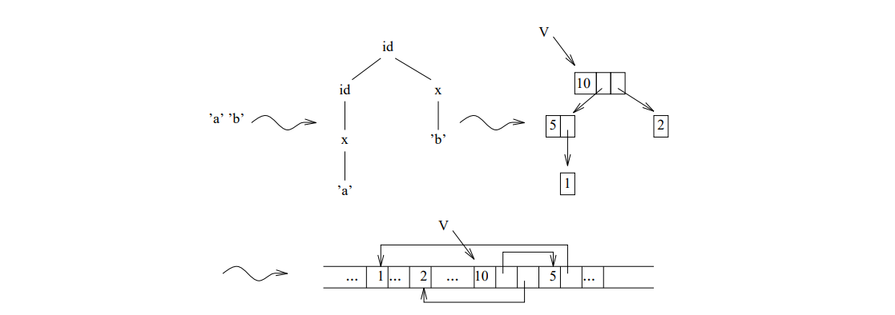

In Eta, the performance of analyses and syntheses is further subdivided. Formally analysis and synthesis radicates for each meta-alternative (as well as equal and transfer radicates for each meta-nonterminal). These primitive predicates are implemented as short procedures. implemented. The evaluator code then consists essentially of sequences of procedure calls. This is in this respect improvable, as it leads to efficiency losses due to the multiplicity of procedure calls together with parameter transfers. Here the possibility offers itself of optimizing the run time by using the procedure bodies directly, so to speak, and eliminating the assignments for parameter transfers by variable renaming as far as possible. In
general, however, this will increase the size of the generated evaluator.

===== Syntheses

In a synthesis, a new derivation tree is created from existing subtree gema of an affix form. Variables occurring in the affix form are placeholders for already existing variables.

// page 102

synthesized subtree. From these, a new tree is constructed step by step by creating nodes. It is not necessary to copy the subtree, because it cannot be changed.

Since the size of the nodes to be created and their number are known at generation time, the required memory can be requested for all nodes at once. During a preorder traversal of the derivation tree to the affix form, the required assignments are determined. indexing of the memory cells can be done relative to a fixed offset (see figure 6.2 for an example). Figure 6.2 is an example).

.Figure 6.2: Synthesis of id b to the value range symbol id
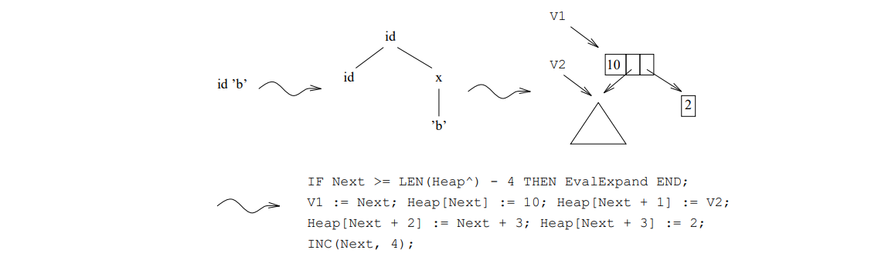

===== Transfer

This is a technical problem that arises because in the procedure of a non-terminal different identifiers are required for the formal parameters. If a variable occurs repeatedly variable occurs repeatedly as a trivial affix form on the positions of the left side, so for applying positions the same value must be supplied by simple assignments.

===== Analyses

In an analysis a derivation tree is checked for the structure given by the affix form. by the affix form. If the analysis is successful, the subtree for the variables occurring in the affix form are determined.

The necessary verification of the node identifiers is done during a preorder traversal of the derivation tree to the affix form. The corresponding traversal of the tree to be analyzed can be done at runtime of the generated compiler. The access to the can be coded by nested indexes, which represent the respective way from the root. 

As can be seen from Figure 6.3, these expressions can grow rapidly^1^. This can be by the usual use of temporary variables to eliminate common subexpressions (see Figure 6.4). (see Figure 6.4), which additionally optimizes the runtime.

^1^ In particular, the Oberon compiler we used failed above nesting depth 5

// page 103

.Figure 6.3: Analysis of a x to the value range symbol id
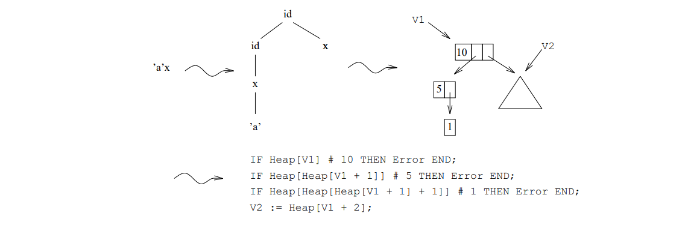

.Figure 6.4: Analysis of a x to the value range symbol id using temporary variables
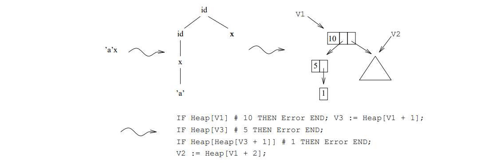

===== Comparisons

If a variable `M` is in the denominating position more than once, the corresponding values must be the same due to the requirement of consistent substitution. On the other hand the values of the variables `M` and `#M` must be different.

The verification is realized simply by comparing the derivation trees. The Boolean function procedure `Equal` accomplishes this task by a recursive traversal of both derivation trees with successful termination at equal references. To check whether two trees are different, the result is negated. This procedure is called during the analysis analysis, directly after the determination of the corresponding subtree.

===== Pradicates

Some hyper-non-terminals can only be derived to the empty word. They do not contribute to the context-free denotation of the source language. These so-called pradicates have to be because of the deliberate ambiguity allowed for them.

// page 104

When evaluating a pradicate, a derivation of the empty word can generally be found by backtracking. word can be found in general by backtracking. The failure of an analysis or of a comparison indicates here no error but a dead end.

A pradicate is implemented as a Boolean function procedure. In contrast to the procedure scheme for basic non-terminals, the selection of the appropriate alternative is essential here. For this all alternatives are tried one after the other:
----
    PROCEDURE P (formale Parameter): BOOLEAN;
    ...
    BEGIN
        failed := TRUE;
        Code zu Uberprufung  der ersten Alternative
        IF failed THEN
            Code zu Uberprufung  der zweiten Alternative
            ...
        END;
        RETURN ~ failed
    END P;
----
For an alternative, the analyses and comparisons as well as the procedure calls to the associated predicates control the further flow of control. This is appropriately formulated by nested IF statements. appropriately. The analyses not formulated in the following scheme, in particular the verification of the individual node identifier, must also be converted into nested IF-statements.
----
    (* Beginn einer Alternative *)
    IF Analyse der Eingabeparameter der linken Seite (evtl. Vergleiche)
       erfolgreich THEN
     ...
     Synthese der Eingabeparameter zu P'
     IF P'(aktuelle Parameter) THEN
           IF Analyse der Ausgabeparameter zu P' (evtl. Vergleiche)
              erfolgreich THEN
             ...
            Synthese der Ausgabeparameter der linken Seite (evtl. Transfer)
            failed := FALSE;
            ...
         END
       END;
       ...
    END;
    (* Ende der Alternative *)
----
Only the call of a predicate procedure from a procedure for a basic non-terminal leads to an error message in case of failure.
----
    Synthese der Eingabeparameter zu P
    IF ~ P (aktuelle Parameter) THEN Fehlerbehandlung END;
    Analyse der Ausgabeparameter zu P (evtl. Vergleiche)
----

// page 105

===== Error Handling

As mentioned above, errors can occur during the evaluation: Analyses, comparisons, and predicates may fail. This indicates context errors and prevents a correct translation.  However, an abort of the generated compiler is an unsatisfactory behavior. represents. The program flow is to be continued, in order to find and report further context errors. to be able. Follow-up error messages are to be suppressed.

Unlike in the case of failed comparisons, in the case of failed analyses the program sequence cannot be can be continued without further ado, since in general temporary variables receive values during the examination of the subtree. Also in the case of failing predicates the output parameters must be set to denoted values.

As solution it offers itself to create a special error node, which has the maximum Stelligkeit has. For each subtree, a loop is used to refer back to the error node. A reference to this node is used as error value; subsequent errors can then be recognized on the basis of this value. can be detected by this value. In the implementation the first entries of the heap form the error node. The error value is denoted by the constant `errVal` and refers to the first entry of this node.

If the verification of a node identifier fails in an analysis, the reference to the node is replaced by the error value. node is replaced by the error value. If then the analysis is continued simply, then results the error value for all subtree; in particular the associated variables are set to this value. are set to this value. In this case, no subsequent error is reported if the error value is already examined:
----
    IF V # errVal THEN Fehlermeldung; V := errVal END;
----
If a predicate fails, then the output parameters are set to the error value. The underprinting of error messages, if one of the input parameters has the error value, occurs for predicate calls from procedures of the basic non-terminals.
----
    IF alle Eingabeparameter ungleich errVal THEN Fehlermeldung END;
----
If the comparison of two trees fails, the error message is underprinted, if for at least the error value is present:
----
    IF (V1 # errVal) & (V2 # errVal) THEN Fehlermeldung END;
----
In order to reduce the size of the generated code, the error handling in the procedures `AnalyseError`, `Eq`, `UnEq` as well as `CheckP` for a pradicate _P_ are combined.

The texts of the error messages are created automatically by the generator from the identifiers occurring in the specification in the specification. Together with the error message a position in the input text is output. Analysis error messages for the hyper non-terminal N have the form "analysis in _N_ failed" . For failed comparisons, the name of the variable _M_ is compared with the name of the hyper associated hyper non-terminal in "_M_ failed in _N_". If a predicate _P_ fails, the error message "predicate _P_ failed" is output.

===== EBNF Operators

The semantics of ENBF operators is defined by the transformation described in section 2.2. For the resulting rules without EBNF operators, the LEAG procedure described so far can be applied. LEAG procedure can be used for the resulting rules without EBNF operators, if they are left-defining. 

// page 106

An optimized implementation of EBNF operators in pradicate rules, in particular a conversion of repetition into iteration, was rejected. Since the iteration prevents a backtracking the abandonment of recursion became noticeable in a changed semantics.

Due to the embedding of the code for anonymous basic non-terminals, there are no changes in the evaluation code schemes. With the generation is to be paid attention however, the names of the temporary variables needed for the evaluation do not overlap with those of the surrounding procedure. The formal procedure parameters omitted by the embedding of the code are procedure parameters are represented by temporary variables.

Limitations arise from the optimizing treatment of the EBNF operator repetition by the parser generator, which does not use this operator as a recursive procedure as described in the following example as a recursive procedure, but by a loop.
----
    (* Wiederholung *)
    f<Parameter fur den Rumpf> ... <Rekursionsparameter>
    g<Parameter fur den Abbruch>
    
    (* transformierte Wiederholung *)
    A <Parameter fur den Rumpf>: ... A <Rekursionsparameter>.
    A <Parameter fur den Abbruch>: .
    
    (* rekursive Implementierung *)
    PROCEDURE A (formale Parameter);
    ...
      (* Begin des Rumpfes *)
      Analyse der Eingabeparameter fur den Rumpf (evtl. Vergleiche)
      ...
      Synthese der Rekursionsparameter
      A (aktuelle Parameter)
      Analyse der Rekursionsparameter (evtl. Vergleiche)
      Synthese der Ausgabeparameter fur den Rumpf (evtl. Transfer)
      (* Ende des Rumpfes *)
      ...
      (* Abbruch *)
      Analyse der Eingabeparameter fur den Abbruch (evtl. Vergleiche)
      Synthese der Ausgabeparameter fur den Abbruch (evtl. Transfer)
      ...
    END A;
----
Since the recursion is implemented by a loop, the possibility of the computation during the recursion. The values of the recursion parameters are therefore not known in a loop pass and can be determined only in the following step. These parameters are therefore not available for analyses, comparisons and syntheses carried out according to the LEAG method.

Well-formedness constraints therefore restrict specifications in such a way that neither analyses for recursion parameters nor comparisons are required and an efficient implementability of the syntheses of the output parameters is guaranteed.

An EAG is a S(trong-)LEAG if.
 
- its transformed rules are left-denoting (LEAG),

// page 107

- on a defining position of the recursion parameters there is only one variable of the value range symbol, so no analyses are necessary,

- for each variable `M` occurring on defining position in recursion parameters neither `M` nor `#M` occurs on another denoting position in the alternative, so that no comparisons are necessary,

- no variable occurring in recursion parameters on defining position is applied more than once is applied (simple synthesis).

In the iterative implementation the recursion parameters represent a repetition of the parameters of the left side in the following iteration step. The iteration ends with the evaluation of the output parameters for the empty case.

In an iteration step references to the trees of the recursion parameters are not yet known, since they are determined only in the following iteration step, and cannot be entered. This problem is solved by the fact that these entries of the tree are noted and in the following iteration step the references to the subtree are added. In order not to have to remember several entries in each iteration step, it is demanded, that the variables of the denoting recursion parameters are not applied several times.

In the implementation, the construction of a derivation tree is done by "indirect heap accesses" . A temporary variable, the so-called "root variable" , marks a location in the heap that is refers to the root of the synthesized tree. A second so-called "run variable" describes the heap entry of the already synthesized tree, into which in the following iteration step a further part of the tree is synthesized. Before the iteration, both variables are initialized. Following the iteration, the root variable represents the output parameter.

The following example shows the Oberon source code generated for a repetition:
----
    N = 'i' N j .
    f<+ 'i' N: N> 'a' <N>g<+ : N>
    
    V1 := NextHeap; INC(NextHeap); V2 := V1; (* N *)
    WHILE Tok = 'a' DO Get(Tok);
      Heap[V2] := NextHeap; Heap[NextHeap] := "N = 'i' N.\;
      V2 := NextHeap + 1; INC(NextHeap, 2)
    END;
    Heap[V2] := NextHeap; Heap[NextHeap] := "
    N = .\; INC(NextHeap);
    V1 := Heap[V1];
----
As can be seen in the example, only with `"Heap[V2] := NextHeap;"` the reference to the subtree and with `"V2 := NextHeap + 1;"` in the following synthesis the still undenated entry in the tree is noted. The run variable V2 is overwritten with a new value.

The reference is entered separately from syntheses for all run variables, so that the value of a run variable is not value of a run variable is not overwritten prematurely in a synthesis, as would otherwise be the case in the following example.
----
    N = 'i' N j .
    f<+ 'i' N2: N, + 'i' N1: N> 'a' <N1, N2>g<+ : N, + : N>
    
    V1 := NextHeap; INC(NextHeap); V2 := V1; (* N1 *)
    V3 := NextHeap; INC(NextHeap); V4 := V3; (* N2 *)
----
// page 108
----
    WHILE Tok = 'a' DO Get(Tok);
      Heap[V2] := NextHeap; Heap[V4] := NextHeap + 2;
      Heap[NextHeap] := "
      N = 'i' N.\; V4 := NextHeap + 1;
      Heap[NextHeap + 3] := "
      N = 'i' N.\; V2 := NextHeap + 3;
      INC(NextHeap, 4)
    END;
    ...
----
Furthermore, it can happen that the variable on the defining position of a recursion parameter is not applied in one alternative, but is applied in others. At runtime then after evaluation of this alternative the corresponding run variable has no denoted value; in a subsequent iteration step no reference to a subtree may be entered in this case. may be entered in a subsequent iteration step.

As a solution, in the code of an alternative in which this variable is not applied, the value undef is assigned to the variable is assigned the value `undef`. Therefore, before hooking a subtree in all alternatives the run variable must be checked for this value in all alternatives before a subtree is hooked. Since this is very complex this treatment is omitted, if the appropriate variable is applied in all alternatives, which can be checked by the generator. The code scheme for this case is shown by example below. It is to be noted here, since the hooking takes place as described above independently of the synthesis.
----
    N = 'i' N j .
    f<+ 'i' N: N> 'a' <N> j <+ : N> 'b' <N>g<+ : N>
    
    V1 := NextHeap; INC(NextHeap); V2 := V1; (* N *)
    WHILE ... DO Get(Tok);
      IF Tok = 'a' THEN
        IF V2 # undef THEN
          Heap[V2] := NextHeap
        END;
        IF V2 # undef THEN
          Heap[NextHeap] := "N = 'i' N.\; V2 := NextHeap + 1;
          INC(NextHeap, 2)
        END
      ELSIF Tok = 'b' THEN
        IF V2 # undef THEN
          Heap[V2] := NextHeap
        END;
        IF V2 # undef THEN
          Heap[NextHeap] := "N = .\; INC(NextHeap)
        END
      END
    END;
    ...
----
===== Optimization of Terminal Affix Forms

Terminal affix forms are constant in the sense that they are represented in the evaluator by always identical trees in the evaluator. In principle, a synthesis has to be done only once; later it is enough to provide a reference to the tree. it is sufficient to provide a reference to the tree. Likewise, for each final rule (without non-terminals) a leaf must exist only once in the heap. By such a constant folding the memory memory requirements can be reduced, and naturally a shorter and faster program results.

// page 109

The generation of such an optimized evaluation is optional, since it is not suitable for the generation of derivation trees. is not suitable for the generation of derivation trees due to the resulting collapsing. In the implementation, all leaves and the trees of terminal affix forms are initially presynthesized in a reserved part of the heap. reserved part of the heap. The references are thereby known and can be used in syntheses. The end of this reserved area is marked by the constant predefined, as shown in Figure 6.5. The example of a synthesis from Figure 6.2

.Figure 6.5: Explanation of the memory structure in the generated evaluators

changes as a result:
----
    (* Synthese von id 'b' zum Wertebereichssymbol id *)
    IF Next >= LEN(Heap^) - 3 THEN EvalExpand END;
    V1 := Next; Heap[Next] := 10; Heap[Next + 1] := V2;
    Heap[Next + 2] := 42; (* Verweis auf Blatt *)
    INC(Next, 3);
----
In analyses, terminal affix forms cannot generally be used, since the trees to be analyzed may have arisen in many different ways. However, since leaves are present exactly once in the heap, the check of the node identifier can be abbreviated by a check of the reference. The example from Figure 6.4 thus changes to:
----
    (* Analyse des Satzes 'a' x zum Wertebereichssymbol id *)
    IF Heap[V1] # 10 THEN Fehlerbehandlung END; V3 := Heap[V1 + 1];
    IF Heap[V3] # 5 THEN Fehlerbehandlung END;
    IF Heap[V3 + 1] # 43 (* Verweis auf Blatt *) THEN Fehlerbehandlung END;
    V2 := Heap[V1 + 2];
----
===== Free Memory Management

Since memory for nodes is explicitly requested during syntheses, but never explicitly released and since potentially a large part of the heap is used for the representation of intermediate results with a temporary meaning, the evaluator shall be optionally extended by a free space management.

In the generated evaluator a reference payer method can be used. Here the references present in temporary variables to the roots of trees to the runtime also which allows an immediate reuse of no longer referenced nodes.

The reference to a tree is expressed by the increment of the payer of the root node. As explained in Figure 6.6, collapsing results in multiple references to subtree.

// page 110

.Figure 6.6: Explanation of multiple reference to subtree

If the last reference loses its validity, the root node and all its subtree nodes are freed. nodes of its subtree, to which no further reference exists, by entering them in free space lists. are entered. Requested heap memory is then primarily taken from these lists.

New references are created during the evaluation of applying affix positions, namely to the trees created by syntheses and to the subtree described by variables in the affix form. subtree.

Only with the completion of the evaluation of an alternative loses the reference to a tree, which represents the parameter value of a defining position loses its validity, since subtrees may still be used for synthesis or comparison.

For the error node and for pre-synthesized trees of terminal affix forms, the procedure works accordingly. When setting the error value, the faulty (sub-)tree loses its reference, the error node gets another one to prevent a release without special treatment.   prevent. Through a synthesis an additional reference to a presynthesized tree is created tree.

For the evaluation of basic non-terminals this results in an optimization possibility, since, in contrast to pradicates, a determination of all parameter values of an alternative is carried out. In this case it can be determined by the generator, how often a variable is applied; the increase of the reference numerator of the corresponding subtree is then summarized. Thus a premature deletion of the reference can take place directly after analyses. can be done. However, if a variable`M` or `#M` occurs in an alternative on a denoting position "right" of all positions on which it is applied, an erroneous comparison can take place due to an erroneous comparison due to a wrong release of the tree. This is prevented by an additional This is prevented by an additional increase of the reference numerator. In this case, following the last comparison an explicit deletion of the reference is necessary.

In the implementation the node identifier is conceptually extended by the reference numerator to a triple. The additional constant refConst is used as follows for the reconstruction of the components:
----
       Reference counter = node identifier DIV refConst,
                   Arity = (node identifier MOD refConst) DIV arityConst,
      Alternative Number = node identifier MOD arityConst.
----
In the reference counter, only the number of additional references to a node is counted.

A separate free list is created for each node location. Shared nodes are managed according to their position in these lists. The entries of the `FreeList` field point to the first node of such a list. The chaining is as shown in figure 6.7, in the first entry of the free nodes.

// page 111

.Figure 6.7: Example of a free space list

In syntheses, memory is now requested node by node using the procedure `GetHeap` procedure. The deletion of a reference as well as a possible release of the memory is carried out by the procedure `FreeHeap`.

By application of the reference number procedure and under the condition, since no optimization of terminal affix forms takes place and the synthesis occurs in a Pradikatprozedur, the example of the synthesis changes from figure 6.2 to:
----
    (* Synthese von id 'b' zum Wertebereichssymbol id *)
    GetHeap(V1, 2); Heap[V1] := 10; Heap[V1 + 1] := V2;
    INC(Heap[V2], refConst);
    GetHeap(V3, 1); Heap[V1 + 2] := V3; Heap[V3] := 2;
----
The example in Figure 6.4 changes under the condition that no optimization of terminal affix forms and the analysis occurs in the procedure for a basic non-terminal:
----
    (* Analyse des Satzes 'a' x zum Wertebereichssymbol id *)
    IF Heap[V1] # 10 THEN Fehlerbehandlung END; V3 := Heap[V1 + 1];
    IF Heap[V3] # 5 THEN Fehlerbehandlung END;
    IF Heap[Heap[V3] + 1] # 1 THEN Fehlerbehandlung END;
    V2 := Heap[V1 + 2]; INC(Heap[V2], 3 * refconst);
FreeHeap(V1);
----
===== Storage of Position Information

For error messages in a separate evaluator, the derivation tree built by the "One-Pass-Compiler" is enriched with position information (see chapter 7). For this purpose the derivation tree for each possible error location. For the structure statements are inserted into the evaluation code of the one-pass compiler.

In the implementation, the positions are represented in parallel to the heap in the `PosHeap` field. For the correct entry of the positions they are cached in the cellar `PosStack` cellar. By calling the procedure `PushPos` after the evaluation of a denoting position a position is stored on the cellar; before the synthesis of the output parameter of a procedure, these entries are transferred from the cellar to the field `PosHeap` by calling the procedure `PopPos`.

==== The Generator

The SLEAG evaluator generator allows the generation of an evaluation either according to the LEAG procedure for transformed EBNF rules or according to the SLEAG procedure. It is divided into
// page 112
test part, which contains procedures for checking the leftness and the SLEAG conditions for repetitions, and a collection of procedures, which are based on the fragments for global declarations, pradicates, declarations of formal procedure formal procedure parameters and local variables, predicate calls, and analysis and synthesis code. These are used elsewhere to sprinkle evaluator code into surrounding code. 

Both the test and the generation orient themselves at the procedure scheme and take place therefore not terminal-wise. It is to be noted, since with the LEAG procedure also for anonymous non-terminals are created own procedures. The pradicate coding is done exclusively according to the according to the LEAG procedure.

In the generated code optionally an optimization of terminal affix forms can take place. Also can be optionally extended by a free space management. Due to the many case distinctions the special size of the module `SLEAGGen.Mod` results.

===== Evaluability Checking 

The evaluability check is carried out independently of the actual generation.
----
    PROCEDURE Test*;
    PROCEDURE InitTest*;
    PROCEDURE IsLEAG* (N: INTEGER; EmitErr: BOOLEAN): BOOLEAN;
    PROCEDURE IsSLEAG* (N: INTEGER; EmitErr: BOOLEAN): BOOLEAN;
    PROCEDURE FinitTest*;
----
After initialization, the rule-local condition of left-deniability for a non-terminal is checked by calling `IsLEAG`. `IsSLEAG` checks the SLEAG condition for a non-terminal and the anonymous non-terminal and the anonymous non-terminals resulting from the transformation of its rules. The switch `EmitErr` switch controls the output of error messages.

Briefly, the SLEAG condition for the entire grammar can be checked with the `Test` command. 

The verification of the left-denieredness is done by a traversal of the transformed rules which precedes the evaluation. At the beginning the variables of a rule are marked as undefined. If a variable occurs in the course of the traversal on defining position, it is marked as defined. A rule is left-defining if no undefined variable occurs on the variable occurs in the applying position.

===== Interface

The generation of an evaluation procedure is divided into the generation of global parts and the generation of procedurally local parts.
----
    CONST
        parsePass = 0; onePass = 1; sSweepPass = 2;
    
    PROCEDURE InitGen (MOut: eIO.TextOut; Treatment: INTEGER);
    PROCEDURE GenDeclarations;
    PROCEDURE GenPredProcs;
    PROCEDURE FinitGen;
----
// page 113

With the initialization, the generated evaluation procedure is defined via the parameter `Treatment`, which can take the values `parsePass`, `onePass` and `sSweepPass`. In addition, the text is passed, into which is generated alternately. The calculation of the node identifiers and the determination of terminal affix forms. The trees synthesized for the latter trees together with the error node form the initial entries of the heap.

The procedure `GenGlobalDef` inserts global data structures and procedures into the module to be generated and creates the module to be generated and creates the evaluator table. The global data structures such as the heap and the global procedures such as the error output procedures are copied from a text file to the from a text file into the module to be generated. Thereby markers "$" are used, in order to insert special parts or to read over not needed parts of the text file. The evaluator table contains the pre-initialized heap entries and is created as a permanent file. 

The procedure `GenPredProcs` codes the predicates. For each predicate two procedures are generated: One evaluates the predicate, in the second the error handling described in section 6.1.1.6 takes place. Since pradicates can call each other in a concatenated manner, FORWARD declarations are generated.
----
    PROCEDURE ComputeVarNames (N: INTEGER; Embed: BOOLEAN);
    PROCEDURE InitScope (Scope: eEAG.ScopeDesc);
    PROCEDURE GenFormalParams (N: INTEGER; ParNeeded: BOOLEAN);
    PROCEDURE GenVarDecl (N: INTEGER);
    PROCEDURE GenAnalPred (N, P: INTEGER);
    PROCEDURE GenSynPred (N, P: INTEGER);
    PROCEDURE GenPredCall (N, ActualParams: INTEGER);
    PROCEDURE GenActualParams (P: INTEGER; ParNeeded: BOOLEAN);
    PROCEDURE GenRepStart (N: INTEGER);
    PROCEDURE GenRepAlt (N: INTEGER; A: eEAG.Alt);
    PROCEDURE GenRepEnd (N: INTEGER);
    PROCEDURE PosNeeded (P: INTEGER): BOOLEAN;
----
In order to know the number and names of temporary variables for the declaration, the variable assignment by the procedure `ComputeVarNames` before the generation of procedurally local program fragments. Before the generation the variables of an alternative are marked by call of `InitScope` as undeniered. `GenAnalPred` summarizes the generation of analyses and comparisons, `GenSynPred` that of syntheses and transfers. The generation of evaluation code for loops requires the special handling described in section 6.1.1.7 and consists of an initialization, of the treatment of the affix positions of the recusion parameters as well as the applying positions of the left side and finally from the evaluation for the loop termination.

Since in the Oberon language the formal parameters of a procedure and its FORWARD declaration must be identical, their names are assigned according to a fixed scheme, so that for their generation no complete variable is required. no complete variable assignment is necessary for their generation.

===== Assignment of Variable Names

Affix positions and variables are represented in the procedures of the generated program by temporary variables. The affix positions of the left rule side of a non-terminal are represented by are represented by the same Oberon variables, i.e. by the formal procedure parameters. If a variable occurs as trivial affix form on applying position, the variable and the corresponding position are represented by the same temporal variable. This succeeds not in the case that a variable occurs several times as a trivial affix form on applying positions
// page 114
is on the left side. In this case a transfer is necessary. If a variable occurs as a trivial affiform on defining position, this optimization may only be done for the denition position of the variable, otherwise the value of the temporary variable is overwritten.

The evaluation of repetitions requires in addition to the temporary variables for the applying positions of the formal parameters in each case a run variable (see section 6.1.1.7).

Furthermore, for traversal in analyses (and for evaluation with free space management in syntheses) temporary variables are needed for each traversed node of the tree.

In the case, since the code for anonymous non-terminals is embedded into procedures, a parameter transfer takes place by parameter passing because the temporary variables for the affix positions of the call are identical to the temporary variables of the affix forms of the left-hand rule pages of the anonymous non-terminal. It is important to note that the values of temporary variables for the evaluation of a non-terminal are not overwritten by the evaluation of the embedded anonymous non-terminal. This problem is solved by choosing disjoint temporal variables. For this purpose, two Oberon variables are used here for a trivial affix form in the call. one for the variable on the position and one for the position.

The temporary variables computed for the generation are represented in the following data structures represented:
----
    VAR
        HNontVars: POINTER TO ARRAY OF INTEGER;
        FormalName: POINTER TO ARRAY OF INTEGER;
        AffixName: POINTER TO ARRAY OF INTEGER;
        VarName: POINTER TO ARRAY OF INTEGER;
        NodeName: POINTER TO ARRAY OF INTEGER;
----
A temporary variable is represented by a number. The temporary variables are assigned in ascending order. Therefore, for their declaration the knowledge of the number of variables occurring in the procedure is sufficient. However, in this number represented in `HNontVars` are the names for the formal procedure parameters are included.

The Oberon variables for variables and affix forms are stored in the fields `VarName` and `AffixName`. fields, temporary variables for analyses and syntheses are stored in the `NodeName` field.

The `FormalName` field contains the additional variables needed for the evaluation of repetitions. The run variables are represented in the `AffixName` field for the affix positions of the left side and those of the recursion parameters, the root variables in the field `FormalName`. The `Actual` field becomes "local" to `ComputeVarNames` to ensure that as the respective run variables are identical in all alternatives.

The assignment of the variables takes place by an evaluation-preceding traversal of the rules in the procedure `ComputeVarNames`.

To keep the number of temporary variables as low as possible, a lifetime analysis is performed. For the execution a reference number method is used. A reference numerator signals the use of an Oberon variable. By increasing the reference numerator, a premature reuse of an Oberon variable is prevented.

To determine the lifetime of a temporary variable for a variable `M`, its dependencies in the validity domain are symbolically decremented. These consist of the number of variable occurrences, increased by 1, if the variable `#M` occurs in the validity range, since in this case the life time is prolonged until the necessary comparison. These dependencies are represented in the `VarDeps` field and "local" to `ComputeVarNames`.

// page 115
----
    VAR
        VarDeps: POINTER TO ARRAY OF INTEGER;
----

===== Data Structures for Generation

The following data structures are also required for generation:
----
    VAR
        SavePos, UseConst, UseRefCnt, TraversePass: BOOLEAN;
        VarCnt, VarAppls: POINTER TO ARRAY OF INTEGER;
----
The switches control the generation. The fields `VarCnt` and `VarAppls` contain statistical  information about the variables of an alternative. `VarCnt` indicates the number of variable occurrences, `VarAppls`, how often the variable occurs on applying position.
----
    VAR
        NodeIdent: POINTER TO ARRAY OF INTEGER;
        MaxMAlt: INTEGER;
        RefConst: LONGINT;
----
In the `NodeIdent` field, a node identifier is assigned to each meta rule. The entries are calculated in the procedure `ComputeNodeIdent`. Thereby the values `ArityConst` and `RefConst` are used to determine the components.
----
    VAR
        Leaf: POINTER TO ARRAY OF INTEGER;
        AffixPlace: POINTER TO ARRAY OF INTEGER;
        AffixSpace: POINTER TO ARRAY OF INTEGER;
        FirstHeap: INTEGER;
----
When generating with optimization of terminal affix forms, references to an already synthesized leaf or a constant tree directly into the generated code. These references are calculated in the procedure `ComputeConstDat` and entered into the fields `Leaf` and `AffixPlace`. For each affix position the size of a tree to be synthesized is determined; this size stored in the `AffixSpace` field is used in syntheses for overflow checking. overflow verification.  The variable `FirstHeap` denotes the first free entry in the heap of the generated heap of the generated compiler. This value is used for correct initialization.
----
    VAR
        VarRefCnt: POINTER TO ARRAY OF INTEGER;
        VarDepPos: POINTER TO ARRAY OF INTEGER;
----
The VarRefCnt and VarDepPos fields are used to store information for optimizing free space management in the procedures of the basic non-terminals. An entry of the field VarRefCnt assigns to a variable the value by which the reference numerator must be increased when denoting the variable. A positive entry in VarDepPos denotes the axposition at which affix position at which the release of the subtree can take place after a comparison.
----
    VAR
        RepAppls: POINTER TO ARRAY OF BOOLEAN;
        RepVar, EmptySet: Sets.OpenSet;
----
// page 116

The set `RepVar` contains those variables which occur on defining positions of recursion parameters. This set is needed for the syntheses in repetitions. The set `EmptySet` represents the empty set and is used for synthesis in all other cases. In the  `RepAppls` field for each variable on the defining position of the recursion parameter the information whether it is applied in all alternatives of repetition is stored in the field RepAppls.

=== The Output of the Translation 

In the generated compiler the values of the output parameters of the start symbol calculated by the evaluator represent the start symbol represent the translation. The `EmitGen` module generates code that outputs this translation.  output. Internally, the translation is represented by the evaluator through a derivation tree to the MetaGrammar. The output is therefore a traversal of this derivation tree.

It is to be noted, since the output of alternatives of a non-terminal, which is provided with a token marking (a so-called token) as well as their subtree is to take place bundled i.e. without the output of a separator between the individual terminals; in the other case, however, a separator after each case, however, a separator is to be output after each terminal. This results in the situation, because a non-terminal can be a subtoken, i.e. it can be used in a subtree of a token as well as in a subtree not originating from a token. Thus, when outputting alternatives of a subtoken, separators must be output or not output depending on the context in the derivation tree.

The meta non-terminals can now be divided into two sets according to this output property. In the set `Type3` the tokens as well as the non-terminals which can be reached by tokens are to be found. bend. In the set `Type2` the non-terminals which can be reached from the start symbol of the meta-grammar are to end. but without the tokens and without the non-terminals which can only be reached by tokens. The subtokens thus form exactly the intersection of these two sets.

The output takes place in the implementation by procedures, in which a case distinction is made. over alternatives of a non-terminal. For the output with and without separator separate procedures are generated. For subtokens in particular two procedures are generated. In the procedures additionally the size of the output tree is computed, i.e. the number of required heap entries for a non-collapsed storage mode.

The generated procedures can be represented by the following code scheme:
----
    (* Meta-Nichtterminal M *)
    PROCEDURE EmitM Type2/3 (Ptr: HeapType);
    BEGIN
      INC(OutputSize, Heap[Ptr] DIV arityConst + 1);
      CASE Heap[Ptr] MOD arityConst OF
      | 1: Code fur erste Alternative
         .
         .
         .
      | n: Code fur n-te Alternative
      END
    END EmitM Type2/3;
    
    (* Ausgabe von Meta-Terminal T *)
    IO.WriteText(Out, T); (evtl. IO.Write(Trennzeichen); )
    
    (* Prozeduraufruf fur Meta-Nichtterminal N *)
    EmitN Type2/3(Heap[Ptr + i]);
----
// page 117

The generation of the output procedures is done by the procedure `GenEmitProc`, in which the calculation of the sets `Type2` and `Type3` is done by traversing the meta grammar. This is executed by the recursive procedure `CalcSets`. `GenEmitCall` generates the call of the correct procedure. `GenShowHeap` generates the output of information about the memory requirements of the generated compilers.

// page 118

=== Implementations

// page 145

== Compiler With More Powerful Evaluation Methods

For non-left-defining EAGs, affix evaluation cannot be performed in a depth-first left-to-right traversal; thus, they do not satisfy the LEAG condition, and more powerful evaluation methods have to be applied. With such methods the traversing traversing of the derivation tree, which is necessary for the evaluation, cannot be done with the procedures of the parser for its construction, what a separation of the evaluation from the parsing and thus a static this makes a separation of the evaluation from the parsing and thus a static representation of the derivation tree necessary. In Section 7.1, the construction of derivation trees by automatically generated compilers is described in the already known "Heap" is presented.

As example of a more powerful evaluation procedure and thus at the same time as example of a generation in the sense of an _abstraction of algorithms_, the _single sweep procedure_ and its implementation are presented. This is a generalization of the LEAG procedure, in which the visits of subtrees of a node in the derivation tree are permuted. may be performed permuted. Each subtree is visited exactly once; this is also the restriction that is irrelevant in practice. irrelevant restriction compared to the better known single visit method, in which subtree are visited _at most once_. Formally, an EAG is single sweep evaluable if there are no there is a perm tation of the factors for each alternative for the EAG transformed according to section 2.2. factors for which the EAG is left-denoting, i.e. a LEAG.

=== The Creation of Static Derivation Trees

Instead of enriching a generated parser for the creation of static derivation trees with appropriate constructor instructions, it is generated as a special one-pass compiler, whose specification is automatically generated by the `Shift` module (see Section 7.3). This compiler has no output procedures, but passes the "translation" of its input, namely the tree in `Heap`, to the traversal procedure `TraverseSyntaxTree` of a separate evaluator.

The coding of the derivation tree corresponds to the usual scheme presented on page 101 in the context of the evaluator generator, and shall only be briefly repeated here: A node stands for a rule application and is realized by a sequence of entries in the `Heap` field. The first entry identifies the applied rule by the number of the corresponding alternative. In the further heap entries the references to the corresponding subtree are stored in the other `heap` entries; their number is given by the position of the alternative (without pradicates).

// page 146

In order to allow the subsequent evaluator to report the positions when context errors are detected a position must be stored for the nodes of the derivation tree for each possible error location. Possible error locations are all defining parameter positions, for which for which analyses or comparisons may fail, as well as occurrences of pradicates in rules. For simplicity, in this implementation, _all_ positions where analysis code is stored according to the code schemes, a position is stored. These analyses can be performed a node as well as after leaving a subtree. Pradicates should use as error position the position of the subtree visited before. From it results, since to each entry in Heap exactly one position must be stored: That of the entry of a node is the initial position of the word recognized by the rule; for a reference to a sub a reference to a subtree, the position directly after the input word represented by the subtree is stored.

A simple mapping between `heap` entries and their positions is realized by a parallel field `PosHeap` is implemented. At runtime this position field is filled by instructions, which are entered by the evaluation generator `SLEAGGen` into the generated compiler. For this the parser generator transfers to the evaluation generator during its initialization the "contract agreement" `sSweepPass`.

=== The Generated Single Sweep Evaluators

A generated evaluator is an independent module, which is imported by an upstream compiler, which generates a derivation tree and then passes it to the evaluator. For each non-terminal, a separate traversal procedure is generated, into which the evaluation code is embedded directly as in the generated one-pass compilers. Since nodes of the derivation tree are not visited multiple times, the calculated affix values do not need to be stored statically between visits, but can again be dynamically held in procedure parameters. The single sweep procedure is the most powerful practically relevant evaluation procedure that allows this memory-recurrent representation of affix values.

==== Overview of the Single Sweep Svaluators

A generated evaluator consists of a module, the rough structure of which is shown in the following simplified program fragment:
----
    MODULE Evaluatorname;
    
    TYPE TreeType* = LONGINT;
         OpenTree* = POINTER TO ARRAY OF TreeType;
         OpenPos*  = POINTER TO ARRAY OF eIO.Position;
        ...
    VAR Tree : OpenTree;
     PosTree : OpenPos;
         Pos : eIO.Position;
    
    PROCEDURE P0(Adr : TreeType; VAR V1 : HeapType); (* Startsymbol *)
    ... (* Berechnet die Ubersetzung des Ableitungsbaums *)
    END P0;
    (* ... weitere Prozeduren fur die Nichtterminale: P1, P2,... *)
----
// page 147
----
    PROCEDURE Emit(Ptr : HeapType);
    ... (* Gibt die Ubersetzung aus *)
    END Emit;
    
    PROCEDURE TraverseSyntaxTree*(Tree1 : OpenTree;
                                  PosTree1 : OpenPos; Adr : TreeType);
      VAR V1 : HeapType;
    BEGIN
      Tree := Tree1; PosTree := PosTree1;
      P0(Adr, V1); Emit(V1)
    END TraverseSyntaxTree;
    
    END Evaluatorname.
----
The strict type calling of the programming language Oberon makes it necessary to export the types `TreeType`, `OpenTree` and `OpenPos`, so that the upstream compiler can store the derivation tree and the positions in such typed fields and pass them to the also exported procedure `TraverseSyntaxTree` together with the root of the derivation tree. procedure `TraverseSyntaxTree` together with the root of the derivation tree. The latter procedure makes the passed fields generally accessible by copying the pointers to global variables and then calls the procedure generated for the start symbol for evaluation. There, the static semantics are checked and the translation of the input - is generated in a field `Heap` -, which is not listed here, which is passed to the output procedure by the variable V1. output procedure.

==== Code Schemes for the Evaluation Procedures

The structure of the procedures generated for the basic non-terminals is similar to the procedures of a one-pass compiler and can be described by the following code scheme:
----
    PROCEDURE N(Adr : TreeType; ...);
    ...
    BEGIN
      CASE Tree[Adr] MOD hyperArityConst OF
        | 1 : ...
        ...
        | k : Pos := PosTree[Adr];
               Analyse der Eingabeparameter der linken Seite der k-ten Alt.
               Code fur die k-te Alternative
               Synthese der Ausgabeparameter der linken Seite der k-ten Alt.
        ...
        | n : ...
      END
    END N;
----
In the `Adr` parameter, the root of the subtree to be evaluated is passed to each procedure. Within the CASE statement, the rule applied to this node is determined and the code of the corresponding alternative is executed. This consists of the calls of the procedures for the basic non-terminals or pradicates occurring in this alternative together with the associated the corresponding analyses and syntheses of parameters. The calls take place thereby in a The calls are made in a permutation of the textual order determined by the generator according to the following scheme:
----
    (* Aufruf eines Grundnichtterminals N *)
    Synthese der Eingabeparameter zu N
    N(Tree[Adr + Offset des Verweises auf den Unterbaum], ...);
    Pos := PosTree[Adr + Offset des Verweises auf den Unterbaum];
    Analyse der Ausgabeparameter zu N
    
    (* Aufruf eines Pradikats N *)
    Synthese der Eingabeparameter zu N
    Pos := PosTree[Adr + vorheriger Offset];
    N(...);
    Analyse der Ausgabeparameter zu N
----
Contextual errors can be detected during evaluation only in analyses (and comparisons) and pradicates in analyses (and comparisons) as well as in predicates; in order to be able to easily output the corresponding position in the code generated for analyses together with a message, the global variable Pos is set accordingly before each analysis. However, this is only necessary if analyses are actually performed at the corresponding positions. Pradicates do not process any parts of the derivation tree, therefore, no reference to it is passed to the corresponding procedures. In case of failure, however, a meaningful error position should be reported. For this the position of the immediately before visited subtree is used; if in an alternative first a procedure is called first in an alternative, then there is no such previously visited subtree and the position stored for the first heap entry of a node is reported.

=== The Shift Module

This module is used by the parser generator to create "compilers", which only build derivation trees statically and which can be prepended to any separate evaluators. can be switched. In addition from the basic grammar of an EAG a further EAG is generated automatically. which describes the identical mapping on the context-free language; structurally, the transformation from the section 2.2, since the meta-grammar does not contain any EBNF constructs. Each (possibly anonymous) hyper-nonterminal has exactly one output parameter to raise the recognized structure to the meta-level. Thus, the generated EAG is a SLEAG for which a one-pass compiler can be generated; without output, this compiler returns the desired this compiler returns the desired derivation trees in the heap.

For the generated EAG no textual specification is created, but the representation of the internalized EAG is modified accordingly. The base grammar remains unchanged, but all pradicates are removed, and the meta-grammar is replaced by a counterpart of the base grammar, where EBNF constructs are implemented according to the mentioned transformation. transformation. Similarly, the parameterization of hyper-nonterminals is overridden; the simple affix form on a left rule page corresponds directly to the respective alternative. The Earley parser is therefore not necessary for the creation of the corresponding derivation trees.

Since the modification of the representation of an EAG is destructive, the separate evaluator must be generated first with the generation of a compiler. Only afterwards the command `eELL1Gen.GenerateParser` may be used, which modifies the EAG by means of the module `Shift` module and generates the one-pass compiler, which finally passes the derivation tree to the evaluator.

// page 149

=== The Single Sweep Evaluator Generator

The single sweep evaluator generator tries to determine for each alternative of an EAG a permutation of the factors with which the alternative becomes left-defining. If this succeeds, then an evaluator module with the procedures for traversing a derivation tree presented in section 7.2. derivation tree is generated. The evaluator code can again be inserted into the tree by using the module `SLEAGGen` into it.

==== Generation of the Evaluator Module

The evaluator module is created in the `GenerateMod` procedure. The module structure is copied from a fixed text file and extended at the insertion marks "$" by the variable parts. The calculation of the permutations is done non-terminally during the generation.

First some fixed parts as well as the predicate procedures are inserted by means of the generation procedures of the module `SLEAGGen`. Behind this the procedures for the non-terminals of the basic grammar; as already in the parser generator also here before simply still forewarning declarations for all procedures, since these can call each other in general arbitrarily. At last, the output procedures are written into the evaluator using the module `EmitGen` module into the evaluator.

In order not to be subject to any restriction with the EBNF operator for repetitions, for the transformation from section 2.2 is actually performed for the generation. Since the module `SLEAGGen` module is to be used for the generation of the embedded evaluation code, these changes as well as the computed permutations must be worked directly into the data structures of the module `EAG`. For simplification, the terminals can be deleted from the alternatives, since they are irrelevant for the generation of the evaluator. Finally all modifications are to be made retrograde again.

The procedure `SaveAndPatchNont` realizes the transformation of the alternatives of a nonterminal by duplicating the data structures for the alternatives (possibly with modification of the parameterization) and for the non-terminals occurring in them; if necessary, non-terminals for recursive if necessary, non-terminals are newly added for the recursive recall. The copies are concatenated among themselves and added to the data structure for the respective non-terminal "appended" . To procedure `RestoreNont` the pointer to the original data structure is simply stored.

Suitable permutations are computed in the `ComputePermutation` procedure described in the next section. The creation of the non-terminal procedures according to the scheme presented in Section 7.2 is finally done in the procedure `GenerateNont`.

Violations of the single sweep condition are only detected if no suitable permutations can be determined for a non-terminal. In this case the already generated parts of the evaluator are deleted and further generation is suppressed; however, the determination of the remaining permutations is still attempted in order to be able to report all violations to the user. A pure test on single sweep evaluability of an EAG is realized by the fact that the generation is underprinted from the beginning, i.e. only the permutations are calculated. 

==== Calculation of Permutations

In a generated evaluator the procedures for the evaluation of subtree and the Pradikatprozeduren may be called only if all input parameters are computed. At
// page 150
single sweep method, the generator already determines a sequence of calls for each alternative. the non-terminal occurrences of each alternative are reordered in such a way, that the alternative becomes left-defining.

An obvious solution to the problem of finding a suitable permutation would be to build a "dependency graph" for each alternative, whose nodes are the nonterminal occurrences and whose edges reflect the dependencies arising from applying and defining variable occurrences, and then sort this graph topologically. For the following nontrivial example, Figure 7.1 shows the dependency graph of the one alternative of the non-terminal S. Variables in defining positions are italicized in the example.
----
    n = . o = . p = . q = . r = .
    
    SS <+p> : S < , p> .
    S <-r : r, +p : p> :
      A <n, o, r> B <n, o, p> C <n, r> D <p, q, n> E <n, q, r, p>.
    
    A <+ : n, -o : o, -r : r> : "a".
    B <-n : n, + : o, -p : p> : "b".
    C <+ : n, -r : r> : "c".
    D <+ : p, -q : q, -n : n> : "d".
    E <-n : n, + : q, -r : r, + : p> : "e".
----

.Figure 7.1: Dependency graph of the one alternative of the non-terminal S

The problem is that variables can be in multiple defining positions and it is not yet clear which it is not yet clear which is dynamically the first defining position. In Eta the leftmost position was simply set as the defining point; however, this approach is not suitable for the single sweep method. however, is not suitable. The dependency graph shown contains too many edges and cannot be topologically sorted. cannot be sorted topologically (the graph contains cycles). For example, the first factor depends on the second and vice versa. If, however, the third factor is sorted to the front, then the variable `n` is defined behind it and for further sorting all edges marked with `n`, which point to other that factors must be deleted from the graph. By making such deletions, the dependency graph shown can now be sorted.

In general, there are many possible evaluation sequences for an alternative. Here we want to Here, a sequence shall be determined, in which the factors keep their textual order as far as possible; in particular, an evaluation according to the LEAG-method results for left-defining EAGs. This leads to a natural order of the reports of context errors by the generated evaluator.

The determination of permutations can be done efficiently again with a modification of the algorithm for the computation of empty derivable non-terminals (cf. Section 4.2.3). The essential
// page 151
idea is to show the dependencies of factors not on other factors, but on variables. The following data structures are used for this purpose:
----
    Var : POINTER TO ARRAY OF RECORD Factors : INTEGER END;
    Factor : POINTER TO ARRAY OF RECORD
                Vars, CountAppl, Prio : INTEGER;
                F : EAG.Factor
            END;
    
    Edge : POINTER TO ARRAY OF RECORD Dest, Next : INTEGER END;
    NextEdge : INTEGER;
    Stack : POINTER TO ARRAY OF INTEGER; NextStack : INTEGER;
    
    DefVars : Sets.OpenSet;
----
Initially, for each factor of an alternative, a list of the variables in the defining position, the number of the number of applications of not yet defined variables, its priority (analogously to the (analogous to the determination of the continuation grammar in section 5.2.2.3) and a reference to the factor. the factor is stored. For each variable of an alternative a list of those factors is for which it is in the applying position. In order to avoid linear search multiple applications or definitions of a variable for a factor lead to multiple entries in all lists. All lists are realized in the `Edge` field.

In `Stack`, the set of those factors is stored whose application count has fallen to zero, i.e. which only apply variables that have already been denoted. In `DefVars` during the already defined variables are successively added to the sorting of the factors. this set is initialized with the variables defined on the left side of the rule. The dotted slopes in Figure 7.1 dependencies between factors and the left side of the rule must be included in the initial assignment of the data structures, as shown in figure 7.2.

.Figure-7.2: Initial assignment of the data structures for the example
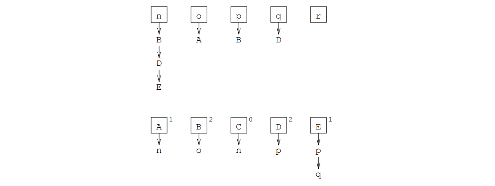

In `Stack` for the example only the factor `C` is entered at the beginning, in `DefVars` only the variable `r` is contained.

The priority of the factors controls the choice of the factor to be removed from `Stack`; a selection corresponds to the denition of the variables in the defining position for this factor,
// page 152
which by the clever choice of the data structures can now easily be incorporated into the set `DefVars` and the application payer of the factors. If such a payer sinks to zero, the corresponding factor is included in `Stack`.

If `Stack` is finally completely emptied, then all factors must have been removed exactly once from it and thereby a new position in the stack. must have been removed exactly once from the stack and thus received a new position in the reordering; furthermore all variables from the left side of the rule must be defined. If these conditions are fulfilled, then the alternative is single sweep evaluable and the evaluation order can be changed by re-sorting of the factors in the module `EAG` "stored" . Otherwise a corresponding error message and a global variable `Error` is set to `TRUE`, in order to suppress a further generation.

// page 153

=== Implementations

// page 163

== Final evaluation

In order to enable an evaluation of the generated compilers and thus of the Epsilon compiler generator, we present at this point some concrete media for a current PC with Pentium-90 processor.

The size of the Epsilon compiler generator is very compact with 6500 lines of source code, i.e. about 80 pages, very compact. From the 14-page specification of an Oberon 0 compiler for a RIS Oberon 0 compiler for a RISC processor, the 170 kB source code of a 1-pass compiler in the generator target language Oberon can be generated in 1.5 seconds. with 140 kB object code (single sweep compiler: 170 kB object code).

For the compilation of a 30-page Oberon 0 program (43 kB) containing nested sorting and multiplication procedures, the 1-pass compiler needs one second to compute the 180 kB large translation and another second to output it (single sweep compiler: 3+1 seconds). The amount of memory needed for this depends on the optimizations the compiler with which the compilers were generated and can be taken from the following table:

[cols="3,1"]
|===
| Optimizations | Memory Consumption 

| without # operator, without optimization     | 18000 kB
| wih # operator, without optimization         | 3342 kB
| wih # operator, with constant folding        | 822 kB
| wih # operator, with free storage management | 476 kB
| wih # operator, with both optimizations      | 310 kB
|===

The single sweep method requires an additional 600 kB of memory for the representation of the derivation tree.

The effort required for these optimizations is therefore justified and leads to compilers comparable with practically used translators in terms of runtime and memory requirements. The subsequent optimization would probably be the use of a real scanner generator. Thus the run time could be lowered still further, since parameter computations for tokens only once had to be accomplished. More importantly, however, the static derivation trees could be used for compilers with more powerful evaluation procedures became clearly smaller.

// page 165

== Syntax of the Epsilon Input Language

An extended Bakkus-Naur formalism (EBNF) is used to describe the ambiguous syntax of Epsilon specifications.

Terminals are represented by strings consisting of non-empty chars, enclosed in quotes or apostrophes (as in Modula-2). Terminals are equal if their strings are equal. To prevent misleading error handling, strings must not extend beyond the end of the line. Non-terminals consist of sequences of lowercase and uppercase letters of arbitrary length. Numbers are represented by an ornamental sequence and are restricted to values between 0 and 9999 for system independence.

A simple comment starts (as in Ada) with an exclamation mark (instead of "-" and extends to the end of the line. For hiding parts of the specification there are still comments (as in Modula-2), which consist of an opening bracket "(\*" followed by an arbitrary string and the corresponding closing parenthesis "*)". These comments may be nested. Simple comments hide lines even in nested comments. 

The exact combinations of parameterizations are explained by tables 2.1 and 2.2.

In formal parameters the value range symbol may be omitted if the affix form consists of a variable to the value range symbol. Formal parameters on the left side of the rule are recognized as abbreviated notation, because the affix forms of the formal parameters of the following alternatives are identical.

// page 166
----
    letter: "a" j ... j "z" j "A" j ... j "Z".
    digit: "0" j ... j "9".
    ident: letter fletterg.
    number: digit fdigitg.
    string: " ' " char fcharg " ' " j " " " char fcharg " " ".
    
    MetaTerm:
      {ident| string}.
    MetaExpr:
      MetaTerm f"j" MetaTermg.
    MetaRule:
      ident ["*"] "=" MetaExpr ".".
    AffixForm:
      {["#"] ident [number] | string}.
    ActualParams:
      "<" AffixForm {"," AffixForm} ">".
    FormalParams:
      "<" ("+" | "-" ) AffixForm ":" ident
      {"," ("+" | "-" ) AffixForm ":" ident} ">".
    HyperTerm:
      {ident [ActualParams] | string
      | [ActualParams]
         ( "(" | "[" | "f" ) HyperExpr ( ")" | "]" | "}" )
         [FormalParams] }.
    HyperExpr:
      [FormalParams] HyperTerm [ActualParams]
      {"|" [FormalParams] HyperTerm [ActualParams] ].
    HyperRule:
      ident ["*"] ":" HyperExpr "." .
    Specification:
      (MetaRule | HyperRule) fMetaRule | HyperRuleg.
----
// page 167

== A Reduced Example

The following example shows the specification of a simple language as well as the verification of a typical context condition of programming languages. Besides it illustrates the above syntax of the input language of Epsilon defined above and shows a clear usage of the EBNF operators. In order to support the readability, the specification texts contain the grammar are printed in bold and affixes on defining positions are highlighted in italics.

The compiler generated from the shown EAG accepts as input a sequence of declarations and applications of identifiers, which in turn consist of sequences of the letters `"a"` and `"b"` as input. Each identifier may be declared only once and applied only after its declaration. after its declaration. To check this context condition, a symbol table is built on the meta level. which can be searched for identifiers with the pradikat `Find`. This predicate searches for the identifier specified in the first parameter in the table specified in the second parameter. table by successive decomposition into the first entry and a remainder table. The result of the search is returned in the third parameter. Context errors will be returned in the procedure generated for the non-terminal `DeclAppl` by failure of an analysis of the affix form `"FALSE"` or `"TRUE"`, which is on the third parameter position of the pradicate call of `Find` is located. At last as "translation" of an input the symbol table is output

// page 168
----
    ! DeclAppl
    
    Tab = | id ";" Tab.
    
    DeclAppl <+ Tab: Tab>:
    <, Tab>
      { <- Tab: Tab, + Tab1: Tab>
          "DECL" id <id> Find <id, Tab, "FALSE">
          <id ";" Tab, Tab1>
      | <- Tab: Tab, + Tab1: Tab>
          "APPL" id <id> Find <id, Tab, "TRUE">
          <Tab, Tab1>
      } <- Tab: Tab, + Tab: Tab>.
    
    x = "a" | "b".
    id* = x | id x.
    
    x <+ "a": x>: "a".
    x <+ "b": x>: "b".
    
    id* <+ id: id>:
      x <x>
      <x, id>
        { <- id: id, + id1: id>
            x <x> <id x, id1>
        } <- id: id, + id: id>.
    
    Bool = "TRUE" | "FALSE".
    
    Find <- id: id, - : Tab, + "FALSE": Bool>: .
    Find <- id: id, - id ";" Tab: Tab, + "TRUE": Bool>: .
    Find <- id: id, - #id ";" Tab: Tab, + Bool: Bool>:
      Find <id, Tab, Bool>.
----
// page 169

== Specification of an Oberon-0 Compiler

As an introduction to the "Fundamentals and Techniques of Translator Construction" Wirth presents in his textbook <<Wirth>> the complete implementation of an efficient and compact compiler. The source language is a substantial subset of the Oberon programming language, and the hypothetical target machine is based on the concept of RISC architectures. is the basis. The following specification <<Kröplin>> is closely based on the hand-written compiler in order to provide an exemplary comparison of the two approaches. However, here symbolic assembler code is generated, which must be transformed afterwards into the actual machine program. On the necessary assembler then also the computation of arithmetic expressions can be shifted, which otherwise in the compiler would require circumstantial pradicates. The transparency doubted by Wirth for the generation seems to be problematic to us essentially at the places, which are already handled by his sample compiler.

// page 170
----
    ! Oberon-0 (Compiler) MK 12.96
    
    OberonO <+ Code>: Module <Code>.
    
    letter =
        "a" | "b" | "c" | "d" | "e" | "f" | "g" | "h" | "i" | "j" | "k" | "l" | "m"
      | "n" | "o" | "p" | "q" | "r" | "s" | "t" | "u" | "v" | "w" | "x" | "y" | "z"
      | "A" | "B" | "C" | "D" | "E" | "F" | "G" | "H" | "I" | "J" | "K" | "L" | "M"
      | "N" | "O" | "P" | "Q" | "R" | "S" | "T" | "U" | "V" | "W" | "X" | "Y" | "Z".
    
    letter:
        <+ "a": letter> "a" | <+ "b": letter> "b" | <+ "c": letter> "c" | <+ "d": letter> "d"
      | <+ "e": letter> "e" | <+ "f": letter> "f" | <+ "g": letter> "g" | <+ "h": letter> "h"
      | <+ "i": letter> "i" | <+ "j": letter> "j" | <+ "k": letter> "k" | <+ "l": letter> "l"
      | <+ "m": letter> "m" | <+ "n": letter> "n" | <+ "o": letter> "o" | <+ "p": letter> "p"
      | <+ "q": letter> "q" | <+ "r": letter> "r" | <+ "s": letter> "s" | <+ "t": letter> "t"
      | <+ "u": letter> "u" | <+ "v": letter> "v" | <+ "w": letter> "w" | <+ "x": letter> "x"
      | <+ "y": letter> "y" | <+ "z": letter> "z"
      | <+ "A": letter> "A" | <+ "B": letter> "B" | <+ "C": letter> "C" | <+ "D": letter> "D"
      | <+ "E": letter> "E" | <+ "F": letter> "F" | <+ "G": letter> "G" | <+ "H": letter> "H"
      | <+ "I": letter> "I" | <+ "J": letter> "J" | <+ "K": letter> "K" | <+ "L": letter> "L"
      | <+ "M": letter> "M" | <+ "N": letter> "N" | <+ "O": letter> "O" | <+ "P": letter> "P"
      | <+ "Q": letter> "Q" | <+ "R": letter> "R" | <+ "S": letter> "S" | <+ "T": letter> "T"
      | <+ "U": letter> "U" | <+ "V": letter> "V" | <+ "W": letter> "W" | <+ "X": letter> "X"
      | <+ "Y": letter> "Y" | <+ "Z": letter> "Z".
    
    digit = "0" | "1" | "2" | "3" | "4" | "5" | "6" | "7" | "8" | "9".
    
    digit:
        <+ "0": digit> "0" | <+ "1": digit> "1" | <+ "2": digit> "2" | <+ "3": digit> "3"
      | <+ "4": digit> "4" | <+ "5": digit> "5" | <+ "6": digit> "6" | <+ "7": digit> "7"
      | <+ "8": digit> "8" | <+ "9": digit> "9".
    
    ident* = letter | ident letter | ident digit.
    
    ident* <+ ident>:
      letter <letter>
      <letter, ident>
        { <- ident, + ident1>
            letter <letter> <ident letter, ident1>
        | <- ident, + ident1>
            digit <digit> <ident digit, ident1>
        } <- ident, + ident>.
    
    N* = digit | N digit.
    
    integer* <+ N>:
      digit <digit>
      <digit, N>
        { <- N, + N1>
            digit <digit> <N digit, N1>
        } <- N, + N>.
----
// page 171
----
    Selector:
      { <- Table, - Item, - "RECORD" Scope: Type, + Item2, + Type2,
         - Code, - Regs, - N, + Code2, + Regs2, + N2>
          "." ident <ident> FindObject <Scope, ident, "FIELD" E Type1>
          Field <Item, E, Item1, Code, Regs, Code1, Regs1>
          <Table, Item1, Type1, Item2, Type2, Code1, Regs1, N, Code2, Regs2, N2>
      | <- Table, - Item, - "ARRAY" E1 "*" E2 Type2: Type, + Item3, + Type3,
         - Code, - Regs, - N, + Code3, + Regs3, + N3>
          "[" Expression <Table, Item1, "INT", Code, Regs, N, Code1, Regs1, N1> "]"
          Index <Item, E1, E2, Item1, Item2, Code1, Regs1, Code2, Regs2>
          <Table, Item2, Type2, Item3, Type3, Code2, Regs2, N1, Code3, Regs3, N3>
      } <- Table, - Item, - Type, + Item, + Type,
         - Code, - Regs, - N, + Code, + Regs, + N>.
    
    Op =
        "+" | "-" | "*" | "DIV" | "MOD"
      | "NOT" | "OR" | "AND"
      | "=" | "#" | "<" | ">=" | ">" | "<=".
    
    Factor:
        <- Table, + Item1, + Type1,
         - Code, - Regs, - N, + Code2, + Regs2, + N2>
          ident <ident> Find <Table, ident, Object, Lev>
          MakeItem <Object, Lev, Item, Type, Code, Regs, Code1, Regs1>
          Selector <Table, Item, Type, Item1, Type1, Code1, Regs1, N, Code2, Regs2, N2>
      | <- Table, + "CONST" N1: Item, + "INT": Type,
         - Code, - Regs, - N, + Code, + Regs, + N>
          integer <N1>
      | <- Table, + Item, + Type,
         - Code, - Regs, - N, + Code1, + Regs1, + N1>
          "(" Expression <Table, Item, Type, Code, Regs, N, Code1, Regs1, N1> ")"
      | <- Table, + Item1, + "BOOL": Type,
         - Code, - Regs, - N, + Code2, + Regs2, + N1>
          "~" Factor <Table, Item, "BOOL", Code, Regs, N, Code1, Regs1, N1>
          UnOp <"NOT", Item, Item1, Code1, Regs1, Code2, Regs2>.
    
    Term <- Table, + Item1, + Type,
          - Code, - Regs, - N, + Code2, + Regs2, + N2>:
      Factor <Table, Item, Type, Code, Regs, N, Code1, Regs1, N1>
      <Table, Item, Type, Item1, Code1, Regs1, N1, Code2, Regs2, N2>
        { <- Table, - Item, - Type, + Item4,
           - Code, - Regs, - N, + Code4, + Regs4, + N4>
            <Item, Type, Op, Item1, Code, Regs, N, Code1, Regs1, N1>
              ( <- Item, - "INT": Type, + Op, + Item,
                 - Code, - Regs, - N, + Code, + Regs, + N>
                  <Op>
                    ( <+ "*": Op> "*" | <+ "DIV": Op> "DIV" | <+ "MOD": Op> "MOD" )
              | <- Item, - "BOOL": Type, + "AND": Op, + Item1,
                 - Code, - Regs, - N, + Code1, + Regs1, + N1>
                  "&"
                  CondJump <Item, Item1, Code, Regs, N, Code1, Regs1, N1>
              )
            Factor <Table, Item2, Type, Code1, Regs1, N1, Code2, Regs2, N2>
            Op <Op, Item1, Item2, Item3, Code2, Regs2, Code3, Regs3>
            <Table, Item3, Type, Item4, Code3, Regs3, N2, Code4, Regs4, N4>
        } <- Table, - Item, - Type, + Item,
           - Code, - Regs, - N, + Code, + Regs, + N>.
----
// page 172
----
    Sign = "+" | "-" | .
    
    SimpleExpression <- Table, + Item2, + Type,
                      - Code, - Regs, - N, + Code3, + Regs3, + N3>:
    
      <Sign>
        [ <+ "+": Sign> "+" | <+ "-": Sign> "-" ] <+ : Sign>
      Term <Table, Item, Type, Code, Regs, N, Code1, Regs1, N1>
      <Sign, Item, Type, Item1, Code1, Regs1, Code2, Regs2>
        [ <- "+": Sign, - Item, - "INT": Type, + Item,
           - Code, - Regs, + Code, + Regs>
        | <- "-": Sign, - Item, - "INT": Type, + Item1,
           - Code, - Regs, + Code1, + Regs1>
            UnOp <"-", Item, Item1, Code, Regs, Code1, Regs1>
        ] <- : Sign, - Item, - Type, + Item,
           - Code, - Regs, + Code, + Regs>
      <Table, Item1, Type, Item2, Code2, Regs2, N1, Code3, Regs3, N3>
        { <- Table, - Item, - Type, + Item4,
           - Code, - Regs, - N, + Code4, + Regs4, + N4>
            <Item, Type, Op, Item1, Code, Regs, N, Code1, Regs1, N1>
              ( <- Item, - "INT": Type, + Op, + Item,
                 - Code, - Regs, - N, + Code, + Regs, + N>
                  <Op>            
                    ( <+ "+": Op> "+" | <+ "-": Op> "-" )
              | <- Item, - "BOOL": Type, + "OR": Op, + Item2,
                 - Code, - Regs, - N, + Code2, + Regs2, + N2>
                  "OR" UnOp <"NOT", Item, Item1, Code, Regs, Code1, Regs1>
                  CondJump <Item1, Item2, Code1, Regs1, N, Code2, Regs2, N2>
              )
            Term <Table, Item2, Type, Code1, Regs1, N1, Code2, Regs2, N2>
            Op <Op, Item1, Item2, Item3, Code2, Regs2, Code3, Regs3>
            <Table, Item3, Type, Item4, Code3, Regs3, N2, Code4, Regs4, N4>
        } <- Table, - Item, - Type, + Item,
           - Code, - Regs, - N, + Code, + Regs, + N>.
    
    Expression <- Table, + Item1, + Type1,
                - Code, - Regs, - N, + Code2, + Regs2, + N2>:
      SimpleExpression <Table, Item, Type, Code, Regs, N, Code1, Regs1, N1>
      <Table, Item, Type, Item1, Type1, Code1, Regs1, N1, Code2, Regs2, N2>
        [ <- Table, - Item1, - "INT": Type, + Item3, + "BOOL": Type,
           - Code, - Regs, - N, + Code2, + Regs2, + N1>
            <Op>
              ( <+ "=": Op> "=" | <+ "#": Op> "#"
              | <+ "<": Op> "<" | <+ ">=": Op> ">="
              | <+ ">": Op> ">" | <+ "<=": Op> "<="
              )
            SimpleExpression <Table, Item2, "INT", Code, Regs, N, Code1, Regs1, N1>
            Relation <Op, Item1, Item2, Item3, Code1, Regs1, Code2, Regs2>
        ] <- Table, - Item, - Type, + Item, + Type,
           - Code, - Regs, - N, + Code, + Regs, + N>.
    
    ActualParameters:
      [ <- Table, - Parameters, + Item,
         - Code, - Regs, - N, + Code1, + Regs1, + N1>
          "("
          <Table, Parameters, Item, Code, Regs, N, Code1, Regs1, N1>
            [ <- Table, - Kind Type Parameters: Parameters, + Item,
               - Code, - Regs, - N, + Code3, + Regs3, + N3>
                Expression <Table, Item, Type, Code, Regs, N, Code1, Regs1, N1>
----
// page 173
----
                Parameter <Kind, Item, Code1, Regs1, Code2, Regs2>
                <Table, Parameters, Code2, Regs2, N1, Code3, Regs3, N3>
                  { <- Table, - Kind Type Parameters: Parameters,
                     - Code, - Regs, - N, + Code3, + Regs3, + N3>
                      "," Expression <Table, Item, Type, Code, Regs, N, Code1, Regs1, N1>
                      Parameter <Kind, Item, Code1, Regs1, Code2, Regs2>
                      <Table, Parameters, Code2, Regs2, N1, Code3, Regs3, N3>
                  } <- Table, - : Parameters,
                     - Code, - Regs, - N, + Code, + Regs, + N>
            ] <- Table, - : Parameters, + "VAR" "0" "," "0": Item,
               - Code, - Regs, - N, + Code, + Regs, + N>
          ")"
      ] <- Table, - : Parameters, + "VAR" "0" "," "0": Item,
         - Code, - Regs, - N, + Code, + Regs, + N>.
    
    AssignmentOrProcedureCall <- Table, - N, + Code, + N1>:
      ident <ident> Find <Table, ident, Object, Lev>
      <Table, Object, Lev, N, Code, N1>
        ( <- Table, - Object, - Lev, - N, + Code4, + N3>
            available <Regs>
            MakeItem <Object, Lev, Item, Type, , Regs, Code1, Regs1>
            Selector <Table, Item, Type, Item1, BasicType, Code1, Regs1, N, Code2, Regs2, N2>
            ":=" Expression <Table, Item2, BasicType, Code2, Regs2, N2, Code3, Regs3, N3>
            Store <Item1, Item2, Code3, Regs3, Code4, Regs4>
        | <- Table, - Proc Parameters: Object, - Lev, - N, + Code2, + N1>
            available <Regs>
            ActualParameters <Table, Parameters, Item, , Regs, N, Code1, Regs1, N1>
            <Proc, Item, Code1, Regs1, Code2, Regs2>
              ( <- "LPROC" E: Proc, - Item,
                 - Code, - Regs, + Code Code1: Code, + Regs>
                  Call <E, Code1>
              | <- SProc: Proc, - Item,
                 - Code, - Regs, + Code1, + Regs1>
                  IOCall <SProc, Item, Code, Regs, Code1, Regs1>
              )
        ).
    
    Condition <- Table, + Item1, - N, + Code2, + N2>:
      available <Regs>
      Expression <Table, Item, "BOOL", , Regs, N, Code1, Regs1, N1>
      CondJump <Item, Item1, Code1, Regs1, N1, Code2, Regs2, N2>.
    
    IfStatement <- Table, - N, + Code4 Code5: Code, + N4>:
      Label <E, N, Code5, N5>
      "IF" Condition <Table, Item, N5, Code1, N1>
      "THEN" StatementSequence <Table, N1, Code2, N2>
      <Table, E, Item, Item1, Code1 Code2, N2, Code3, N3>
        { <- Table, - E, - Item, + Item2, - Code, - N, + Code5, + N5>
            Jump <E, Code1> Fix <Item, Code2>
            "ELSIF" Condition <Table, Item1, N, Code3, N3>
            "THEN" StatementSequence <Table, N3, Code4, N4>
            <Table, E, Item1, Item2, Code Code1 Code2 Code3 Code4, N4, Code5, N5>
        } <- Table, - E, - Item, + Item, - Code, - N, + Code, + N>
----
// page 174
----
    <Table, E, Item1, Code3, N3, Code4, N4>
      ( <- Table, - E, - Item, - Code, - N, + Code Code1 Code2 Code3: Code, + N3>
          Jump <E, Code1> Fix <Item, Code2>
          "ELSE" StatementSequence <Table, N, Code3, N3>
      | <- Table, - E, - Item, - Code, - N, + Code Code1: Code, + N>
          Fix <Item, Code1>
      )
    "END".
    
    WhileStatement <- Table, - N, + Code1 Code2 Code3 Code4 Code5: Code, + N3>:
      Label <E, N, Code1, N1>
      "WHILE" Condition <Table, Item, N1, Code2, N2>
      "DO" StatementSequence <Table, N2, Code3, N3> Jump <E, Code4>
      "END" Fix <Item, Code5>.
    
    Statement <- Table, - N, + Code, + N1>:
        AssignmentOrProcedureCall <Table, N, Code, N1>
      | IfStatement <Table, N, Code, N1>
      | WhileStatement <Table, N, Code, N1>
      | <N, Code, N1>
          ( <- N, + : Code, + N> ).
    
    StatementSequence <- Table, - N, + Code2, + N2>:
      Statement <Table, N, Code1, N1>
      <Table, Code1, N1, Code2, N2>
        { <- Table, - Code1, - N1, + Code3, + N3>
            ";" Statement <Table, N1, Code2, N2>
            <Table, Code1 Code2, N2, Code3, N3>
        } <- Table, - Code, - N, + Code, + N>.
    
    IdentList = | ident ";" IdentList.
    
    IdentList <+ ident ";" IdentList: IdentList, - Scope, + Scope1>:
      ident <ident> FindObject <Scope, ident, "NIL">
      <IdentList, Scope ident "UNDEF", Scope1>
        { <+ ident ";" IdentList: IdentList, - Scope, + Scope1>
            "," ident <ident> FindObject <Scope, ident, "NIL">
            <IdentList, Scope ident "UNDEF", Scope1>
        } <+ : IdentList, - Scope, + Scope>.
    
    BasicType = "INT" | "BOOL".
    Type = BasicType | "ARRAY" E "*" E Type | "RECORD" Scope.
    
    ArrayType <- Table, + "ARRAY" E1 "*" E2 Type: Type, + "(" E1 "*" E2 ")": E>:
      available <Regs>
      "ARRAY" Expression <Table, "CONST" E1, "INT", , Regs, "0", Code1, Regs1, N1>
      "OF" Type <Table, Type, E2>.
    
    FieldList:
      [ <- Table, - Scope, - E, + Scope2, + E2>
          IdentList <IdentList, Scope, Scope1>
          ":" Type <Table "UNDEF" Scope1, Type, E1>
          <IdentList, Type, E1, Scope, E, Scope2, E2>
            { <- ident ";" IdentList: IdentList, - Type, - E1, - Scope, - E, + Scope2, + E2>
               <IdentList, Type, E1, Scope ident "FIELD" E Type, "(" E "+" E1 ")", Scope2, E2>
            } <- : IdentList, - Type, - E1, - Scope, - E, + Scope, + E>
      ] <- Table, - Scope, - E, + Scope, + E>.
----
// page 175
----
    RecordType <- Table, + "RECORD" Scope2: Type, + E2>:
      "RECORD" FieldList <Table, , "0", Scope1, E1>
      <Table, Scope1, E1, Scope2, E2>
        { <- Table, - Scope, - E, + Scope2, + E2>
            ";" FieldList <Table, Scope, E, Scope1, E1>
            <Table, Scope1, E1, Scope2, E2>
        } <- Table, - Scope, - E, + Scope, + E>
      "END".
    
    Type <- Table, + Type, + E>:
        ident <ident> Find <Table, ident, "TYPE" E Type, Lev>
      | ArrayType <Table, Type, E>
      | RecordType <Table, Type, E>.
    
    Kind = "VAR" | "REF" | "PAR".
    SProc = "READ" | "WRITE" | "WRITEHEX" | "WRITELN".
    Proc = "LPROC" E | SProc.
    Parameters = | Kind Type Parameters.
    Object =
        "UNDEF"
      | "CONST" E Type | "TYPE" E Type | "FIELD" E Type | Kind E Type | Proc Parameters.
    Scope = | Scope ident Object.
    
    ObjNil = Object | "NIL".
    
    FindObject:
        <- : Scope, - ident, + "NIL": ObjNil>
      | <- Scope ident Object: Scope, - ident, + Object: ObjNil>
      | <- Scope #ident Object: Scope, - ident, + ObjNil: ObjNil>
          FindObject <Scope, ident, ObjNil>.
    
    Insert:
      { <- ident ";" IdentList: IdentList, - Kind, - E1, - Type, - E2,
         - Scope, - E, + Scope3, + E3>
          <IdentList, Kind, E1, Type, E2,
          Scope ident Kind "(" E1 "-" "(" E "+" E2 ")" ")" Type, "(" E "+" E2 ")", Scope3, E3>
      } <- : IdentList, - Kind, - E1, - Type, - E2,
            - Scope, - E, + Scope, + E>.
    
    Lev = "GLOBAL" | "UNDEF" | "LOCAL".
    Table = | Table Lev Scope.
    
    Find <- Table Lev Scope: Table, - ident, + Object, + Lev1>:
      FindObject <Scope, ident, ObjNil>
      <Table, ident, ObjNil, Lev, Object, Lev1>
        { <- Table Lev Scope: Table, - ident, - "NIL": ObjNil, - Lev3, + Object, + Lev2>
            FindObject <Scope, ident, ObjNil>
            <Lev, Lev1>
              ( <- "GLOBAL": Lev, + "GLOBAL": Lev>
              | <- "UNDEF": Lev, + "UNDEF": Lev>
              | <- "LOCAL": Lev, + "UNDEF": Lev>
              )       
            <Table, ident, ObjNil, Lev1, Object, Lev2>
        } <- Table, - ident, - Object: ObjNil, - Lev, + Object, + Lev>.
----
// page 176
----
    FPSection <- Table, - Scope, - E, + Scope2, + E2>:
      <Kind>
        [ <+ "REF": Kind> "VAR" ] <+ "VAR": Kind>
      IdentList <IdentList, Scope, Scope1>
      ":" ident <ident> Find <Table "UNDEF" Scope1, ident, "TYPE" E1 BasicType, Lev>
      Insert <IdentList, Kind, "0", BasicType, E1, Scope, E, Scope2, E2>.
    
    FormalParameters:
      [ <- Table, + Scope, + E, + Parameters>
          "("
          <Table,Scope, E, Parameters>
            [ <- Table, + Scope3, + E2, + Parameters>
                FPSection <Table, , "0", Scope1, E1>
                <Table, Scope1, E1, Scope2, E2>
                  { <- Table, - Scope, - E, + Scope2, + E2>
                      ";" FPSection <Table, Scope, E, Scope1, E1>
                      <Table, Scope1, E1, Scope2, E2>
                  } <- Table, - Scope, - E, + Scope, + E>
                markSize <E3>
                <"(" E2 "+" E3 ")", Scope2, Scope3, , Parameters>
                  { <- E,
                     - Scope ident Kind E1 Type: Scope,
                     + Scope1 ident Kind "(" E "+" E1 ")" Type: Scope,
                     - Parameters, + Parameters1>
                      <E, Scope, Scope1, Kind Type Parameters, Parameters1>
                  } <- E, - : Scope, + : Scope, - Parameters, + Parameters>
            ] <- Table, + : Scope, + "0": E, + : Parameters>
          ")"
      ] <- Table, + : Scope, + "0": E, + : Parameters>.
    
    Body <- Table, - N, + Code, + N1>:
      <Table, N, Code, N1>
        [ <- Table, - N, + Code, + N1>
             "BEGIN" StatementSequence <Table, N, Code, N1>
        ] <- Table, - N, + : Code, + N>
      "END".
    
    ProcedureDeclaration <- Table, - Lev, - Scope, + Scope ident "LPROC" E Parameters: Scope,
                          - N, + Code1 Code2 Code3 Code4 Code5: Code, + N4>:
      Label <E, N, Code2, N2>
      "PROCEDURE" ident <ident> FindObject <Scope, ident, "NIL">
      FormalParameters <Table Lev Scope, Scope1, E1, Parameters>
      ";"
      Declarations <Table Lev Scope ident "LPROC" E Parameters, "LOCAL", Scope1, Table1, E2,
                    N2, Code1, N1>
      Enter <E2, Code3>
      Body <Table1, N1, Code4, N4> ident <ident>
      Return <E1, Code5>.
    
    Declarations <- Table, - Lev, - Scope, + Table Lev Scope4: Table, + E, - N, + Code1, + N1>:
      <Table, Scope, Scope1>
        [ <- Table, - Scope, + Scope1>
            "CONST"
            <Table, Scope, Scope1>
             { <- Table, - Scope, + Scope1>
                 ident <ident> FindObject <Scope, ident, "NIL">
                 available <Regs>
----
// page 177
----
                 "=" Expression <Table "UNDEF" Scope ident "UNDEF", "CONST" E, "INT",
                                 , Regs, "0", Code1, Regs1, N1>
                 ";"
                <Table, Scope ident "CONST" E "INT", Scope1>
            } <- Table, - Scope, + Scope>
      ] <- Table, - Scope, + Scope>
    <Table, Scope1, Scope2>
      [ <- Table, - Scope, + Scope1>
           "TYPE"
           <Table, Scope, Scope1>
             { <- Table, - Scope, + Scope1>
                 ident <ident> FindObject <Scope, ident, "NIL">
                 "=" Type <Table "UNDEF" Scope ident "UNDEF", Type, E>
                 ";"
                 <Table, Scope ident "TYPE" E Type, Scope1>
             } <- Table, - Scope, + Scope>
       ] <- Table, - Scope, + Scope>
     <Table, Lev, Scope2, Scope3, E>
       [ <- Table, - Lev, - Scope, + Scope1, + E1>
           <Lev, E>
             ( <- "GLOBAL": Lev, + E>
                 memSize <E>
             | <- "LOCAL": Lev, + "0": E>
             )
           "VAR"
            <Table, E, Scope, "0", Scope1, E1>
              { <- Table, - E1, - Scope, - E, + Scope3, + E3>
                  IdentList <IdentList, Scope, Scope1>
                  ":" Type <Table "UNDEF" Scope1, Type, E4>
                  Insert <IdentList, "VAR", E1, Type, E4, Scope, E, Scope2, E2>
                  ";"
                  <Table, E1, Scope2, E2, Scope3, E3>
              } <- Table, - E1, - Scope, - E, + Scope, + E>
        ] <- Table, - Lev, - Scope, + Scope, + "0": E>
      <Table, Lev, Scope3, Scope4, , N, Code1, N1>
        { <- Table, - Lev, - Scope, + Scope2, - Code, - N, + Code2, + N2>
            ProcedureDeclaration <Table, Lev, Scope, Scope1, N, Code1, N1>
            ";"
            <Table, Lev, Scope1, Scope2, Code Code1, N1, Code2, N2>
        } <- Table, - Lev, - Scope, + Scope, - Code, - N, + Code, + N>.
    
    standard <+ "F" "A" "L" "S" "E" "CONST" "0" "BOOL"
                "T" "R" "U" "E" "CONST" "1" "BOOL"
                "I" "N" "T" "E" "G" "E" "R" "TYPE" "1" "INT"
                "B" "O" "O" "L" "E" "A" "N" "TYPE" "1" "BOOL"
                "R" "e" "a" "d" "READ" "PAR" "INT"
                "W" "r" "i" "t" "e" "WRITE" "PAR" "INT"
                "W" "r" "i" "t" "e" "H" "e" "x" "WRITEHEX" "PAR" "INT"
                "W" "r" "i" "t" "e" "L" "n" "WRITELN"
              : Scope>: .
    
    Module <+ Code1 Code2 Code3 Code4: Code>:
      standard <Scope>
      "MODULE" ident <ident>
      ";" Declarations <"UNDEF" Scope, "GLOBAL", , Table, E, "1", Code1, N1>
      Header <E, Code2>
      Body <Table, N1, Code3, N3> ident <ident>
      "." close <Code4>.
----
// page 178
----
    ! RISC-Assembler
    
    label* = "L" N.
    Ls = | Ls Ls
      | label.
    
    Inc:
        <- N digit: N, + N digit1: N>
          Inc <digit, digit1>
      | <- N "9": N, + N1 "0": N>
          Inc <N, N1>
      | <- "0": N, + "1": N>
      | <- "1": N, + "2": N>
      | <- "2": N, + "3": N>
      | <- "3": N, + "4": N>
      | <- "4": N, + "5": N>
      | <- "5": N, + "6": N>
      | <- "6": N, + "7": N>
      | <- "7": N, + "8": N>
      | <- "8": N, + "9": N>
      | <- "9": N, + "1" "0": N>.
    
    E =
        N | label | "PC"
      | "(" E "+" E ")" | "(" E "-" E ")" | "(" E "*" E ")" | "(" E "/" E ")" | "(" E "%" E ")".
    
    eqO <- "0": E>: .
    
    uneqO <- E>:
      <#E>
        ( <+ "0": E> ). 
    
    CC = "BEQ" | "BNE" | "BLT" | "BGE" | "BGT" | "BLE".
    
    Negated:
        <- "BEQ": CC, + "BNE": CC> | <- "BNE": CC, + "BEQ": CC>
      | <- "BLT": CC, + "BGE": CC> | <- "BGE": CC, + "BLT": CC>
      | <- "BGT": CC, + "BLE": CC> | <- "BLE": CC, + "BGT": CC>.
    
    Code = | Code Code
      | label "*" | Ls !
      | "ADD" N "," N "," N
      | "SUB" N "," N "," N
      | "MUL" N "," N "," N
      | "DIV" N "," N "," N
      | "MOD" N "," N "," N
      | "CMP" N "," N "," N
      | "ADDI" N "," N "," E
      | "SUBI" N "," N "," E
      | "MULI" N "," N "," E
      | "DIVI" N "," N "," E
      | "MODI" N "," N "," E
      | "CMPI" N "," N "," E
      | "CHKI" N "," E
      | "LDW" N "," N "," E
      | "STW" N "," N "," E
      | "POP" N "," N "," E
      | "PSH" N "," N "," E
----
// page 179
----
    | CC N "," E
    | "BSR" E
    | "RET" N
    | "RD" N
    | "WD" N
    | "WH" N
    | "WL" N.
  
  ! Registerzuteilung
  
  Regs = | N ";" Regs.
  
  rO <+ "0": N>: .
  
  fp <+ "2" "9": N>: .
  
  sp <+ "3" "0": N>: .
  
  lnk <+ "3" "1": N>: .
  
  available <+ "1" ";"     "2" ";"     "3" ";"     "4" ";"     "5" ";"
               "6" ";"     "7" ";"     "8" ";"     "9" ";"     "1" "0" ";"
           "1" "1" ";" "1" "2" ";" "1" "3" ";" "1" "4" ";" "1" "5" ";"
           "1" "6" ";" "1" "7" ";" "1" "8" ";" "1" "9" ";" "2" "0" ";"
           "2" "1" ";" "2" "2" ";" "2" "3" ";" "2" "4" ";" "2" "5" ";"
           "2" "6" ";" "2" "7" ";" "2" "8" ";"
         : Regs>: .
  
  FreeReg:
      <- N, - Regs, + Regs>
        rO <N>
    | <- N, - Regs, + Regs>
        fp <N>
    | <- N, - Regs, + N ";" Regs: Regs>
        <N, N>
          ( <- #N1, - #N2>
              rO <N1> fp <N2>
          ).
  
  ! Code-Auswahl
  
  Item = "VAR" N "," E | "REG" N | "CONST" E | "COND" CC N Ls "," Ls | "PEND" Ls.
  
  MakeItem:
      <- "CONST" E Type: Object, - Lev, + "CONST" E: Item, + Type,
       - Code, - Regs, + Code, + Regs>
    | <- "VAR" E Type: Object, - "GLOBAL": Lev, + "VAR" N "," E: Item, + Type,
       - Code, - Regs, + Code, + Regs>
        rO <N>
    | <- "VAR" E Type: Object, - "LOCAL": Lev, + "VAR" N "," E: Item, + Type,
       - Code, - Regs, + Code, + Regs>
        fp <N>
    | <- "REF" E Type: Object, - "LOCAL": Lev, + "VAR" N1 "," "0": Item, + Type,
       - Code, - N1 ";" Regs: Regs, + Code "LDW" N1 "," N "," E: Code, + Regs>
        fp <N>
----
// page 180
----
  MakeCond <- Op, - N, + "COND" CC N ",": Item>:
    <Op, CC>
      ( <- "=": Op, + "BEQ": CC> | <- "#": Op, + "BNE": CC>
      | <- "<": Op, + "BLT": CC> | <- ">=": Op, + "BGE": CC>
      | <- ">": Op, + "BGT": CC> | <- "<=": Op, + "BLE": CC>
      ).
  
  Load:
      <- "VAR" N "," E: Item, + "REG" N1: Item,
       - Code, - Regs, + Code "LDW" N1 "," N "," E: Code, + Regs1>
        FreeReg <N, Regs, N1 ";" Regs1>
    | <- "REG" N: Item, + "REG" N: Item,
       - Code, - Regs, + Code, + Regs>
    | <- "CONST" E: Item, + "REG" N1: Item,
       - Code, - N1 ";" Regs: Regs, + Code "ADDI" N1 "," N "," E: Code, + Regs>
        uneqO <E>
        rO <N>
    | <- "CONST" E: Item, + "REG" N: Item,
       - Code, - Regs, + Code, + Regs>
        eqO <E>
        rO <N>
    | <- "COND" CC N1 Ls1 "," Ls2: Item, + "REG" N2: Item,
       - Code, - Regs, + Code CC N1 "," "3"
                          Ls1 "ADDI" N2 "," N "," "0"
                              "BEQ" N "," "2"
                          Ls2 "ADDI" N2 "," N "," "1": Code, + Regs1>
        rO <N> FreeReg <N1, Regs, N2 ";" Regs1>.
  
  LoadBool:
          <- "REG" N: Item, + Item>
            MakeCond <"#", N, Item>
        | <- "CONST" E: Item, + Item>
            uneqO <E>
            rO <N> MakeCond <"=", N, Item>
        | <- "CONST" E: Item, + Item>
            eqO <E>
            rO <N> MakeCond <"#", N, Item>
        | <- "COND" CC N Ls1 "," Ls2: Item, + "COND" CC N Ls1 "," Ls2: Item>.
  
  Field <- "VAR" N "," E: Item, - E1, + "VAR" N "," "(" E "+" E1 ")": Item,
         - Code, - Regs, + Code, + Regs>: .
  
  Index:
      <- Item, - E1, - E2, - "VAR" N "," E: Item, + Item2,
       - Code, - Regs, + Code2, + Regs2>
        Load <"VAR" N "," E, Item1, Code, Regs, Code1, Regs1>
        Index <Item, E1, E2, Item1, Item2, Code1, Regs1, Code2, Regs2>
    | <- "VAR" N "," E: Item, - E1, - E2, - "REG" N1: Item, + "VAR" N2 "," E: Item,
       - Code, - Regs, + Code "CHKI" N1 "," E1
                              "MULI" N2 "," N1 "," E2: Code, + Regs1>
        rO <N>
        FreeReg <N1, Regs, N2 ";" Regs1>
    | <- "VAR" N "," E: Item, - E1, - E2, - "REG" N1: Item, + "VAR" N2 "," E: Item,
       - Code, - Regs, + Code "CHKI" N1 "," E1
                              "MULI" N2 "," N1 "," E2
                              "ADD" N2 "," N "," N2: Code, + Regs2>
        rO <#N>
        FreeReg <N1, Regs, N2 ";" Regs1> FreeReg <N, Regs1, Regs2>
----
// page 181
----
    | <- "VAR" N "," E: Item, - E1, - E2, - "CONST" E3: Item,
      + "VAR" N "," "(" E "+" "(" E2 "*" E3 ")" ")": Item,
      - Code, - Regs, + Code, + Regs>.
  
  CondJump:
      <- "VAR" N1 "," E: Item, + Item2,
       - Code, - Regs, - N, + Code2, + Regs2, + N2>
        Load <"VAR" N1 "," E, Item1, Code, Regs, Code1, Regs1>
        CondJump <Item1, Item2, Code1, Regs1, N, Code2, Regs2, N2>
    | <- Item, + "PEND" Ls1 "L" N: Item,
       - Code, - Regs, - N, + Code CC1 N2 "," "(" "L" N "-" "PC" ")"
                              Ls2: Code, + Regs1, + N1>
        LoadBool <Item, "COND" CC N2 Ls1 "," Ls2> Negated <CC, CC1>
        FreeReg <N2, Regs, Regs1> Inc <N, N1>.
  Fix <- "PEND" Ls: Item, + Ls: Code>: .
  
  UnOp:
      <- Op, - "VAR" N "," E: Item, + Item2,
       - Code, - Regs, + Code2, + Regs2>
        Load <"VAR" N "," E, Item1, Code, Regs, Code1, Regs1>
        UnOp <Op, Item1, Item2, Code1, Regs1, Code2, Regs2>
    | <- "-": Op, - "REG" N1: Item, + "REG" N2: Item,
       - Code, - Regs, + Code "SUB" N2 "," N "," N1: Code, + Regs1>
        rO <N> FreeReg <N1, Regs, N2 ";" Regs1>
    | <- "-": Op, - "CONST" E: Item, + "CONST" "(" "0" "-" E ")": Item,
       - Code, - Regs, + Code, + Regs>
    | <- "NOT": Op, - Item, + "COND" CC1 N Ls2 "," Ls1: Item,
       - Code, - Regs, + Code, + Regs>
        LoadBool <Item, "COND" CC N Ls1 "," Ls2> Negated <CC, CC1>.
  
  Op:
      <- Op, - Item1, - "VAR" N "," E: Item, + Item3,
       - Code, - Regs, + Code2, + Regs2>
        Load <"VAR" N "," E, Item2, Code, Regs, Code1, Regs1>
        Op <Op, Item1, Item2, Item3, Code1, Regs1, Code2, Regs2>
    | <- Op, - Item, - "REG" N2: Item, + "REG" N3: Item,
       - Code, - Regs, + Code1 Code2: Code, + Regs3>
        Load <Item, "REG" N1, Code, Regs, Code1, Regs1>
        FreeReg <N2, Regs1, Regs2> FreeReg <N1, Regs2, N3 ";" Regs3>
        <Op, N3, N1, N2, Code2>
          ( <- "+": Op, - N, - N1, - N2, + "ADD" N "," N1 "," N2: Code>
          | <- "-": Op, - N, - N1, - N2, + "SUB" N "," N1 "," N2: Code>
          | <- "*": Op, - N, - N1, - N2, + "MUL" N "," N1 "," N2: Code>
          | <- "DIV": Op, - N, - N1, - N2, + "DIV" N "," N1 "," N2: Code>
          | <- "MOD": Op, - N, - N1, - N2, + "MOD" N "," N1 "," N2: Code>
          )
    | <- Op, - Item, - "CONST" E: Item, + "REG" N2: Item,
       - Code, - Regs, + Code1 Code2: Code, + Regs2>
      <Item, "REG" N1, Code, Regs, Code1, Regs1>
        ( <- "VAR" N "," E: Item, + Item,
           - Code, - Regs, + Code1, + Regs1>
            Load <"VAR" N "," E, Item, Code, Regs, Code1, Regs1>
        | <- "REG" N: Item, + "REG" N: Item,
           - Code, - Regs, + Code, + Regs>
        )
      FreeReg <N1, Regs1, N2 ";" Regs2>
      <Op, N2, N1, E, Code2>
----
// page 182
----
        ( <- "+": Op, - N, - N1, - E, + "ADDI" N "," N1 "," E: Code>
        | <- "-": Op, - N, - N1, - E, + "SUBI" N "," N1 "," E: Code>
        | <- "*": Op, - N, - N1, - E, + "MULI" N "," N1 "," E: Code>
        | <- "DIV": Op, - N, - N1, - E, + "DIVI" N "," N1 "," E: Code>
        | <- "MOD": Op, - N, - N1, - E, + "MODI" N "," N1 "," E: Code>
        )
  | <- Op, - "CONST" E1: Item, - "CONST" E2: Item, + "CONST" E3: Item,
     - Code, - Regs, + Code, + Regs>
      <Op, E1, E2, E3>
        ( <- "+": Op, - E1, - E2, + "(" E1 "+" E2 ")": E>
        | <- "-": Op, - E1, - E2, + "(" E1 "-" E2 ")": E>
        | <- "*": Op, - E1, - E2, + "(" E1 "*" E2 ")": E>
        | <- "DIV": Op, - E1, - E2, + "(" E1 "/" E2 ")": E>
        | <- "MOD": Op, - E1, - E2, + "(" E1 "%" E2 ")": E>
        )
  | <- "OR": Op, - "PEND" Ls: Item, - Item, + "COND" CC N Ls1 "," Ls Ls2: Item,
     - Code, - Regs, + Code, + Regs>
      LoadBool <Item, "COND" CC N Ls1 "," Ls2>
  | <- "AND": Op, - "PEND" Ls: Item, - Item, + "COND" CC N Ls Ls1 "," Ls2: Item,
     - Code, - Regs, + Code, + Regs>
      LoadBool <Item, "COND" CC N Ls1 "," Ls2>.
  
  Relation:
      <- Op, - Item1, - "VAR" N "," E: Item, + Item3,
       - Code, - Regs, + Code2, + Regs2>
        Load <"VAR" N "," E, Item2, Code, Regs, Code1, Regs1>
        Relation <Op, Item1, Item2, Item3, Code1, Regs1, Code2, Regs2>
    | <- Op, - Item1, - "REG" N2: Item, + Item,
       - Code, - Regs, + Code1 "CMP" N3 "," N1 "," N2: Code, + Regs3>
        Load <Item1, "REG" N1, Code, Regs, Code1, Regs1>
        FreeReg <N2, Regs1, Regs2> FreeReg <N1, Regs2, N3 ";" Regs3>
        MakeCond <Op, N3, Item>
    | <- Op, - Item1, - "CONST" E: Item, + Item,
       - Code, - Regs, + Code1 "CMPI" N2 "," N1 "," E: Code, + Regs2>
        uneqO <E>
        Load <Item1, "REG" N1, Code, Regs, Code1, Regs1>
        FreeReg <N1, Regs1, N2 ";" Regs2>
        MakeCond <Op, N2, Item>
    | <- Op, - Item1, - "CONST" E: Item, + Item,
       - Code, - Regs, + Code1, + Regs1>
        eqO <E>
        Load <Item1, "REG" N, Code, Regs, Code1, Regs1>
        MakeCond <Op, N, Item>.
  
  Parameter:
      <- "VAR": Kind, - Item,
       - Code, - Regs, + Code1 "PSH" N1 "," N "," "1": Code, + Regs2>
        Load <Item, "REG" N1, Code, Regs, Code1, Regs1>
        sp <N> FreeReg <N1, Regs1, Regs2>
    | <- "REF": Kind, - "VAR" N1 "," E: Item,
       - Code, - Regs, + Code "ADDI" N2 "," N1 "," E
                              "PSH" N2 "," N "," "1": Code, + N2 ";" Regs1: Regs>
        uneqO <E>
        sp <N> FreeReg <N1, Regs, N2 ";" Regs1>
    | <- "REF": Kind, - "VAR" N1 "," E: Item,
       - Code, - Regs, + Code "PSH" N1 "," N "," "1": Code, + Regs1>
        eqO <E>
        sp <N> FreeReg <N1, Regs, Regs1>
----
// page 183
----
  | <- "PAR": Kind, - Item,
     - Code, - Regs, + Code, + Regs>.
  
  Store <- "VAR" N "," E: Item, - Item,
         - Code, - Regs, + Code1 "STW" N1 "," N "," E: Code, + Regs3>:
          Load <Item, "REG" N1, Code, Regs, Code1, Regs1>
          FreeReg <N1, Regs1, Regs2> FreeReg <N, Regs2, Regs3>.
  
  Label <+ "L" N: E, - N, + "L" N: Code, + N1>:
    Inc <N, N1>.
  
  Jump <- E, + "BEQ" N "," "(" E "-" "PC" ")": Code>:
    rO <N>.
  
  Call <- E, + "BSR" "(" E "-" "PC" ")": Code>: .
  
  IOCall:
      <- "READ": SProc, - Item,
       - Code, - N ";" Regs: Regs, + Code1, + Regs1>
        Store <Item, "REG" N, Code "RD" N, Regs, Code1, Regs1>
    | <- "WRITE": SProc, - Item,
       - Code, - Regs, + Code1 "WD" N: Code, + Regs2>
        Load <Item, "REG" N, Code, Regs, Code1, Regs1>
        FreeReg <N, Regs1, Regs2>
    | <- "WRITEHEX": SProc, - Item,
       - Code, - Regs, + Code1 "WH" N: Code, + Regs2>
        Load <Item, "REG" N, Code, Regs, Code1, Regs1>
        FreeReg <N, Regs1, Regs2>
    | <- "WRITELN": SProc, - Item,
       - Code, - Regs, + Code "WL" N: Code, + Regs>
        rO <N>.
  
  memSize <+ "1" "0" "2" "4": E>: .
  
  Header <- E, + "L" "0" "*" "ADDI" N2 "," N "," "(" E1 "-" E ")": Code>:
    rO <N> sp <N2> memSize <E1>.
  
  close <+ "RET" N: Code>:
    rO <N>.
  
  markSize <+ "2": E>: .
  
  Enter <- E, + "PSH" N3 "," N2 "," "1"
                "PSH" N1 "," N2 "," "1"
                "ADD" N1 "," N "," N2
                "SUBI" N2 "," N2 "," E: Code>:
    rO <N> fp <N1> sp <N2> lnk <N3>.
  
  Return <- E, + "ADD" N2 "," N "," N1
                  "POP" N1 "," N2 "," "1"
                  "POP" N3 "," N2 "," "(" E "+" "1" ")"
                  "RET" N3: Code>:
    rO <N> fp <N1> sp <N2> lnk <N3>.
----
// page 185

== Inequality in the Pure Calculus

In the pure calculus of two-level grammars (without inequality #), the naive formulation of inequality of single letters is theoretically trivial, but practically the listing of hundreds of hundreds of rules for the case which is quadratic in the number of letters. many cases. The simple idea that only different letters can be removed one by one from the alphabet, systematically leads to an auxiliary radical for deleting a character from a string. However, if this is to be formulated generally as a function, for example for the specification to delete the first occurrence from strings with repetition, already the inequality of characters is necessary; however "works" here for the actual calls the restriction to strings without repetition. If in the specification of the Oberon 0 compiler for checking the inequality of identifiers and numbers, the following pradicates are used, this causes an enormous waste of memory for the permanent supply of the strings without optimization of terminal affix forms, and in any case the generated compiler is considerably slowed down.

// page 186
----
  ! unequal
  
  letgit = letter | digit.
  letgits = | letgit letgits.
  
  excl:
      <- letgit letgits: letgits, - letgit, + letgits>
    | <- letgit1 letgits: letgits, - letgit, + letgit1 letgits1: letgits>
        excl <letgits, letgit, letgits1>.
  
  ident* = letter | ident letgit.
  
  uneqID:
      <- ident1 letgit1: ident, - ident2 letgit2: ident>
        uneqID <ident1, ident2>
    | <- ident1 letgit1: ident, - ident2 letgit2: ident>
        excl <"a" "b" "c" "d" "e" "f" "g" "h" "i" "j" "k" "l" "m"
              "n" "o" "p" "q" "r" "s" "t" "u" "v" "w" "x" "y" "z"
              "A" "B" "C" "D" "E" "F" "G" "H" "I" "J" "K" "L" "M"
              "N" "O" "P" "Q" "R" "S" "T" "U" "V" "W" "X" "Y" "Z"
              "0" "1" "2" "3" "4" "5" "6" "7" "8" "9",
                        letgit1, letgits1>
        excl <letgits1, letgit2, letgits2>
    | <- ident letgit: ident, - letter: ident>
    | <- letter: ident, - ident letgit: ident>
    | <- letter1: ident, - letter2: ident>
        excl <"a" "b" "c" "d" "e" "f" "g" "h" "i" "j" "k" "l" "m"
              "n" "o" "p" "q" "r" "s" "t" "u" "v" "w" "x" "y" "z"
              "A" "B" "C" "D" "E" "F" "G" "H" "I" "J" "K" "L" "M"
              "N" "O" "P" "Q" "R" "S" "T" "U" "V" "W" "X" "Y" "Z",
                        letter1, letgits1>
        excl <letgits1, letter2, letgits2>.
  
  N* = digit | N digit.
  
  uneqN:
      <- N1 digit1: N, - N2 digit2: N>
        uneqN <N1, N2>
    | <- N1 digit1: N, - N2 digit2: N>
        uneqN <digit1, digit2>
    | <- N digit1: N, - digit2: N>
    | <- digit1: N, - N digit2: N>
    | <- digit1: N, - digit2: N>
        excl <"0" "1" "2" "3" "4" "5" "6" "7" "8" "9",
                        digit1, letgits1>
        excl <letgits1, digit2, letgits2>.
----
// page 187

== Specification of a Eta-to-Epsilon Converter

In order not to have to transfer existing Eta specifications manually into the new specian appropriate tool is needed, which itself can be regarded as a simple compiler. For the following specification the special treatment of the token non-terminals is indispensable. token non-terminals in the parser generator is indispensable for the following specification, so that also token identifiers are recognized correctly. Since with the transformation auer the syntax analysis almost no since during the transformation almost no check takes place and subsequent messages refer to the generated specification, the readability of the output translation plays a central role here. 

// page 188
----
  ! Eta (Konverter) MK 08.96
  
  Eta <+ Spec>:
    Specification <Spec>.
  
  letter =
      "a" | "b" | "c" | "d" | "e" | "f" | "g" | "h" | "i" | "j" | "k" | "l" | "m"
    | "n" | "o" | "p" | "q" | "r" | "s" | "t" | "u" | "v" | "w" | "x" | "y" | "z"
    | "A" | "B" | "C" | "D" | "E" | "F" | "G" | "H" | "I" | "J" | "K" | "L" | "M"
    | "N" | "O" | "P" | "Q" | "R" | "S" | "T" | "U" | "V" | "W" | "X" | "Y" | "Z".
  
  letter:
      <+ "a": letter> "a" | <+ "b": letter> "b" | <+ "c": letter> "c" | <+ "d": letter> "d"
    | <+ "e": letter> "e" | <+ "f": letter> "f" | <+ "g": letter> "g" | <+ "h": letter> "h"
    | <+ "i": letter> "i" | <+ "j": letter> "j" | <+ "k": letter> "k" | <+ "l": letter> "l"
    | <+ "m": letter> "m" | <+ "n": letter> "n" | <+ "o": letter> "o" | <+ "p": letter> "p"
    | <+ "q": letter> "q" | <+ "r": letter> "r" | <+ "s": letter> "s" | <+ "t": letter> "t"
    | <+ "u": letter> "u" | <+ "v": letter> "v" | <+ "w": letter> "w" | <+ "x": letter> "x"
    | <+ "y": letter> "y" | <+ "z": letter> "z".
  
  LETTER:
      <+ "A": letter> "A" | <+ "B": letter> "B" | <+ "C": letter> "C" | <+ "D": letter> "D"
    | <+ "E": letter> "E" | <+ "F": letter> "F" | <+ "G": letter> "G" | <+ "H": letter> "H"
    | <+ "I": letter> "I" | <+ "J": letter> "J" | <+ "K": letter> "K" | <+ "L": letter> "L"
    | <+ "M": letter> "M" | <+ "N": letter> "N" | <+ "O": letter> "O" | <+ "P": letter> "P"
    | <+ "Q": letter> "Q" | <+ "R": letter> "R" | <+ "S": letter> "S" | <+ "T": letter> "T"
    | <+ "U": letter> "U" | <+ "V": letter> "V" | <+ "W": letter> "W" | <+ "X": letter> "X"
    | <+ "Y": letter> "Y" | <+ "Z": letter> "Z".
  
  digit = "0" | "1" | "2" | "3" | "4" | "5" | "6" | "7" | "8" | "9".
  
  digit:
      <+ "0": digit> "0" | <+ "1": digit> "1" | <+ "2": digit> "2" | <+ "3": digit> "3"
    | <+ "4": digit> "4" | <+ "5": digit> "5" | <+ "6": digit> "6" | <+ "7": digit> "7"
    | <+ "8": digit> "8" | <+ "9": digit> "9".
  
  char = letter | digit | "'"
    | " " | "!" | '"' | "#" | "$" | "%" | "&" | "(" | ")" | "*" | "+" | ","
    | "-" | "." | "/" | ":" | ";" | "<" | "=" | ">" | "?" | "@" | "[" | "\\"
    | "]" | "^" | "_" | "`" | "{" | "|" | "}" | "~".
  
  char:
      <+ letter: char>
        letter <letter>
    | <+ letter: char>
        LETTER <letter>
    | <+ digit: char>
        digit <digit>
    | <+ " ": char> " " | <+ "!": char> "!" | <+ '"': char> '"' | <+ "#": char> "#"
    | <+ "$": char> "$" | <+ "%": char> "%" | <+ "&": char> "&" | <+ "(": char> "("
    | <+ ")": char> ")" | <+ "*": char> "*" | <+ "+": char> "+" | <+ ",": char> ","
    | <+ "-": char> "-" | <+ ".": char> "." | <+ "/": char> "/" | <+ ":": char> ":"
    | <+ ";": char> ";" | <+ "<": char> "<" | <+ "=": char> "=" | <+ ">": char> ">"
    | <+ "?": char> "?" | <+ "@": char> "@" | <+ "[": char> "[" | <+ "\\": char> "\"
    | <+ "]": char> "]" | <+ "^": char> "^" | <+ "_": char> "_" | <+ "`": char> "`"
    | <+ "{": char> "{" | <+ "|": char> "|" | <+ "}": char> "}" | <+ "~": char> "~".
----
// page 189
----
  chars = | char chars.
  
  ident* <+ letter chars: chars>:
    letter <letter>
    <chars>
      { <+ letter chars: chars>
          letter <letter> <chars>
      | <+ digit chars: chars>
          digit <digit> <chars>
      | <+ "_" chars: chars>
          "_" <chars>
      } <+ : chars>.
  
  ident* = letter | ident letter.
  leftIdent* = "\n" ident.
  
  IDENT* <+ ident>:
    LETTER <letter>
    <letter, ident>
      { <- ident1, + ident>
          LETTER <letter> <ident1 letter, ident>
      } <- ident, + ident>.
  
  digits = | digit digits.
  
  number* <+ digit digits: digits>:
    digit <digit>
    <digits>
      { <+ digit digits: digits>
          digit <digit> <digits>
      } <+ : digits>.
  
  string* = "'" chars "'" | '"' chars '"'.
  
  string* <+ string>:
    "'"
    <string>
      ( <+ "'" char chars "'": string>
          char <char>
          <chars>
            { <+ char chars: chars>
                char <char> <chars>
            } <+ : chars>
      | <+ '"' "'" '"': string>
          "'" "'"
      )
    "'".
  
  MetaT:
      <+ '"' chars '"': string>
        ident <chars>
    | <+ string>
        string <string>.
  
  MetaN <+ ident, + digits>:
    IDENT <ident>
    <digits>
----
// page 190
----
    [ <+ digits>
        number <digits>
    ] <+ : digits>.
  
  HyperT <+ string>:
    string <string>.
  
  HyperN <+ ident>:
    ident <letter chars>
    <letter, chars, ident>
      { <- ident1, - letter chars: chars, + ident>
          <ident1 letter, chars, ident>
      | <- ident1, - "0" chars: chars, + ident>
          <ident1 "O" "h", chars, ident>
      | <- ident1, - "1" chars: chars, + ident>
          <ident1 "O" "n" "e", chars, ident>
      | <- ident1, - "2" chars: chars, + ident>
          <ident1 "T" "w" "o", chars, ident>
      | <- ident1, - "3" chars: chars, + ident>
          <ident1 "T" "h" "r" "e" "e", chars, ident>
      | <- ident1, - "4" chars: chars, + ident>
          <ident1 "F" "o" "u" "r", chars, ident>
      | <- ident1, - "5" chars: chars, + ident>
          <ident1 "F" "i" "v" "e", chars, ident>
      | <- ident1, - "6" chars: chars, + ident>
          <ident1 "S" "i" "x", chars, ident>
      | <- ident1, - "7" chars: chars, + ident>
          <ident1 "S" "e" "v" "e" "n", chars, ident>
      | <- ident1, - "8" chars: chars, + ident>
          <ident1 "E" "i" "g" "h" "t", chars, ident>
      | <- ident1, - "9" chars: chars, + ident>
          <ident1 "N" "i" "n" "e", chars, ident>
      | <- ident1, - "_" chars: chars, + ident>
          <ident1 "X", chars, ident>
      } <- ident, - : chars, + ident>.
  
  Dir = "+" | "-".
  Signature = "NIL" | Dir ident Signature.
  
  FormalParameter <+ Dir, + ident>:
    <Dir>
      ( <+ "+": Dir> "+"
      | <+ "-": Dir> "-"
      )
    MetaN <ident, digits>.
  
  Definition <+ ident, + Signature>:
    HyperN <ident>
    <Signature>
      [ <+ Dir ident Signature: Signature>
          "(" FormalParameter <Dir, ident>
          <Signature>
            { <+ Dir ident Signature: Signature>
                "," FormalParameter <Dir, ident>
                <Signature>
          } <+ "NIL": Signature>
        ")"
    ] <+ "NIL": Signature>.
----
// page 191
----
  Kind = "ROOT" | "NONT" | "PRED".
  Table = | Kind ident Signature Table.
  
  Find:
      <- Kind ident Signature Table: Table, + Kind, - ident, + Signature>
    | <- Kind1 #ident Signature1 Table: Table, + Kind, - ident, + Signature>
        Find <Table, Kind, ident, Signature>.
  
  Heading <+ Table>:
    HyperN <ident1> "(" "+" MetaN <ident, digits> ")"
    <"ROOT" ident1 "+" ident "NIL", Table1>
      { <- Table1, + Table>
          Definition <ident, Signature>
          <"NONT" ident Signature Table1, Table>
      } <- Table, + Table>
    <Table1, Table>
      [ <- Table1, + Table>
          ";" Definition <ident, Signature>
          <"PRED" ident Signature Table1, Table>
            { <- Table1, + Table>
                Definition <ident, Signature>
                <"PRED" ident Signature Table1, Table>
            } <- Table, + Table>
      ] <- Table, + Table>
    ".".
  Bool = "TRUE" | "FALSE".
  
  and:
      <- "TRUE": Bool, - Bool, + Bool>
    | <- "FALSE": Bool, - Bool, + "FALSE": Bool>.
  
  MetaTerm = | MetaTerm MetaTerm
    | string
    | ident.
  MetaExpr = MetaExpr "\n " "|" MetaExpr
    | MetaTerm .
  Enum = Enum "|" Enum |
    MetaTerm.
  MetaRule =
      leftIdent "=" "\n " MetaExpr "."
    | leftIdent "=" "\n " Enum ".".
  
  MetaAlt:
    [ <+ MetaTerm1 MetaTerm2: MetaTerm, + Bool>
        <MetaTerm1, Bool1>
          ( <+ string: MetaTerm, + "TRUE": Bool>
              MetaT <string>
          | <+ ident: MetaTerm, + "FALSE": Bool>
              MetaN <ident, digits>
          )
        <MetaTerm2, Bool2>
          { <+ string MetaTerm: MetaTerm, + "FALSE": Bool>
              MetaT <string>
              <MetaTerm, Bool>
          | <+ ident MetaTerm: MetaTerm, + "FALSE": Bool>
              MetaN <ident, digits>
              <MetaTerm, Bool>
          } <+ : MetaTerm, + "TRUE": Bool>
----
// page 192
----
        and <Bool1, Bool2, Bool>
    ] <+ : MetaTerm, + "FALSE": Bool>.
  
  MetaRule <+ MetaRule>:
    MetaN <ident, digits> ":"
    MetaAlt <MetaTerm, Bool1>
    <MetaTerm, MetaTerm, Bool1, MetaExpr, Enum, Bool>
      { <- MetaExpr1, - Enum1, - Bool1, + MetaExpr, + Enum, + Bool>
          ";" MetaAlt <MetaTerm, Bool2>
          and <Bool1, Bool2, Bool3>
          <MetaExpr1 "\n " "|" MetaTerm, Enum1 "|" MetaTerm, Bool3, MetaExpr, Enum, Bool>
      } <- MetaExpr, - Enum, - Bool, + MetaExpr, + Enum, + Bool>
    <ident, MetaExpr, Enum, Bool, MetaRule>
      ( <- ident, - MetaExpr, - Enum, - "TRUE": Bool,
          + "\n" ident "=" "\n " Enum ".": MetaRule>
      | <- ident, - MetaExpr, - Enum, - "FALSE": Bool,
          + "\n" ident "=" "\n " MetaExpr ".": MetaRule>
      )
    ".".

  Var* = ident digits.
  AffixForm = | AffixForm AffixForm
    | string
    | Var.
  
  AffixForm:
    [ <+ AffixForm1 AffixForm2: AffixForm>
        <AffixForm1>
          ( <+ string: AffixForm>
              MetaT <string>
          | <+ ident digits: AffixForm>
              MetaN <ident, digits>
          )
        <AffixForm2>
          { <+ string AffixForm: AffixForm>
              MetaT <string>
              <AffixForm>
          | <+ ident digits AffixForm: AffixForm>
              MetaN <ident, digits>
              <AffixForm>
          } <+ : AffixForm>
    ] <+ : AffixForm>.
  
  FPList = FPList "," FPList
    | Dir AffixForm ":" ident.
  FormalParams = | "<" FPList ">".
  
  LeftHyperNotion <- Table, + Kind, + ident, + FormalParams>:
    HyperN <ident>
    Find <Table, Kind, ident, Signature>
    <Signature, FormalParams>
      [ <- Dir ident Signature: Signature, + "<" FPList ">": FormalParams>
          "(" AffixForm <AffixForm>
          <Dir AffixForm ":" ident, Signature, FPList>
            { <- FPList1, - Dir ident Signature: Signature, + FPList>
                "," AffixForm <AffixForm>
                <FPList1 "," Dir AffixForm ":" ident, Signature, FPList>
            } <- FPList, - "NIL": Signature, + FPList>
----
// page 193
----
          ")"
      ] <- "NIL": Signature, + : FormalParams>.
  
  APList = APList "," APList
    | AffixForm.
  ActualParams = | "<" APList ">".
  
  RightHyperNotion <+ ident, + ActualParams>:
    HyperN <ident>
    <ActualParams>
      [ <+ "<" APList ">": ActualParams>
          "(" AffixForm <AffixForm>
          <AffixForm, APList>
            { <- APList1, + APList>
                "," AffixForm <AffixForm>
                <APList1 "," AffixForm, APList>
            } <- APList, + APList>
          ")"
      ] <+ : ActualParams>.
  
  HyperFactor =
      string
    | ident ActualParams.
  HyperTerm = | "\n " HyperFactor HyperTerm.
  HyperExpr =
      HyperTerm
    | string.
  HyperRule = leftIdent FormalParams ":" HyperExpr ".".
  
  HyperRule <- Table, + Kind, + "\n" ident FormalParams ":" HyperExpr ".": HyperRule>:
    LeftHyperNotion <Table, Kind, ident, FormalParams> ":"
    <HyperExpr>
      [ <+ HyperExpr>
          <HyperFactor>
            ( <+ string: HyperFactor>
                HyperT <string>
            | <+ ident ActualParams: HyperFactor>
                RightHyperNotion <ident, ActualParams>
            )
          <HyperTerm>
            { <+ "\n " string HyperTerm: HyperTerm>
                HyperT <string>
                <HyperTerm>
            | <+ "\n " ident ActualParams HyperTerm: HyperTerm>
                RightHyperNotion <ident, ActualParams>
                <HyperTerm>
            } <+ : HyperTerm>
          <HyperFactor, HyperTerm, HyperExpr>
            ( <- string: HyperFactor, - : HyperTerm,
                + string: HyperExpr>
            | <- ident ActualParams: HyperFactor, - : HyperTerm,
                + "\n " ident ActualParams: HyperExpr>
            | <- HyperFactor1, - "\n " HyperFactor HyperTerm: HyperTerm,
                + "\n " HyperFactor1 "\n " HyperFactor HyperTerm: HyperExpr>
            )
      ] <+ : HyperExpr>
    ".".
----
// page 194
----
  Spec = | Spec Spec
    | MetaRule
    | HyperRule.
  
  append:
      <- "ROOT": Kind, - HyperRule, - Spec1, + Spec1 HyperRule: Spec, - Spec2, + Spec2> 
    | <- "NONT": Kind, - HyperRule, - Spec1, + Spec1, - Spec2, + Spec2 HyperRule: Spec>
    | <- "PRED": Kind, - HyperRule, - Spec1, + Spec1, - Spec2, + Spec2 HyperRule: Spec>.
  
  Specification <+ Spec1 Spec2 Spec3: Spec>:
    Heading <Table>
    <Spec1>
      ( <+ MetaRule Spec: Spec>
          MetaRule <MetaRule>
          <Spec>
            { <+ MetaRule Spec: Spec> 
                MetaRule <MetaRule>
                <Spec>
            } <+ : Spec>
      )
    <Table, Spec2, Spec3>
      ( <- Table, + Spec2, + Spec4>
          HyperRule <Table, Kind, HyperRule>
          append <Kind, HyperRule, , Spec1, , Spec3>
          <Table, Spec1, Spec2, Spec3, Spec4>
            { <- Table, - Spec1, + Spec3, - Spec4, + Spec6>
                HyperRule <Table, Kind, HyperRule>
                append <Kind, HyperRule, Spec1, Spec2, Spec4, Spec5>
                <Table, Spec2, Spec3, Spec5, Spec6>
            } <- Table, - Spec1, + Spec1, - Spec2, + Spec2>
      ).
----
// page 195

== Use of the Epsilon compiler generator

The generation of a compiler takes place in several steps, which are initiated by calling appropriate commands. A one-pass compiler is generated in the following way:

1. internalization of a specification
2. generation of the scanner
3. determination of the pradicates
4. test of SLEAG evaluability
5. generation of the parser extended to the single-pass compiler

If a compiler with a separate single sweep evaluator is to be generated, steps 4 and 5 are omitted. Instead, the evaluator is generated first, followed by the upstream parser.

The names of the individual commands as well as the respective options can be taken from the following printout of the tool file, which is also available electronically.
----
  Epsilon
  Compiler-Generator for Oberon Version 1.02
  
  Edit.Open DeclAppl.Eps
  
  eAnalyser.Analyse *
  eScanGen.Generate
  ePredicates.Check
  eSLEAGGen.Test eELL1Gen.Test
  eELL1Gen.Generate
  eSSweep.Test eSSweep.Generate eELL1Gen.GenerateParser
  
  Edit.Open DeclAppl.Mod
  
  DeclAppl.Compile *
----
// page 196
----
  eErrorElems.Insert ^ eErrorElems.Remove
  eErrorElems.Next eErrorElems.Repair
  
  Options:
    of the Epsilon compiler generator (generation commands):
      -c: disable collapsing constant trees
      -r: disable reference counting in generated compiler
      -m: modules are shown, not compiled directly
      -p: parser ignores regular token marks at hypernonterminals
      -w: open new window with compilation output as default
      -s: generated compiler uses a space instead of a newline
            as separator in compilation output
    of the generated compilers:
      -i: show heap usage information
      -v: verbose parser error messages
      -w: toggle default value for opening window
  
  Commands of the Epsilon compiler generator:
  eAnalyser.Analyse ( * j @ j ^ j filename )
    internalizes an Epsilon specification. All further commands use this
    internalized version. Errors are reported. eAnalyser.Warnings shows
    warnings.
  eScanGen.Generate [ -m ]
    generates a scanner.
  ePredicates.Check
    computes the predicates in the specification. ePredicates.List shows
    them. Needed by all further commands.
  eSLEAGGen.Test
    checks for SLEAG evaluability. Needed for a one pass compiler.
  eELL1Gen.Test [ -p ]
    checks for ELL(1) parsability.
  eELL1Gen.Generate [ -crmpws ]
    generates complete one pass compiler. Consists of ELL(1) parser and
    SLEAG evaluator. Needs a scanner.
  eELL1Gen.GenerateParser [ -mp ]
    generates a separate parser for a compiler with a
    single sweep evaluator. Needs a scanner.
  eSSweep.Test
    checks for single sweep evaluability.
  eSSweep.Generate [ -crmws ]
    generates a single sweep evaluator. Needs a separate parser.
    This command must be executed before eELL1Gen.GenerateParser
    (restriction of implementation).
  
  eSplit.Split [-num] [-m] ( * j @ j ^ j filename )
    splits generated module into num MOD 100 smaller modules plus
    num DIV 100 basemodules. Needed for large modules, that can't 
    be compiled with the standard Oberon compiler (error 210).
  
  eErrorElems.Insert [ ^ ]
    reads specified error messages of a generated compiler and inserts
    eErrorElems into the marked text.
  eErrorElems.Remove
    removes all eErrorElems from the marked text.
----
// page 197
----
  eErrorElems.Next
    shows the next eErrorElem in the marked text and sets the caret.
  eErrorElems.Repair
    repairs parser defined syntax errors in the marked text with
    eErrorElems inserted. Requires compiler option -v (verbose).
  
  Commands of the generated compilers:
  Name.Compile [-ivw ] ( * j @ j ^ j filename )
    compiles the specified input.
  Name.Reset
    frees allocated heap space.
----
Here is a protocol of the generation of a one-pass compiler from the above example specification, as well as the subsequent compilation of a small input with the generated compiler:
----
Analysing ... DeclAppl ok
ScanGen writing DeclAppl new symbol file 5304
Predicates in DeclAppl: 1 ePredicates.List
Predicates in DeclAppl:
  pos 1797 : Find
SLEAG testing DeclAppl ok
ELL(1) writing DeclAppl +rc +ct new symbol file 9516

DeclAppl compiler (generated with Epsilon)
DeclAppl compiler: compiling...
ba ; ab ; b ; a ;
----
// page 199

== Demonstration of the Error Handling

In order to show the goodness of error detection, restart behavior, and repair, we reproduce here the error messages in a clear form, which the Oberon-0 compiler mentioned in chapter 8 outputs during the compilation of an abundantly buggy test program. The message texts are fully generated and therefore do not correspond to the usual form. To be noted, since due to the error repair parallel to the syntax errors also context errors can be reported parallel to the syntax errors.
----
  MODULE Error;
  CONST M := 10, N = 100 X = 10;
          ^ ^ ^ ^        ^
          1 2 3 4        5
  
  VAR , a, b, c;
      ^ ^      ^
      6 7      8
  
  PROCEDURE P;
  BEGIN
    s := 0; a = 5 * (b - 1 END;
      ^       ^      ^     ^  ^
      9       10     11    12 13
  
  BEGIN
    >  a  >  b;
    ^  ^  ^  ^
   14 15 16 17
  
  WHILE a DO
    BEGIN > b;  -  c := 0;
    ^       ^^    ^ ^
   18     19 20  21 22
  WHILE a > 0 BEGIN
               ^
            23
    
    IF ODD [a c := c * - b;
    ^       ^ ^        ^
    24     25 26       27
  
     b := 2 * b; a := a *2
   END;
   P := 0; P; 666;
     ^        ^  ^
    28        29 30
  
  END .
      ^
      31
  
  1 syntax error, expected: =
  2     restart point
        symbol inserted: =
  3 syntax error, expected: ;
  4     restart point
        symbol inserted: ;
  5 syntax error, expected: * DIV MOD &
        restart point
        symbol inserted: ;
  6 syntax error, expected: a b ... y z A B ... Y Z
  7     restart point
  8 syntax error, expected: ,
        restart point
        symbol inserted: :
        symbol inserted: a
        analysis in 'Type' failed
  9 predicate 'Find' failed
  10 syntax error, expected: . [ ( :=
  11    restart point
        analysis in 'AssignmentOrProcedureCall' failed
  12 syntax error, expected: ,
        restart point
        symbol inserted: )
  13 syntax error, expected: a b ... y z A B ... Y Z
        restart point
        symbol inserted: a
    'ident' failed in 'ProcedureDeclaration'
  14 syntax error, expected: a b ... y z A B ... Y Z IF WHILE REPEAT
  15    restart point
  16 syntax error, expected: . [ ( :=
  17    restart point
        symbol inserted: :=
  18 syntax error, expected: a b ... y z A B ... Y Z IF WHILE REPEAT
  19    restart point
  20 analysis in 'AssignmentOrProcedureCall' failed
  21 syntax error, expected: a b ... y z A B ... Y Z IF WHILE REPEAT
  22    restart point
  23 syntax error, expected: * DIV MOD &
  24    restart point
        symbol inserted: DO
  25 predicate 'Find' failed
  26 syntax error, expected: . [
        restart point
        symbol inserted: ]
        symbol inserted: THEN
  27 syntax error, expected: a b ... y z A B ... Y Z 0 1 ... 9 ( ~
        restart point
        symbol inserted: a
  28 predicate in 'AssignmentOrProcedureCall' failed
  29 syntax error, expected: a b ... y z A B ... Y Z IF WHILE REPEAT
  30    restart point
  31 syntax error, expected: ;
        restart point
        symbol inserted: END
        symbol inserted: END
        symbol inserted: a
    'ident' failed in 'Module'
    
    25 errors detected
----
The erroneous program was transformed during parsing into the following syntactically correct  program to which the reported context errors refer:
----
  MODULE Error;
  CONST M = 10 ; N = 100 ; X = 10;
  VAR a, b, c : a ;
  
  PROCEDURE P;
  BEGIN
    s := 0; a (b - 1 ) END a ;
  
  BEGIN
    a := b;
    WHILE a DO
      b; c := 0;
      WHILE a > 0 DO IF ODD [a ] THEN c := c * a - b;
        b := 2 * b; a := a *2
      END;
      P := 0; P; ;
    END END END a .
----
// page 203

[bibliography]
== Bibliography

[[Earley]] J. Earley:
An efficient context-free parsing algorithm
Communications of the ACM 13: 94--102 (1970)

[[Grosch]] J. Grosch:
Efficient and Comfortable Error Recovery in Recursive Descent Parsers
Structured Programming 11: 129--140 (1990)

[[Kröplin]] M. Kröplin:
Eta nach Epsilon (Teil II): Spezifikation eines Oberon-0-Compilers
Vorträge im Forschungskolloquium am 5. und 18. Dezember 1996,
Fachgebiet PC, Fachbereich Informatik, TU Berlin

[[Reiser]] M. Reiser:
The Oberon System: User Guide and Programmer's Manual
Addison-Wesley 1991

[[ReiWi]] M. Reiser, N. Wirth:
Programming in Oberon: Steps beyond Pascal and Modula
Addison-Wesley 1992

[[Röhrich]] J. Röhrich:
Methods for the Automatic Construction of Error Correcting Parsers
Acta Informatica 13: 115--139 (1980)

[[Schröer]] F. W. Schröer:
Eta: Ein Compiler-Generator auf der Basis zweistffiger Grammatiken
Bericht Nr. 84-2, Fachbereich Informatik, TU Berlin, Marz 1984

[[Watt]] D. A. Watt:
Analysis Oriented Two Level Grammars
Ph. D. thesis, Glasgow 1974

[[Wirth]] N. Wirth:
Grund lagen und Techniken des Compilerbaus
Addison-Wesley 1996

[[WiGu]] N. Wirth, J. Gutknecht:
Project Oberon - The Design of an Operating System and Compiler
Addison-Wesley 1992

[[Zimmermann]] B. Zimmermann, K. Voßloh:
Compiler-Generierung II: Spezifikationskalkule und Implementierungskonzepte
Skript einer Lehrveranstaltung an der TU Berlin im WS 1994/95
