//  Page 1

= An Evaluator Generator for Two Heuristic Subclasses of Sequentially Orientable Extended Affix Grammars
Denis Kuniß, Diploma Thesis, March 1998
:description: Diploma Thesis
:toc:

====
Technische Universität Berlin +
Fachbereich Informatik +
Institut für Angewandte Informatik +
FG Programmiersprachen und Compiler
====

NOTE: This document has been automatically translated from German and was only slightly reviewed.

// -------------------------------------------------------------------------------
// Page 4

== Foreword
The present diploma thesis is the provisional conclusion of an intensive occupation of several years with theory and practice of compiler generation. The discussion of this topic was the main focus of my studies and was supported by the FG Programming Languages and Compilers of the Department of Computer Science at the TU Berlin under the direction of Prof. Dr. Bleicke Eggers. InSönke Kannapinn and Mario Kröplin in particular, who have supported my fascination for this subfield of for this subfield of computer science through excellent lectures and didactically outstanding seminars and tutorials. I owe a large part of my engineering-technical knowledge to them.

I would like to thank Prof. Eggers for his efforts to present a holistic view of things in his lectures, which is not limited to the field of computer science, and for providing food for thought about the responsibilities of engineers and scientists, responsibility of the engineer or scientist for the future. His lectureson the social relevance of computer science, I have rediscovered my inclination for philosophy and and that I have been sensitized for socio-critical considerations.

This paper is intended for readers who are familiar with the problems of compiler generation and formallanguages in general and the ordered attribute grammars [Kastens] and Extended Affix Grammars <<Watt>> in particular. Furthermore, a previous reading of thethesis by Demuth and Weber <<DeWe>> or the research report <<DeWeKrKa>>  is recommended.

I dedicate this work to my wife Julia.
Berlin, March 26, 1998.
Denis Kuniß

// -------------------------------------------------------------------------------
// Page 5

== Introduction

Compilers basically realize complex partial functions: they map elements of a well-defined subset of all buildable strings into other strings; the definition and value domain of a compiler understood as a function are formal languages. The implementation of a compiler results is in principle the result of the comparison of sentences of the source language and the sentences of the target
target language. The number of sentences in a formal language is however potentially infinite, a Compilerof this form would therefore not be recordable. Now the sentences of many languages can be structured in such a way that
a finite structure of all sentences of a language can be derived. These structures, called grammars could now, since they are finite, be used constructively for the comparison in a compiler.

Unfortunately this comparison is not comprehensible in "handwritten" compilers. Thus however
the actual function of a compiler is not transparent. Also the best and most exact manual of a
compiler does not describe its function completely. The only complete description of the
functionality of a compiler is its coding. But who wants to be expected to read the source code of a compiler for verification, especially the actual translation structure of programming styles, inadequacies of the used programming language or optimizations, if the source code is at all available.
Source code at all is available. Desirably a formalism would be, in which structures of the source and target language in a simple, clear form to be contrasted and from which automatically
a compiler can be generated.

The _attribute grammars_ (AGs) introduced by Knuth provide a formalism that can be used not only to describe not only for the description of programming languages, but also as basis for the automatic generation of compilers. This formalism requires as open calculus however the use of a further specification or programming language for the description of the context conditions and the context conditions and the semantics of a language. This complicates the understanding of the compiler and obscures its actual functionality, as in the "handwritten" compiler.

The _extended affix grammars_ (EAGs) introduced by Watt represent a closed calculus and compensate for this disadvantage <<Watt>>. Syntax and semantics of a programming language are described in a formalism, which omits all non-relevant information - concerning the optimization, the used Implementation language used and other - concerning - renounces. The comparison of the source and target language is explicit and describes the transformation function to be realized by the compiler to be realized by the compiler unambiguously and in simple form. In 1984 a compiler generator called Eta was developed by Schröer at the Department of Computer Science of the TU Berlin based on the Extended Affix Grammars <<Schröer>>. advantages of this concept for the automatic generation of translators and has been used since then with many has since been used with many extensions also in the context of courses. One of these extensions transfers the principle of ordered attribute grammars (OAGen, [Kastens]) into the world of extended Affix  Grammars and was integrated into the compiler generator Eta by Kutza in 1989 [Kutza]. The OAGen are a polynomial subclass of the multi-visit AGs introduced by Engelfriet [Engelfriet]. For multi-visit AGs a runtime and size efficient evaluator can be given, unfortunately the decision whether a multi-visit AG exists is NP-complete.

OAGs are computed via the polynomial computability of a total order over the attribute of each grammar symbol X, such that in every possible attributed derivation tree the attribute instances of an instance of X can always be evaluated according to this order, are defined. However, there are always practical AGs occur for which such a total order of attributes cannot be computed. Kastens gives different possibilities to be able to order the attributes of an AG after all <<KaHuZi>>, which however leave many problematic AGs unnoticed. Kröplin and Kannapinn have in their work a generalization of one of these ideas <<KröpKann>>. The AGs they specify are _sequentially orientable_ AGs (SOAGs) are a subclass of mult-visit AGs, and the decision,  whether an AG is an SOAG is also NP-complete. The authors present a procedure to identify the AG "responsible" for the NP-completeness "responsible" nondeterminism with an ad hoc determinism, whereby an attribute evaluation order can be computed for all OAGs and many non-OAGs.

The task of the present diploma thesis was to transfer the principle of SOAGs to the Extended grammars and to implement an evaluator generator for the outlined procedure. implemented. The starting point for this is the compiler generator _Epsilon_, which was developed at the TU Berlin under the guidance of Kröplin and Kannapinn in the context of the diploma thesis of Demuth and Weber.

// -------------------------------------------------------------------------------
// Page 6

<<DeWe>>. It replaces the predecessor system Eta, which was "outdated" in its conception and could not be further maintained with the extremely low system _Eta_ and, in particular, provides a parser generator with scanner.

The paper describes the implementation of the principle of SOAGs in the concept of Extended Affix Grammars and closely follows it. In order to underline this concern and to clarify the complexity of the implementation, the source texts are commented.implementation, the source texts are commented and reprinted in the original. Thus the description of abstract algorithms is omitted. This work can describe the underlying theory only rudimentarily in terms of the implementation. in the sense of the implementation, for a comprehensive treatment must be referred to appropriate sources <<KröpKann>>. must be referred to <<KröpKann>>.

The following documentation starts with a general overview of the implementation and the auxiliary modules used. Chapter 3 introduces the terminology of the EAGs and documents the central data structures. data structures. Chapters 4, 5 and 6 present the modules which create the prerequisite for the generation of an evaluator. of an evaluator; this includes the computation of evaluation sequences, visit sequences and optimization information. Chapter 7 undertakes an effort analysis of the presented algorithms, and in the last chapter the actual code generation is treated.

The appendix contains a reduced example with the module generated by the evaluator generator, as well as an analysis of two non-OEAGs that are recognized as SOEAGs by the generator.

// -------------------------------------------------------------------------------
// Page 7

==  General information about the implementation

Based on the existing compiler generator Epsilon the programming was done with the programming language Oberon <<ReiWi>> in the operating system of the same name. In order to have a uniform working and test environment, Oberon was likewise selected as target language of the generation. The compiler generator Epsilon contains the two basic modules _IO_ and _eSets_, which are also used in this system extension. system extension. A description of these two modules can be found in <<DeWe>>. The programming techniques suggested there of the grouping of program objects of a type in a field is further used. Data type extensions are made by creating a parallel field. To
each field `_F_` there is a constant `_firstF_`, which symbolizes the first usable index of the field, and a variable `_NextF_`, which points to the first empty field entry. The fields are expanded by module-local procedures named `Expand`. Undefined references to these fields are represented by the constant `nil`.

=== Lists and Stacks

The `eAList` module implements lists as dynamically expandable fields and implements the following
Interface:Lists and Stacks
The module eAList implements lists as dynamically extendable fields and realizes the following interface:

----
DEFINITION eALists;
    CONST
        firstIndex = 0;
    TYPE
        AList = POINTER TO AListDesc;
        AListDesc = RECORD
            Last: INTEGER;
            Elem: OpenList;
        END;

    PROCEDURE Append (VAR List: AList; Value: INTEGER);
    PROCEDURE Delete (VAR List: AList; Index: INTEGER);
    PROCEDURE IndexOf (VAR List: AList; Value: INTEGER): INTEGER;
    PROCEDURE New (VAR List: AList; Len: INTEGER);
    PROCEDURE Reset (VAR List: AList);
END eALists.
----

The procedures `New` and `Reset` create a new list and empty it respectively. The procedure `Append` adds an element to the the end of the list. The `Delete`  procedure deletes an element from the list by overwriting the position of the element to be deleted with the last element of the list. overwriting the position of the element to be deleted with the last element of the list and shortening the list by one element. element from the list. Thus, the action is of constant effort, but changes the sequence  within the list. The `IndexOf` function returns the list index of an element. The element is determined by linear search.

Furthermore, an `eStacks` module was implemented to describe basement storage. This module is based on the previous module and implements the known basement storage procedures:

// -------------------------------------------------------------------------------
// Page 8

----
DEFINITION eStacks;
    
    IMPORT eALists;

    TYPE
        Stack = POINTER TO RECORD (eALists.AListDesc) END;

    PROCEDURE IsEmpty (S: Stack): BOOLEAN;
    PROCEDURE New (VAR S: Stack; Len: INTEGER);
    PROCEDURE Pop (VAR S: Stack; VAR Val: INTEGER);
    PROCEDURE Push (VAR S: Stack; Val: INTEGER);
    PROCEDURE Reset (VAR S: Stack);
    PROCEDURE Top (VAR S: Stack; VAR Val: INTEGER);

END eStacks.
----

=== Different implementations of sets

The base module `eSets` proved to be unsuitable in effort-critical sections of the implementation. In particular, the elements contained in a set could not be accessed efficiently as a list.  the bit vector representing the set, even for sparse sets, would have had to be traversed completely. would have had to be traversed completely. It is obvious to extend the data structure of the base module by a list of the elements contained in the set. contained in the set. This allows efficient access and increases the memory requirement only slightly for sparse sets. only insignificantly for sparse sets. This approach was realized in the module `eBSets` with the following interface:

----
DEFINITION eBSets;

    IMPORT eALists;

    CONST
        firstIndex = 0;

    TYPE
        BSet = POINTER TO BSetDesc;
        BSetDesc = RECORD
            Max: INTEGER;
            List: eALists.AList;
        END;

    PROCEDURE Delete (VAR S: BSet; Elem: INTEGER);
    PROCEDURE In (S: BSet; Elem: INTEGER): BOOLEAN;
    PROCEDURE Insert (VAR S: BSet; Elem: INTEGER);
    PROCEDURE New (VAR S: BSet; MaxElem: INTEGER);
    PROCEDURE Reset (VAR S: BSet);

END eBSets.
----

The `BSetDesc` data structure contains a bit vector that is not visible in the interface and is declared as follows. declared as follows:
    
----  
    BitVector: eSets.OpenSet;
----

The procedure `New` creates a set of constant size. `Reset` deletes the content of a set, the allocated data structure is preserved and can be reused. The function `In` checks whether an element is contained in the set. set is contained. The list of elements contained in the set S can be effectively accessed by constructs of the type S.List<<eBSets.firstIndex>> to S.List<<S.List.Las>>]. The procedures Insert and Delete add an element to the set and delete it from the set, respectively. The deletion of an element is of linear effort in this implementation, because the list of the contained elements must be searched for it. 

The linear overhead for deleting an element can unnecessarily increase the overhead of an algorithm by a power of by a power. Therefore, quantities have been implemented in the `eASets` module that allow the deletion of a 

// -------------------------------------------------------------------------------
// Page 9

element in constant time and for which the list of elements contained in a set can be retrieved efficiently. can be retrieved. The interface is similar to the previous module:

DEFINITION eASets;
    IMPORT eALists;
        
    CONST
        firstIndex = 0;
    
    TYPE
        ASet = POINTER TO ASetDesc;
        ASetDesc = RECORD
            Max: INTEGER;
            List: eALists.AList;
        END;

    PROCEDURE Delete (VAR S: ASet; Elem: INTEGER);
    PROCEDURE In (S: ASet; Elem: INTEGER): BOOLEAN;
    PROCEDURE Insert (VAR S: ASet; Elem: INTEGER);
    PROCEDURE IsEmpty (VAR S: ASet): BOOLEAN;
    PROCEDURE New (VAR S: ASet; MaxElem: INTEGER);
    PROCEDURE Reset (VAR S: ASet);
    PROCEDURE Test;
END eASets.

The only addition is the `IsEmpty` function, which indicates whether a set is empty. In contrast to `eBSets` the bit vector was omitted completely. The elements are entered into the list `ASet.List` in the order of their insertion into the set. the set into the list `ASet.List`, where `ASet.List.Last` refers to the last element entered. element. The list is implemented as a field and results from the field entries of `ASets.List<<eASets.firstIndex>>` to `ASets.Lis<<ASet.List.Last>>`. If the value i of an element to be inserted into the set is greater than `ASet.List.Last`, then i is appended to the end of the list and a pointer to the end of the list is entered in the field position `ASet.List<<i>>`. If the value i of the element is less than or equal to `ASet.List.Last`, it is inserted at the position ASet.List[i]. is entered. The element that was previously at its position is moved to the end of the list and its pointer is and its pointer is moved accordingly. This procedure divides the field into two halves. In the  first part lists the elements contained in the set. The second part contains for all set elements whose value is greater than `ASet.List.Last`, a value greater than zero on their field position and otherwise the value noelem. When the contents of the set S are changed by the interface procedures the following invariants are preserved in the `ASet.List field`. For all field indices i less-than-equal to the data element `ASet.List.Last`:
----
    ASet.List[i]=i ⇔ i∈S ∧ ASet.List[i]≠i ⇒ ASet.List[i]∈S
----

and for all field indices `i` that are greater than the data element `ASet.List.Last`:

----
    i∈S ⇔ ASet.List[i]≠noelem ∧ i∉S ⇔ ASet.List[i]=noelem
----

From these invariants it is very easy to derive when an element is contained in a set. This makes the bit vector superfluous. The procedures Insert and Delete can be realized with constant effort.

In summary it can be stated that the module `eASets` is particularly well suited for the implementation of densely populated sets, while the module `eBSets` is more suitable for sparsely populated sets, when no time-critical time-critical deletion of elements is required. Both modules can only  constant sets, dynamic extensions during runtime are not possible.

Both set implementations use the `eAList` module. However, this is a complete
encapsulation - you should not apply the interface procedures of the `eAList` module to the list data module `eAList` on the list data structures of the sets, since this can make the data structure inconsistent. The option of dynamic extensibility of lists is not used in the implementations of the sets.

For all generated compilers additionally the independent module `eLIStacks` was implemented, which manages data elements of the type `LONGINT`.

// -------------------------------------------------------------------------------
// Page 10

=== System structure

The SOAG evaluator generator extends the original compiler generator Epsilon by the modules shown in Fig. 3-1. The arrows indicate significant import relationships between the modules. The modules `eALists`, `eStacks`, `eASets`, and `eBSets` are used multiple times to implement Lists, Sets, and Cellar Stores, which can be instantiated in any number. The modules with the "SOAG" prefix describe the actual SOAG evaluator generator. The module `SOAG` contains the central data structures of the generator. In the module `SOAGPartition` the Affixpartition of the analyzed grammar is calculated and thus it is decided whether the generation of an evaluator is possible. In `SOAGVisitSeq`, the visit sequences for the evaluator are calculated using the `SOAGHash` module, which implements a hash table. Optionally, the `SOAGOptimizer` module provides information to information is provided by the module `SOAGOptimizer`, which allows an optimization of the generated evaluator by storing affix variables in cellar memories and global variables. The module `SOAGGen` generates from the Visit sequences the  The module `SOAGProtocol` serves above all for the logging of central data structure contents during development. central data structure contents during the development.

.System Structure
image::images\image-3.1-system-structure.PNG[system structure]

As in the original compiler generator Epsilon, all modules are prefixed with an "e" to prevent name conflicts with the Oberon system.

=== Implementation

Please note that the links below are targeting the actual implementation in D, the original implementation referenced in the original German version was done in Modual-2.

- link:https://github.com/linkrope/epsilon/blob/v0.2.1/src/soag/eALists.d[src/soag/eALists.d]
- link:https://github.com/linkrope/epsilon/blob/v0.2.1/src/soag/eStacks.d[src/soag/eStacks.d]
- link:https://github.com/linkrope/epsilon/blob/v0.2.1/src/soag/eBSets.d[src/soag/eBSets.d]
- link:https://github.com/linkrope/epsilon/blob/v0.2.1/src/soag/eASets.d[src/soag/eASets.d]
- link:https://github.com/linkrope/epsilon/blob/v0.2.1/src/soag/eLIStacks.d[src/soag/eLIStacks.d]

// -------------------------------------------------------------------------------
// Page 17

== Definition of terms and internalization

This chapter provides a brief formal definition of EAGs to capture the terminology used in the rest of the paper. terminology used in further work. It is closely based on the definitions of Kutza [Kutza]. Since however EAGen in the compiler generator Epsilon are no longer available in normal form, some extensions and new definitions became necessary. The terms _affix parameter_ and _defining affix_ are newly introduced and the data structure for the internal representation of the EAGen is described.

=== Terminology and definition of EAGs

An Extended Affix Grammar is an 8-tuple +
_EAG_ = (_MN_, _MT_, _MR_, _HN_, _HT_, _SPEC_, _HR_, _S_) +
whose individual components are defined as follows:

- _MN_ is a finite set of _meta-non-terminals_. If _M_ ∈ _MN_, then _M_, _M1_, _M2_, ... as well as _#M_, _#M1_, _#M2_, ... _Affixes_ to _M_.
For any affix _A_ to _M_, _dom(A)_ := _M_ is the range of values of the `affix`. In several other sources the term _variable_ is used synonymously to the term `affix`.

- _MT_ represents the finite set of _meta-terminals_ with MN ∩ _MT_ = ∅.

- _MR_ represents the finite set of _meta-rules_ of the form _M~0~_ = _M~1~_.... _M~n~_ with _n0_ and _M~0~_ ∈ _MN_ and _M~i~_ ∈ _MN_ ∪ _MT_).

The context-free grammar _MG~M~_ := (_MN_, _MT_, _MR_, _M_) is called the meta-grammar spanned by the meta-non-terminal _M_ is called the _meta-grammar_ spanned by the meta-non-terminal _M_. _Affix forms_ to a meta-non-terminal M are sentence forms of MG~M~ in which all occurring meta-nonterminals have been replaced by corresponding affixes.

- _HN_ is a finite set of _hyper-nonterminals_.

- _HT_ is a finite set of _hyper-terminals_, with _HN_ ∩ _HN_ = ∅.

- _SPEC_ is a finite set of _specifications_ of the form _H_ _( dir(a~1~) dom(a~1~), ..., dir(a~#a(H)~) dom(a~#a(H)~))_,
therein are:

- _#a(H)_ is the ordinality of _H_

- the tuples _ai_ with _0 < i ≤ #a(H)_ affix positions of H, which are also named in the form ai H ai H. The set A(H) = { a~i~^H^ : 0 < i ≤ #a(H)} is the set of all affix positions of the hypernonterminal _H_.

- _dir(a~i~)_ ∈ {↑,↓} is the direction of the affix position _a~i~_. Affix positions with the direction ↓ are  _inherited_, those with the direction ↑ _synthesized_. _I(H)_ and _S(H)_ denote the sets of inherited and derived affixes of the hyper-nonterminal _H_, respectively.

- _dom(a~i~)_ ∈ _MN_ the range of values of an affix position

The specification of an _EAG_ is not explicitly present in the calculus of the compiler generator Epsilon, but is integrated into the syntactic structure of the hyper-rules for simplification. Formally, however, a separation is is unavoidable and also easier to handle. 

If one inserts affix forms of the corresponding value range into the affix positions of a hyper non-terminal, then a _symbol occurrence_ results which is formally defined as follows: 

If _H( dir(a~1~)_ M~1~, ..., _dir(a~#a(H)~) M~#a(H)~_ is a specification and _f~1~, .., f~#a(H)~_ are affix forms to _M~1~, .., M~#a(H)~_, then _H_, parameterised with affix forms _H(f~1~, .., f~#a(H)~)_, is a _symbol occurrence_. In other sources the term _hypernotion_ is also used.

- _HR_ is a finite set of hyper-rules. A hyper-rule _r_ consists of one left and one right rule side and has the form _X~0~ : X~1~ ... X~n~_ with _~n~≥0_, where _X~0~_ is a symbol occurrence and the _X~i~_ are symbol occurrences or hyper-terminals. The colon separates the left-hand rule side from the right. So that the symbol occurrences can be clearly distinguished outside the rule context, they are additionally they are additionally parameterised with the rule: _X^i^~r~_.

Within the generation of an evaluator, the hyper-terminals of a hyper-rule are abstracted.
The expression _#S(r)_ defines the number of symbol occurrences in the rule _r_.

// -------------------------------------------------------------------------------
// Page  18

In the context of a rule, the parameters ai of a symbol occurrence X(a~1~,..,a~#a(H)~) are called _affix parameters_. In order to be able to distinguish affix parameters unambiguously even without the context of the rule, they are with the rule _r_ and the index of the symbol occurrence _X~i~_: _a~k~^(r,i)^_. The position index _k_ refers either to the position of the affix parameter in the list of affix parameters of the symbol occurrence or, if the index of the symbol occurrence is omitted, to the position in the list of all affix parameters of a rule _r_: _a~k~^(r)^_. The expression _#a(r)_ quantifies the number of all affix parameters used in the rule _r_. The term affix parameter has been redefined in this work. In <<ZiVoKüNa>> there is the affix positions of the specification and the parameterisation of the symbol occurrences are not conceptually affix parameters are defined as affix positions of a rule. This would lead to confusion, especially in the description of the implementation, since affix parameters, as can be seen in thedefinition below, some affix parameters have other properties that cannot be applied to affix positions in any way. are in no way transferable to affix positions. Kutza defines the synonymous term of _affix occurrence_ <<Kutza>>, which I do not consider adequate, but for historical reasons it has found its way into the implementation.  for historical reasons. However, since there is a close relationship between affix parameters and affix positions, the following conceptual relation is defined: An affix parameter a~k~^(r,i)^ of a rule _r corresponds_ to an affix position _a~j~^X^_,  if _X~i~^r^_ =_X_ and _k=j_ holds. In this case _X~i~^r^_ is a symbol occurrence for the symbol _X_ in rule _r_, and the  affix parameter _a~k~^(r,i)^_ is on the _j_-th parameter position of the symbol occurrence _X~i~^r^_.

The set of all affix parameters of a rule r is defined by _AP(r)_ := { a~k~^(r,i)^: 0 _<i≤#S(r)_ and 0<k≤_#a(X~i)~}_. An affix parameter a~k~^(r,i)^ is called defining if with _X=X~i~_ holds: (_i_=0 and _dir(a~k~^X^)_= ↓) or (_i_>0 and _dir(a~k~^X^)_=↑), and applicative if with _X=X~i~_ holds: (_i_=0 and _dir(a~k~^X^)_=↑) or (_i_>0 and _dir(a~k~^X^)_= ↓). _AP~D~(r)_ and _AP~A~(r)_ denote the sets of defining and applying affix parameters, respectively. The content of each applying affix parameter (a^(r,i)^) results from its affix form. The affix form, in turn, consists of affixes that result from defining affix parameters of the rule _r_. Thus, (a^(r,i)^) is defined as a function of a set D(a^(r,i)^) of affix parameters of the same rule. The well-formedness conditions ensure that the _EAG_ is in _Bochmann normal form_, i.e. that there are no applying affix parameters are contained in D(a^(r,i)^) are contained. _D_ is interpreted in the usual way as a relation on affix parameters, i.e. 

_(a^(r,i)^), b^(rj)^)_ ∈ _D_ ⇔ _b^(rj)^)_ ∈ _D(a^(r,i)^)_, 

where the dependencies in the direction of data flow are described by 

_D^-1^_ = { _(b^(rj)^, a^(r,i)^)_: _(a^(r,i)^, b^(rj)^)_ ∈ _D_}.

An affix is a _defining affix_ if it is textually placed in a hyper-rule before all other affixes of the same name in an affix form of a defining affix parameter. affixes in an affix form of a defining affix parameter. A hyper-rule is _left-defining_, if for every affix _V_ in applying affix parameters and for every negated affix _#V_ in defining affix parameters, there exists a defining affix _V_.

-_S_ is an excellent hyper-nonterminal, the starting symbol with specification _S(↑M)_, where _M_ ∈ _MN_. 

_EAGs_ allow the formulation of so-called predicates. Predicates are specified by hyper-nonterminals which can be derived empty or fail. It makes sense to split the _EAG_ into a generative and a predicative part, since predicates contribute nothing to the context-free structure of the source language.

The set of _basic non-terminals GN_ of an _EAG_ is inductively defined as follows:

- _S_ is a basic non-terminal;

- if a hyper-rule contains a hyper-terminal on the right-hand side of the rule, then the hyper-non-terminal on the left-hand side of the rule is a basic non-terminal. on the left-hand side of the rule is a basic non-terminal;

- if a hyper-rule on the right-hand side of the rule contains a basic non-terminal, the hyper-non-terminal on the left-hand side of the rule is a basic non-terminal. on the left-hand side of the rule is a basic non-terminal. 
The set _PN_ of _predicate non-terminals_ contains all hyper-non-terminals which are not basic non-terminals. are.

A hyper-rule is a _predicate rule_ if on its left-hand side there is a symbol occurrence of a predicate non-terminal; all other rules are evaluator rules. The basic grammar (also called _parser grammar_) of an _EAG_ is a context-free grammar consisting of the basic non-terminals, the hyper-terminals and the evaluator rules. hyper-terminals and the evaluator rules, in which the predicate non-terminals and all parameterisations have been parameterisations have been eliminated. The start symbol of the _EAG_ remains as the start symbol.

A parser generated from the basic grammar produces derivation trees of the parser grammar, which, however, no longer contain hyper-terminals. no longer contain hyper-terminals. A derivation tree _t_ is an ordered tree. Each node of _t_ is
// -------------------------------------------------------------------------------
// Page 19
marked with a basic non-terminal. For each node _k_ of the derivation tree _t_ there exists a rule _r=X~0~^r^_ : _X^r^~1~, ..., X^r^~#S(r)~_, so that _k_ instance of the symbol occurrence _X_~0~^_r_^ and its sons are instances of the symbol occurrences _X^r^~1~, ..., X^r^~#S(r)~_; _k_ is additionally marked with _r_. Furthermore, each node is assigned the instances of the affixes occurring in the hyper-rule - called _affix variables_ - are assigned to each node. of the defining affix and contain the translation of the evaluation. The root of each derivation tree generated by the parser is an instance of the start symbol _S_ of the _EAG_. 

=== Well-formedness conditions for EAGs

An EAG is well-formed if

. its basic grammar is unambiguous and each basic rule arises from exactly one hyper-rule,
. every meta-non-terminal _M_ ∈ _MR_ is _strictly synthesised_ or the meta-grammar spanned by _M_ is _MG~M~_ is  unique,
. the EAG is cycle-free, and
. all predicate rules are left-defining and the reachable predicates are unique and convergent.

The first condition enables the strict separation of the context-free analysis from the analysis of the context dependencies and thus an independent generation of parsers and evaluators. It is not automatically verifiable, since the problem of the uniqueness of any context-free language is not decidable. decidable.

A meta-nonterminal _M_ ∈ _MR_ is _strictly synthesising_ if, for all defining affix parameters that contain an affix ^_A_ to _M_, _A_ is the only constituent of the affix form and a defining affix, and no defining affix parameter contains the negated affix _#A_. The second condition preserves the uniqueness of all affix form analyses and prevents comparisons for ambiguous meta-grammars for ambiguous derivation trees. The generator cannot check compliance with this condition because, like the first condition, the problem is with the first condition is undecidable.

The cycle-free check of an EAG is an integral part of any evaluator generation procedure and is described in detail in the following chapter.

The fourth condition ensures the availability of all transfer parameters of a predicate call and ensures the termination and the uniform calculation of the return parameters of all predicate calls. termination as well as the uniform calculation of the return parameters of all predicate calls. Without this condition, an unambiguous generation of predicate procedures would not be possible.

The specifics of the generation procedure to be presented here require yet another condition, which is valid for most evaluation procedures with multiple visits of the tree nodes, and therefore should be should be mentioned already now. It is the requirement for the left-definiteness of all hyper-rules, as it has already been demanded for predicate rules. It ensures that every affix in an affix parameter, at least once in a defining affix parameter of the same rule, so that its value at the time of so that its value is known at the time of synthesis. This condition can be check this condition automatically.

=== Internal representation of the EAGs

Since the primary data structure of the compiler generator Epsilon is adapted to the EBNF rules of the specification language [DeWe], the rules for the calculation of an evaluator for SOAGs are in BNF form. <<DeWe>>, but for the computation of an evaluator for SOAGen the rules must be available in BNF form, a corresponding data structure and an algorithm that performs this transformation were developed.  Both are presented in the following.

// -------------------------------------------------------------------------------
// Page 20

----
TYPE
    OpenTDP = POINTER TO ARRAY OF Sets.OpenSet;

    RuleDesc = RECORD
        SymOcc,
        AffOcc: EAG.ScopeDesc;
        TDP: OpenTDP;
        VS: EAG.ScopeDesc
    END;
    RuleBase = POINTER TO RuleDesc;

    EmptyRule = POINTER TO RECORD (RuleDesc)
        Rule: EAG.Rule
    END;

    OrdRule = POINTER TO RECORD (RuleDesc)
        Alt: EAG.Alt;
    END;

    OpenRule = POINTER TO ARRAY OF RuleBase;

VAR
    Rule: OpenRule;
----

To calculate the SOAG property of a specification, each alternative of the initial data structure must be converted into an independent rule. The optional alternative and the repetition must be stored in their BNF equivalent form. All these rules are recorded in the `Rule` field. `SymOcc` refers to an area in the `SymOcc` field containing all symbol occurrences of a rule `AffOcc` refers to an area in the `AffOcc` field containing all affix parameters belonging to the rule.

The connection to the output data structure of the EAG module is established by the RECORD field `Rule` in the type extension `EmptyRule` and by the RECORD field `Alt` in the type extension `OrdRule` (_ordinary rule_). These are necessary to enable access to the parameters and text positions of the rules. enable access to the parameters and text positions of the rules. The transformed rules are directly reflected in the data structure to be described. For a pictorial illustration of the data structure, I use the following table (Table 4-1)

// TODO make a real table allowing to translate header
.Transformation of the EBNF rules
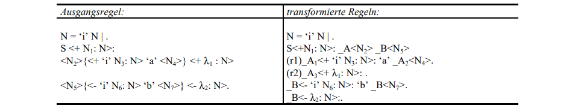

Example specification. The unique indexing of the affixes in Table 4-1 serves only to track their positioning after the transformation. _λ_ symbolises the empty word. (r1) and (r2) denote two rules uniquely, and some indices on hyper-nonterminals are used to uniquely distinguish different occurrences of the hyper-non-terminal _A_.

----
TYPE
    SymOccDesc = RECORD
        SymInd,
        RuleInd: INTEGER;
        Nont: EAG.Nont;
        AffOcc: EAG.ScopeDesc;
        Next: INTEGER;
    END;

    OpenSymOcc = POINTER TO ARRAY OF SymOccDesc;

VAR
    SymOcc: OpenSymOcc;
----

// -------------------------------------------------------------------------------
// Page 21

.Illustration of the connection between SOAG and EAG data structure
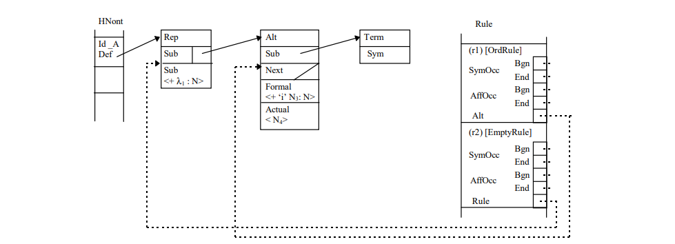

The field `SymOcc` contains all symbol occurrences that occur in the transformed rules of the specification. `SymInd` is an index into the field `Sym`. `Nont` refers to the HyperNonterminal of the output data structure of the module EAG. As in the previous type declaration, the RECORD field `AffOcc` refers to the affix parameters belonging to the hyper-non-terminal.  affix parameters belonging to the hyper-non-terminal. The RECORD field `Next` points to the next occurrence of the same hyper non-terminal. `Next` is used to form a list of all occurrences of a hyper-non-terminal in all rules. are formed.

----
TYPE
    AffOccDesc = RECORD
        ParamBufInd,
        SymOccInd: INTEGER;
        AffOccNum: RECORD
            InRule,
            InSym: INTEGER;
        END
    END;
    
    OpenAffOcc = POINTER TO ARRAY OF AffOccDesc;

VAR
    AffOcc: OpenAffOcc;
----

The affix parameters of a hyper non-terminal are stored in the `AffOcc` field. Each field entry contains a reference to the affix form through the index `ParamBufInd`, which refers to the field `ParamBuf` of the module `EAG`. `SymOccInd` refers to the occurrence of the symbol in the field `SymOcc`. coordinates of the affix parameter with respect to its rule, in which it is contained, and with respect to the hyper-non-terminal, which it parameterises, are declared.

// -------------------------------------------------------------------------------
// Page 22

.Illustration of the data structure of the SOAG evaluator generator
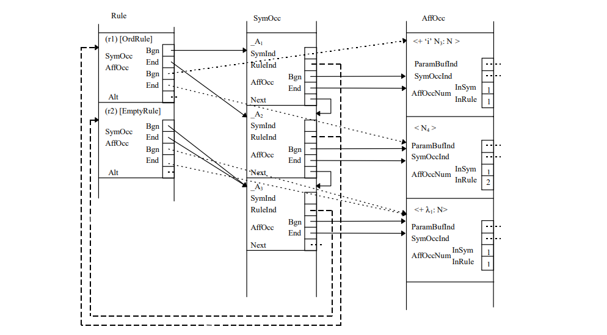

----
TYPE
    SymDesc = RECORD
        FirstOcc,
        MaxPart: INTEGER;
        AffPos: EAG.ScopeDesc;
    END;

    OpenSym = POINTER TO ARRAY OF SymDesc;
    OpenPart = POINTER TO ARRAY OF INTEGER;
    OpenDefAffOcc = POINTER TO ARRAY OF INTEGER;
    OpenAffixApplCnt = POINTER TO ARRAY OF INTEGER;

VAR
    Sym: OpenSym;
    PartNum: OpenPartNum;
    DefAffOcc: OpenDefAffOcc;
    AffixApplCnt: OpenAffixApplCnt;
----

The field `Sym` exists in parallel with the field `HNont` and contains an anchor in `FirstOcc` that refers to a list of all occurrences of a hyper-nonterminal in the structure described above. `AffPos` refers to an area in the `PartNum` field that will hold all partition numbers of the hyper-nonterminal's Affix positions belonging to the hyper non-terminal. `MaxPart` takes the maximum partition number of the symbol. Both elements are not calculated until the SOAGPartition module. 

The field `DefAffOcc` is parallel to `EAG`. `Var` and takes for each affix variable the index of the affix parameter that contains the defining affix of the affix variable. 

The `AffixApplCnt` field contains for each affix variable the number of its applications in syntheses and comparisons. It is used in the `SOAGGen` module to calculate the lifetime of affix variables. Its content is calculated in the `  `SOAGPartition` module.

// -------------------------------------------------------------------------------
// Page 23

----
VAR
    NextSym,
    NextPartNum,
    NextRule,
    NextSymOcc,
    NextAffOcc,
    NextVS,
    NextDefAffOcc,
    NextAffixApplCnt: INTEGER;
----

All variables of the form `NextFieldname` refer to the next free field entry of the respective field. 
(This implementation principle was also used in the `EAG` module).

=== Implementation

Please note that the links below are targeting the actual implementation in D, the original implementation referenced in the original German version was done in Modual-2.

- link:https://github.com/linkrope/epsilon/blob/v0.2.1/src/soag/eSOAG.d[src/soag/eSOAG.d]

// -------------------------------------------------------------------------------
// Page 29

== Determination of affix partitions

The theory presented in this chapter for the calculation of affix partitions is essentially based on the work of Kröplin and Kannapin <<KröpKann>>. Only some adaptations to the terminology of the terminology used for the EAGs.

=== Multi-visit EAGs

In this section, multi-visit EAGs are defined using the orientations suggested by Kastens <<Kastens>>. orientations. For later modification, the OEAG method is reconstructed.

A visit of a tree starts and ends at the root _r_ and consists in between of an arbitrary sequence of visits of the subtrees whose roots are sons of _r_. A family of ordered partitions _(A~1~(X),...,A~n(X)~(X))_ for _X_ ∈ _HN_ with n  _(X)_ ≥ _0_ is _visit-correct_ if and only if for each derivation tree _t_ the values of all affix parameter instances in _n(S)_ visits of _t_ can be computed, where at the _i_-th visit of each subtree whose root is marked with _X_, exactly the corresponding instances of the affix parameters _A~i~(X)_ are evaluated. Thus an EAG for which there is such a visit-correct family of partitions, is a _("simple") multi-visit EAG_.

In order to have at least one constructive criterion for deciding whether a given family of partitions is is visit-correct, an equivalent characterisation of multi-visit EAGs is given below. is given. Instead of specifying evaluation orders by total orders on _A(X)_ , the more appropriate concept of orientations is used. more appropriate concept of orientations is used, where an order is determined only between each inherited and each synthesised affix position. An _orientation_ of the symmetric product _A*B_ = _(A×B)_ ∪ _(B×A)_ for sets _A_ and _B_ is a relation _R_ ⊆ _A*B_, where for each _a_ ∈ _A_ and _b_ ∈ _B_. either _(a,b)_ ∈ _R_ or _(b,a)_ ∈ _R_ holds. In the following, a bijection between the _canonical partitions_ _(A~1~(X),...,A~n(X)~(X))_ of _A(X)_ where each _A~i~(X)_ is an inherited affix for _1≤i<n(X)_, and for _1<i≤n(X)_ a synthesised affix position, and the corresponding acyclic orientations of _I(X)_ * _S(X)_.

Definition 5-1 (_acyclic orientation_)::
Let (A1(X),...,An(X)(X)) be an ordered partition of A(X) for X ∈ HN. Then +
        DS(X) = {_(a,b)_ ∈ _I(X)_ × _S(X)_: _a_ ∈ _Ai(X)_ and _b_ ∈ _Aj(X)_ for _i_ ≤ _j_} ∪ 
                {_(b,a)_ ∈ _S(X)_ × _I(X)_: _a_ ∈ _Ai(X)_ and _b_ ∈ _Aj(X)_ for _i_ > _j_} +
the corresponding (acyclic) orientation of I(X) * S(X).

Definition 5-2 (Construction of a partition)::
Let DS(X) be an acyclic orientation of I(X) * S(X) for X ∈ HN. To this end, inductively the set +
_B_~0~(X) = ∅, +
_B_~1~(X) = { _a_ ∈ _S_(_X_): there is no (_a_,_b_) ∈ _DS_(_X_)}, +
_B_~_i_+1~(X) = { _a_: for all (_a_,_b_) ∈ _DS_(_X_) there is _b_ ∈ _B~i~_(_X_) } +
is defined. Then there is a smallest number _n_(_X_) for which _B_~2n(_X_)~(_X_) = _A_(_X_) holds, and with +
_A_~i~(_X_) = _B_~2(_n_(_X_)-_i_+1)~(_X_) / _B_~2(_n_(_X_)-_i_)~(_X_), (_A_~1~(_X_),...,_A_~_n_(_X_)~(_X_)) is the associated ordered partition of A(X).

For the construction of the associated partition of A(X), the following always applies +
_A_~_i_~(_X_) ∩ _I_(_X_) = _B_~2(_n_(_X_)-_i_+1)~(_X_) \ _B_~2(_n_(_X_)-_i_)+1~(_X_) +
_A_~_i_~(_X_) ∩ _I_(_X_) = _B_~2(_n_(_X_)-_i_)+1~(_X_) \ _B_~2(_n_(_X_)-_i_)~(_X_), 

even if _DS(X)_ as below is only the transitive closure of a subset of an acyclic orientation _I(X) * S(X)_. In this case, _(A~1~(X), ..., A~n(X)~(X))_ is called the _box partition belonging_ to _DS(X)_,  which is characterized by the fact that in a partition as short as possible each affix position is arranged as late as possible ("lazy"). ("lazy") in the shortest possible partition. The corresponding orientation is then called _box completion_. 

It is easy to see that an EAG is a multi-visit EAG exactly if for every _X_ ∈ _HN_ there is an orientation _DS(X)_ of _I(X) * S(X)_ such that the extended dependencies.  

_D^-1^_ ∪ {_(a^(r,i)^, b^(r,i)^)_: _(a,b)_ ∈ _DS(X^r^~i~)_}

// -------------------------------------------------------------------------------
// Page 30

are acyclic. Thus, the decision problem of whether a given EAG is a multi-visit EAG is in NP, and furthermore Engelfriet and Filé have shown for attribute grammars <<EngFil>> that this problem is NP-complete.

However, from the dependencies _D^-1^_, we can efficiently read a necessary condition that every visit-correct family of partitions must satisfy. For this purpose, all direct and resulting indirect dependencies between affix parameters of a symbol occurrence are transferred to all corresponding affix parameters of the same symbol.

Definition 5-3 (_induced dependencies_)::
Let _DP_ be a relation on affix parameters. Then the induced dependencies are defined as the smallest relation defined as 
_ind(DP)_ = _DP_ ∪ {_(a^(q,j)^, b^(q,j)^)_: _(a^(r,i)^, b ^(r,i)^)_ ∈ _ind_(_DP_)+  for _X^r^~i~ = X^q^~j~_} 
is satisfied, where _R^+^_ denotes the transitive closure of a relation _R_. 

The induced dependences _IDP_ = _ind(D^-1^)_ reflect not only transitive dependences to the derivation trees, but also such arrangements, which result compellingly from the abstraction from the context of the symbols. The projection of _IDP_ onto _A(X)_ is denoted by _IDS(X)_, i.e. 

_IDS(X)_ = {_(a,b)_ :(_a_^(_r,i_)^, _b_^(_r,i_)^) ∈ _IDP_ for _X^r^~i~_ = X}, 

and for any visit-correct family of partitions with associated orientations _DS(X)_, it follows that 

_IDS(X)_ ∩ _(I(X) * S(X))_ ⊆ _DS(X)_. 

Furthermore, for any multi-visit EAG IDP is acyclic. If this is the case, then for any _X_ ∈ _HN_, _IDS(X)_ is the transitive closure of a subset of an acyclic orientation of _I(X) * S(X)_. 

From the given necessary condition, Kastens has determined in <<Kastens>> a subclass of multi-visit AGs for which a visit-correct family of partitions can be computed efficiently, and which is also very easily, as shown by Kutza <<Kutza>>, can be applied to EAGs. An EAG is exactly if _IDP_ is acyclic and the family of box partitions belonging to _IDS(X)_ is visit-correct.

=== Sequentially orientable EAGs

In the following, the OEAG method will now be modified to systematically determine larger subclasses of the multi-visit EAGs.

The weakness of the OEAG method is that the partitions from _IDS(X)_ for _X_ ∈ _HN_ are determined independently of each other. To remedy this, Kastens in <<KaHuZi>> therefore outlined a more "careful" procedure, in which the family of partitions is formed symbol-wise and new induced dependencies are taken into account, which result from already determined partitions. Those multi-visit AGs for which this sequential procedure is successful are called "automatically arranged orderly". This approach of Kastens mainly makes a statement about the order of the symbols in the determination of a partition. This influence of the order will be in the foreground of the following the foreground of the further investigations.

// -------------------------------------------------------------------------------
// Page 31

The example of an EAG shown in Figure 5-1 combines in two rules the dependencies of a "leftto-right threading" (a) and a "right-to-left threading" (b). According to Reps and Teitelbaum [RepTei] illustrate multi-visit AGs corresponding to this type of EAGs illustrate a practically relevant constellation in which the OAG procedure, and hence the OEAG procedure, fails. Since there is only one symbol in this case, the sequential method cannot be successful either. At this point the superiority of the _concept of orientations_. Every ordered partition of the set {_(X, {a}_*{b}): _a_ ∈ _I(X)_ and _b_ ∈ _S(X)_ for  _X_ ∈ _HN_} is an orientation sequence. An orientation sequence (C1,...,Cm) is trivial if _m_ = 1 holds, and _elementary_ if each set _C~j~_ contains only exactly one pair.

Definition 5-4 (_immediately successful orientation sequence_)::
Let _(C~1~,...,C~m~)_ be an orientation sequence, then it is inductively defined as follows: initially holds _IDP~0~_ = _IDP_. For acyclic _IDP~j-1~_ with the partitions belonging to the boxes of {_(a,b)_ : _(a^(r,i)^ , b^(r,i)^)_ ∈ _IDP~j-1~_ for _X^r^~i~_ = X} belonging to orientations _DS~j~(X)_ of _I(X) * S(X)_ holds. +
 +
_IDP~j~_ = _ind(IDP~j-1~_ ∪ {(_a_^(_r,i_)^, b^(r,i)^): (_a,b_) ∈ _DS~j~(X)_ for (_X_, {_a_}*{_b_}) ∈ _C~j~_}). +
 +
Thus, the orientation sequence is immediately successful if each _IDP~j~_ is acyclic for 0 ≤ _j_ ≤ _m_. In this case, the projections of _IDP~m~_ onto _A(X)_, i.e. +
 +
_DS(X)_ = {(_a,b_) :(_a_^(_r,i_)^, _b_^(_r,i_)^) ∈ _IDP~m~_ for _X^r^~i~_ = X}, +
 +
acyclic orientations of _I(X) * S(X)_, and the family of associated partitions is visit-correct.

Clearly, an EAG is an OEAG if and only if the trivial orientation order is immediately is successful. Furthermore, then every orientation order is immediately successful, and it is easy to to see that for each _DS~j~_(_X_) the box partition coincides with the box partition of _IDS_(_X_). So, for each orientation order, the same visit-correct family of partitions is determined as in the OEAG procedure. In general, for any immediately successful orientation sequence, any finer orientation sequence in which each _C~j~_ is replaced by any ordered partition, is immediately successful. 

The "more careful" procedure outlined by Kastens can now be characterized by the fact that for a fixed order (X1,...,Xm) of symbols the orientation order (_C~1~,...,C~m~_) with _C~j~_ = {(_X~j~_, {_a_}*{_b_}): _a_ ∈ _I_(_X~j~_) and _b_ ∈ _S_(_X~j~_)} is immediately successful. This is a symbol-wise orientation order, which is uniquely determined by the order of symbols.

Definition 5-5 (_successful orientation sequence_)::
Let (_C~1~,...,C~m~_) now be an elementary orientation sequence and let _IDP~j~_ and _DS~j~_(_X_) be defined as before However, if _IDP~j~_ is cyclic, then instead it is defined with inverse dependencies: +
 +
_IDP~j~_ = _ind_(_IDP_~_j_-1~ ∪ {(_b^(r,i)^_, _a^(r,i)^_): (_a,b_) ∈ _DS~j~_(_X~j~_) for (_X^r^~i~_, {_a_}*{_b_}) = _C~j~_}). +
 +
The orientation sequence is _successful_ if again every _IDP~j~_ is acyclic for 0 ≤ _j_ ≤ _m_. 

Obviously, any elementary orientation sequence that is immediately successful is successful,and so for any OEAG, any elementary orientation sequence is successful. Since the first alternative is always acyclic, we get the same visit-correct family of partitions as for the OEAG-

."left-to-right threading" (a) and a "right-to-left threading" (b)
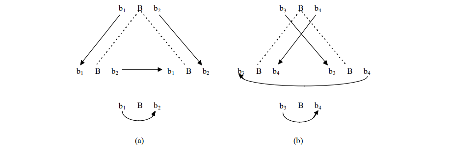

// -------------------------------------------------------------------------------
// Page 32

Procedures. On the other hand, it is easy to see that there are EAGs with successful orientation sequences, for which no orientation sequence is already directly successful.

An EAG is a _sequentially orientable_ EAG (SOEAG) if there is a successful orientation sequence. orientation sequence exists. Thus, of course, every OEAG is a SOEAG, and every SOEAG is a multivisit EAG.

=== Two heuristic subclasses of SOEAGs.

Since the decision problem whether an EAG is a SOEAG is NP-complete, the implementation of a implementation of a SOEAG evaluator generator does not seem advisable. Instead, two useful heuristic subclasses of SOEAGs are presented, which are defined constructively, i.e., an algorithm for computing the orientation order is given and thus the subclass is defined.

Starting from the OEAG method, considerations of easy and efficient implementability hardly allow any other reasonable decision than with respect to the pursued orientation strategy in principle symbol-wise, namely in an arbitrary ad hoc order (_X~1~,...,X~k~_) of the symbols _X_∈ _HN_. To this end, the following two degrees of refinement of increasing power are conceivable:

1. the orientation order (_C~1~,...,C~m~_) with _C~j~_ = {(_X_, {_a_}*{_b_}): _a_ ∈ _I_(_X_) and _b_ ∈ _S_(_X_) for _X_ ∈ _HN_} is refined to an elementary refined one, i.e., for each symbol _X~i~_ a partition of one-element sets is formed. Each of these sets is assigned to a _C~j~_ in ascending order. The success of each orientation is immediately checked. However, in case of failures, backtracking is omitted for efficiency reasons. Only the immediate success of one ad hoc order per symbol is checked instead of all its permutations. are checked. This approach is called the (ad hoc) ESO method (ad hoc elementary symbol sequentially orienting) and approximates the first heuristic grammar subclass to be presented.

2. the same strategy is slightly more complicated to implement when checking for a successful rather than an immediately successful orientation sequence. This may require the undoing of extensions in the dependency graph of the affix parameters of a rule, which in the worst case leads to an increased effort. This procedure is called (ad hoc) ESOB procedure (ad hoc elementary symbol sequentially orienting with local backtracking) and describes by construction the second, more powerful grammar subclass.

It should be emphasized again that, given a multi-visit EAG that is not ordered, the successful generation of an evaluator depends on the ad hoc chosen orders _and_ the fineness of the procedure. If one procedure fails, then a procedure proceeding with the same order can be more finely, but also a different order can lead to the successful generation of an evaluator. In any case all procedures on OEAGen are successful.

It is easy to see that an implementation for the approximation of the second more powerful grammar subclass would also compute the grammars of the first subclass. In the revised version of <<KröpKann>>, the two grammar subclasses, as well as the two procedures describing them constructively ESO and ESOB, are no longer explicitly mentioned. Instead, only a SOAGen or SOEAGen _approximating_ procedure. I agree with this point of view and will from now on only speak of one method without referencing the two grammar subclasses mentioned.

=== Dynamic transitive envelope

The dependencies between the affix parameters of a rule induced by the affix forms are held in the data structure TDP. This data structure is also used to store the transitive closed intermediate results IDPj+ where at the j-th orientation step IDPj+ is calculated from IDPj-1+ is calculated in situ. The data structure TDP is implemented in the present evaluator generator in the module SOAG as a data element of the data structure RuleDesc in the field Rule.

For the expenditure of the approximating procedure for the generation of SOEAG evaluators is formative the algorithm used for the transitive extension of the relation TDP, whereby always only dependencies between affix parameters of the same rule. In the following, in formal notation, an efficient algorithm of Ibaraki and Katoh for the incremental transitive closure of a monotonically growing relation is presented.  

// -------------------------------------------------------------------------------
// Page 33

Definition 5-6 (_incremental transitive closure_)::
Let _S_ be a finite set and _R_ ∪ {(_u,v_)} ⊆ _S^2^_. Then the operators + and * are given by +
[grid="none", frame="none", cols=">5,1,<9"]
|===
|∅^+^| = |∅
|(_R_ ∪ {(_u,v_)})+| = | _R^+^_ ∪ {_x_ : _x R* u_} _×_ {_y_ : _v R* y_} and 
|_R_^*^ | = | _R^+^_ ∪ {(_x,x_) : _x_ ∈ _S_}.
|===

It can be seen immediately that _R_ ∪{(_u,v_)}+ from _R+_ with the effort _O_(|_S_|^2^) can be determined. It is now, related to _R_ and (_u,v_), special predecessor and successor sets

_P~R~_(_u,v_) = {_x_ : _x R^*^ u_, but not _x R^+^ v_} and

_S~R~_(_u,v_) = {_x_ : _v_ _R_+ _x_, but not _u R^+^ x_}

is introduced. Thus, first tightening

(_R_ ∪ {(_u,v_)})+ = _R^+^_ ∪ _P~R~_(_u,v_) × {_y_ : _v R* y_},  (1)

and Ibaraki and Katoh show in <<IbaKat>> that such is the transitive extension of the initial relation R+ by successively adding q (new) relations (_u,v_) ∈ _S^2^_ cumulatively requires only an overhead of _O_(|_S_|^3^) is required. This can even be improved to _O_(_q_⋅|_S_|), as can be shown without difficulty. The key idea is that each newly added relation requires only |_S_|- instead of |_S_|^2^ -times. Consequently, the relation _R+_, starting at ∅, can be incrementally built up in _O_(|_S_|⋅|_R^+^_|) can be constructed. 

Similarly, it is easy to show that the asymmetric algorithm (1) of Ibaraki and Katoh can be further extended to the symmetric algorithm 

(_R_ ∪ {(_u,v_)})+ = _R^+^_ ∪ _P~R~_(_u,v_) × _S~R~_(_u,v_). 

can be tightened. However, this improvement remains without consequence in the cumulative effort. 

When the inductive computational scheme is transformed into a program, where the in question relation R+ is represented by an adjacency matrix, it is to be paid attention, the determination of the successor set _S~R~_(_u,v_), which requires the overhead θ(|_S_|), to be extracted so that the enumeration of _P~R~_(_u,v_) × _S~R~_(_u,v_) does not require effort θ(|_S_|_2_) to formulate. 

The transitive extension of the relation _TDP_ is implemented in the `SOAGPartition`  module in the procedure `AddTDPTrans` implemented. In the first loop of the procedure, the list `NUV` is used to determine the successor set _S~R~_(_u,v_) is determined. The successor set can be implemented as a list, because each node is added at most once.  is added. In the second loop the enumeration of the relation _P~R~_(_u,v_) × _S~R~_(_u,v_) takes place, which forms the transitive termination in _TDP_. As required, both loops are not interleaved in order to comply with the effort described above.

=== Dynamic topological sorting

In this section, we present an algorithm that attempts to specify a successful orientation order in a single topological sort per symbol attempts to specify a successful orientation order. 

Considering _TDP_ = _IDP_~_k_-1~^+^ then for _X_ ∈ _HN_ the projections are 

_DS_(_X_) = { (_a,b_) ∈ _I_(_X_) * _S_(_X_) : (_a^(r,i)^_}, _b_^(_r,i_)^) ∈ _TDP_ for _X^r^~i~_=X}

in each case subset of an (acyclic) orientation of _I_(_X_) * _S_(_X_), which makes it a complete(acyclic) orientation to be extended. (This formulation of _DS_(_X_), which in contrast to the definition of section 5.1, proves to be more convenient for the algorithm to be developed).algorithm to be developed). In principle, these extensions are made symbol-wise, which is why in the following the consideration of a fixed _X_ ∈ _HN_ suffices. As already indicated, it is proceeded in such a way that in the case of a given OEAG orientations result which are box completions of _IDS_(_X_) for _X_ ∈ _HN_. Obviously, the starting point is therefore the technique related to topological sorting. technique for determining the box completions of the above projection _DS_(_X_). We perform for the _X_ ∈ _HN_ in question, we first introduce the following symmetric relation unor ⊆ _I_(_X_) * _S_(_X_), which contains the fraction of affix-pairs from _I_(_X_) * _S_(_X_) that is still to be oriented:

_a unor b_ ⇔ _DS_(_X_) ∪ ({_a_} * {_b_}) = ∅.

Setting an evaluation order between two affix positions _a,b_ ∈ _A_(_X_) with _a unor b_, and this with the preference to compute _a after b_, is abstractly described as a procedure call _orient_(_a,b,X, new_) with the

// -------------------------------------------------------------------------------
// Page 34

output parameter _new_ is formulated. In the following sketch of the effect of a call _orient_(_a,b,X, new_) one can see the retraction of the dependency (_b, a_) in favor of (_a, b_) can be seen, if a cycle is created by (_b, a_). arises.

_TDP'_ := _TDP_;

_TDP_ := _ind_(_TDP'_ ∪ {(_b_^(_r,i_)^,_a_^(_r,i_)^): _X^r^~i~_=_X_ })^+^;

IF _TDP_ cyclic THEN

_TDP_ := _ind_(_TDP'_ ∪ {(_a_^(_r,i_)^,_b_^(_r,i_)^): _X^r^~i~_=_X_ })^+^;

IF _TDP_ cyclic THEN HALT END

END;

_new_ := {(_a,b_) ∈ _I_(_X_) * _S_(_X_): (_a_^(_r,i_)^,_b_^(_r,i_)^) ∈ _TDP_ \ _TDP'_ for an _X^r^~i~_=_X_ }

After termination obviously holds   

_new_ ∪ _DS_(_X_) = { (_a,b_) ∈ _I_(_X_) * _S_(_X_): (_a_^(_r,i_)^,_b_^(_r,i_)^) ∈ _TDP_ for an _X^r^~i~_=_X_ }.

It is clear that eventually _new_ contains not only either (_b,a_) or (_a,b_), but also possibly other new induced evaluation sequences projected onto _A_(_X_). To track _TDP_, the relation _DS_(_X_) has to be extended accordingly by these new dependencies _new_, which in turn has repercussions on the topological sorting process. on the topological sorting process of _DS_(_X_). The intended algorithm can thus be characterized as a dynamic topological sorting of the projection _DS_(_X_), interleaved with the calculation of _TDP_ and the computation of _TDP_ and the checking of cycles.

To derive the algorithm, a key intermediate result is described below: Let j ≥ 0 such that the computation of the quantities ∅ = _B~0~_(_X_) ⊆ _B~1~_(_X_) ⊆ ... ⊆ _B~2n(X)~_(_X_)=_A_(_X_) has already been completed up to and including _B~j~_(_X_), since these sets initially have the properties

_B~0~_(_X_) = ∅,

_B~1~_(_X_) = { _a_ ∈ _S_(_X_): there is no (_a,b_) ∈ _DS_(_X_)} 

and for _i_ < _j_

_B~i+1~_(_X_) = { _a_: for all (_a,b_) ∈ _DS_(_X_) holds _b_ ∈ _B~i~_(_X_) }

and since, moreover, because of the validity of

{_b_: _a unor b_} = ∅ for all _a_ ∈ _B~j~_(_X_) (2)

acyclic expansions of _DS_(_X_) remain without influence on the validity of these invariants. The set variable

_cur_ = { _a_ ∈ _A_(_X_) \ _B~i~_(_X_): for all (_a,b_) ∈ _DS_(_X_) _b_ ∈ _B~j~_(_X_) holds } (3)

contains candidates for affixes new in _B~j+1~_(_X_) with respect to _B~j~_(_X_). (The computation of the sets _B~i~_(_X_) and also of _n_(_X_) is done only implicitly). Obviously now the validity of 

{_b_: _a unor b_} = ∅ for all _a_ ∈ _cur_

and consequently

{_b_: _a unor b_} = ∅ for all _a_ ∈ _B~j+1~_(_X_) (4)

in that for each affix position _a_ ∈ _cur_, for which evaluation sequences with respect to
affix positions _b_ are unknown, these are now determined, whereby in each case the order to evaluate _a after b_ is preferred.

Therefore, if we consider at this point (_a,b_) with _a_ ∈ _cur_ and _a unor b_ and extend _TDP_ by means of a call _orient_(_a,b,X, new_), then one has to investigate how the given invariants can be obtained if now _DS_(_X_) is successively extended by the new relations (_c,d_) ∈ _new_. Along with the statement

_DS_(_X_) := _DS_(_X_) ∪ {(_c,d_)}

goes first the correction of the relation unor according to the definition by

_unor_ := _unor_ \ ({_c_}*{_d_}).

Now, because of (2), it is clear that _DS_(_X_) restricted to attributes from _B~j~_(_X_) ∪ _cur_ is already an orientation, and (_c,d_) furthermore extends _DS_(_X_) acyclically. Therefore, it follows immediately that _c,d_ ∉ _B~j~_(_X_) and |{_c,d_} ∪ _cur_ | ≤ 1 holds. The invariant (3), violated only in the case _c_ ∈ _cur_, thus requires to remove _c_ from _cur_.

// -------------------------------------------------------------------------------
// Page 35

When extending _DS_(_X_) by all new dependencies (_c,d_) ∈ _new_, either (_b,a_) or (_a,b_) is included in _DS_(_X_) so that in any case _a unor b_ is no longer valid; if (_a,b_) was included, then even a ∉_B~j+1~_(_X_). Thus, after treating all _a, b_ with _a unor b_, _cur_ = _B~j+1~_(_X_) \ _B~j~_(_X_), and it is true that in fact (4). 

Now _j_ is (implicitly) increased and again (3) is ensured. This is done by a statement 

_cur_ := _leaves_ 

where the new quantities are defined as follows: 

_leaves_ = { _a_ ∈ _A_(_X_) \ (_B~j~_(_X_) ∪ _cur_): _deg_(_a_)=0 }, 

_deg_(_a_)=|_DS_(_X_)(_a_) \ _B~j~_(_X_)| for all _a_ ∈ _A_(_X_). 

How _deg_ and _leaves_ can be efficiently carried along is described in more detail in section <<Implementation details>> in more detail.

=== Implementation details

At the beginning of every partition determination, all direct dependencies between the affix parameters of a rule _r_ must be entered in the dependency graph `SOAG.Rule[_r_]`. `TDP` this is done for all rules by the procedure `ComputeDP`. If an affix is used in the affix form of an applying affix parameter, the affix depends directly on the defining affix parameter, which contains the defining affix of the same name. Before determining the dependencies in a rule context, each affix occurring in the rule must be assigned to the affix parameter in whose affix form it occurs. must be assigned to each normally occurring affix. This assignment is done by the procedure `SetAffOccforVars` in the module-global field `VarBuf`, which contains the following data structure for each affix of a rule

----
TYPE
    VarBufDesc = RECORD
        AffOcc, Sym,
        Num, VarInd: INTEGER
    END;
    OpenVarBuf = POINTER TO ARRAY OF VarBufDesc;

VAR
    VarBuf: OpenVarBuf;
    NextVarBuf: INTEGER;
----

The `VarBuf` field is cleared and reused for each rule, since the information it contains will not be needed later. is no longer needed.

For explaining the dependencies of an applying affix parameter, for each affix it contains the affix parameter of its defining affix must be known. The procedure `ComputeDefAffOcc` calculates for each affix variable of the current rule in the `SOAG.DefAffOcc` field, which is parallel to `EAG.Var`, the Affix parameter in which the defining affix of the affix variable is located. This is done by linear search in the `VarBuf` field. If no defining affix is found, a violation of the link-definiteness condition is present; an error message and the position of the undefined affix are output and the program is aborted.

The procedure `ComputeAffixApplCnt` calculates for all affix variables the number of their applications in syntheses and comparisons. For this purpose the field `VarBuf` is searched linearly and for non-defining affixes and affixes in applying affix parameters, the value in the `AffixApplCnt` field is incremented accordingly. Additionally, for all comparisons to be performed in a rule r, edges are added to the data structure `SOAG.Rule[_r_]`. `DP`. These dependencies are not really present, but refer from affix parameters with defining affixes to affix parameters with affixes of the same name or affixes with the same name negated by "_#_". This additional information is used later in the optimization of the storage of affix variables. Before applying the procedure `ComputeAffixApplCnt` procedure, the `SOAG.DefAffOcc` data structure for the current rule must have been completely calculated for the current rule.

After calculating the `SOAG.DefAffOcc` field, all direct dependencies are added to the dependency structure using the procedure `AddTDPTrans` into the dependency graph and the transitive completion is formed. All dependencies determined by `AddTDPTrans` are additionally stored by entry into the cellar memory

// -------------------------------------------------------------------------------
// Page 36

`MarkedEdges` marked. In parallel to the calculation of _TDP_, all direct dependencies of a rule _r_ are dependencies of a rule _r_ are entered into the data structure `SOAG.Rule[_r_]`. `DP`.

In the procedure `ComputeInducedTDP` all marked edges are successively removed from the cellar memory `MarkedEdges`. For each marked edge all transitive dependencies are computed and added to the dependency graph if they were not already included. All newly entered edges will be marked by adding them to the basement memory `MarkedEdges`. This procedure is repeated until the basement memory is empty. The termination of the loop is guaranteed by the finiteness of the transitive closure of a dependency graph.

The procedure `orient` implements the abstract procedure _orient_ introduced in Section 5.5 "Dynamic topological sorting". abstract procedure orient. If the orientation of two affix positions in _TDP_ results in a cycle, then all previous extensions of _TDP_ must be undone before inserting the reverse dependency. must be undone before inserting the reverse dependency. For this the module-global variable ´`phase` must be set to `dynTopSort`. If this is the case, then during the transitive completion in AddTDPTrans by the procedure `AddTDPChange` in the ´ChangeBuf` field with the structure

----
TYPE
ChangeBufDesc = RECORD
RuleInd,
AffOccInd1,
AffOccInd2: INTEGER;
END;
OpenChangeBuf: POINTER TO ARRAY OF ChangeBufDesc;
VAR
ChangeBuf: OpenChangeBuf;
NextChangeBuf: INTEGER;
----

all changes of the _TDP_ are recorded. These extensions can then be undone by the procedure `ResetTDPChanges` procedure. The set new returned by _orient_ is implemented in the variable `New` as a set of type `BSets`. Each entry in this set results in a pair of affix items:

`_first element_ = _set entry DIV Separator_`

`_second element_ = _set entry MOD separator_`

The `separator` is calculated in the procedure `DynTopSort`. 

The procedure `DynTopSortSym` implements the procedure for topological sorting motivated in section 5.5 "Dynamic topological sorting". for the topological sorting of the affix position dependencies of a symbol under the following conditions approaching a successful or immediately successful orientation. The algorithm starts with the initialization of the data structure `DS`.
----
TYPE
    DS: POINTER TO ARRAY OF INTEGER;
----
It realizes for a symbol _X_ the set of acyclic orientations _DS_(_X_). Furthermore, since _DS_(_X_) ∩ _unor_ holds, the relation _unor_ is additionally integrated in the data structure `DS`. Since the orientations for all symbols independently and successively, the data structure `DS` can be reused for each symbol. can be reused for each symbol. For an entry in the field `DS` thus applies

`DS[a][b] = element` ⇔ (a, b) ∈ _DS_(_X_) +
`DS[a][b] = nil` ⇒ (a, b) ∉ _DS_(_X_) +
`DS[a][b] = unor` ⇔ a _unor_ b

During the computation of the relation _unor_, the field `Deg` is filled simultaneously, which contains for each affix positionc of the current symbol.

Then, the two sets cur and leave are initialized, which are `cur` and `leave` from Section 5.5 "Dynamic topological sorting". Both sets are of type `ASets` in order to be able to delete elements with a constant effort.

The actual topological sorting process is controlled by a REPEAT loop, which is executed until all is executed until all affix positions of the current symbol are assigned to a partition set. This condition occurs when the set `Cur` is empty, which corresponds to the termination condition of the loop. By

// -------------------------------------------------------------------------------
// Page 37

the use of a REPEAT loop, the loop is run at least once, even if `Cur` is empty after initialization. After initialization `Cur` can be empty exactly if there are no synthesized- but only inherited- values in the partition _A~n(X)_~(_X_) of a symbol _X_ there are no synthesized but only inherited affix positions, i.e. _B~1~_(_X_) is empty.

The partition sets computed in the implementation do not correspond completely to the theoretically produced reasons, the partition sets calculated in the implementation do not quite correspond to the theoretically derived ones. For the partition sets calculated in the implementation partition sets _A^I^~j~_(_X_) holds:

_A^I^~j~_(_X_) = _B~j~_(_X_) \ _B~j-1~_(_X_),

and the derived partition sets then result from

_A~i~_(_X_) = _A^I^_~2(_n_(_X_)-_i_+1)~(_X_) ∪ _A^I^_~2(_n_(_X_)-_i_)+1~(_X_) with

_A^I^_~2(_n_(_X_)-_i_+1)~(_X_) = _A~i~_(_X_) ∩ _I_(_X_) and

_A^I^_~2(_n_(_X_)-_i_+1)~(_X_) = _A~i~_(_X_) ∩ _S_(_X_).

Thus, the computed partition sets alternately contain only inherited or synthesized affixes.However, this does not further limit the implemented algorithm, since the sought partition sets, can be derived very easily, as stated above. In the following the partition sets are always the implementation-related partition sets are meant as partition sets. 

In each loop pass in `Cur` implicitly exactly one partition set of the searched affix partition is calculated. All elements of the set `Cur` are potential candidates for this set. Since the affix positions in the set `Cur` are to be examined in an arbitrary, but fixed order, they are computed before the second loop, which contains the orientation call `Orient`, they are transferred to the list `LastCur`. The order of the elements is fixed. This is necessary, since due to the implementation of the set type `ASets`, changes in the sequence can result from deleting elements.

After the orientation of all affix positions in `Cur` resp. the affix positions in _unor_ relation to them, the partition affix positions, the partition number `Part` is incremented by one. All affix positions remaining in the set `Cur` affix positions now belong to a partition set. Each of these affix positions _n_ ∈ `Cur` is stored in the `SOAG.PartNum[_n_]` data structure is assigned the current partition number. All incoming edges that refer to these affix positions are deleted in the `Deg` field by decrementing. If there are no affix positions for one of the affix positions, which originally referred to affix positions from `Cur`, there are no more outgoing edges, so it is included in the `Leave` set.

At the end of the REPEAT loop, `Cur` results from `Leave`, `Leave` is emptied, and the sorting process continues with the calculation of the next partition set until `Cur` is empty.

The membership of an affix position to a partition set is modeled by the partition number in the field `SOAG.PartNum`. After completion of the topological sorting process all affix positions of a partition set of a partition set have the same partition number. 

=== Implementation

Please note that the links below are targeting the actual implementation in D, the original implementation referenced in the original German version was done in Modual-2.

- link:https://github.com/linkrope/epsilon/blob/v0.2.1/src/soag/eSOAGPartition.d[src/soag/eSOAGPartition.d]

// -------------------------------------------------------------------------------
// Page 45 

== Calculation of the visit sequences

This chapter describes how to construct the visit sequences for the evaluator rules of a SOAG.
are constructed.

=== Visit sequences

For each node _k_ of a derivation tree to which the rule _r_ has been applied, the visit sequence _VS~r~_ represents a local traversal rule. It describes the order in which the sons of node _k_ have to be visited and when to ascend to the parent node. Implicit in the visit sequences is the order in which the affix parameters are evaluated, because before each visit of a node, the instances of applying affix parameters needed during the visit must be synthesized. must be synthesized. After the visit, newly calculated instances of defining affix parameters must be must be analyzed. All instances of defining affix parameters of a node _k_ are computed in the upper context of _k_, those of its sons in the lower context of the respective son. From the point of view of node _k_, for the compute these instances, there must be an ascent to the father node or a visit to the son. The instances of defining affix parameters of predicates are computed by calling the predicate. Therefore, the content of visit sequences results in three types of _instructions_:

1. _VISIT_(_X~i~^r^, n_) indicates the _n_-th visit of the symbol occurrence _X~i~_ in rule _r_,
2. _LEAVE_(_n_) indicates the _n_-th ascent to the parent node,
3. _CALL_(_X_) indicates the invocation of a predicate _X_.

To map affix parameters to instructions, the _MAP_VS_ function is defined.

Definition 6-1 (MAP_VS)::
[horizontal]
MAP_VS(a(r,i)) := ::
*_VISIT_(X~i~^r^, n)*, if a^(r,i)^ ∈ AP~D~(r), i>0 and a^(r,i)^ ∈ A~n~(X) with X= X~i~^r^ and X ist a basic nonterminal; or +
*_LEAVE_(n)*, if a^(r,i)^ ∈ AP~D~(r), i=0 and a^(r,i)^ ∈ A~n~(X) with X= X~i~^r^ and X ist a basic nonterminal; or +
*_CALL_(X)*, if a^(r,i)^ ∈ AP~D~(r), i>0 and with X=X~i~^r^ is X a pridcate nonterminal; or +
*_NOP_*, else (no instruction).

The partition (_A~1~_(_X_),...,_A~n(X)_~(_X_)) found for the affix positions of a symbol _X_ shows the order in which the affix positions must be calculated. order the affix positions have to be calculated. If a partition set _A~i~_(_X_) contains more than one affix positions, their order of calculation can be chosen arbitrarily. In the dependency graphs of the rules with symbol occurrences of _X_, additional dependencies between the affix parameters of the symbol occurrence _X_ are entered in such a way that the calculation sequence is thereby manifested. The application of the function _MAP_VS_ to the topologically sorted affix parameters of a rule yields a list of instructions.  of instructions. After adding some final instructions and eliminating duplicate instructions from this list, the result is instructions from this list, the visit sequence of a rule results. 

The visit sequence of an evaluator rule r is constructed as follows: Let _a~1~_^(_r_)^..._a~k~_^(_r_)^ be a topological sorting of the graph (_AP_~(_r_)~,_IDP~m~_(_r_)) with _k_=|_AP_(_r_)| to a orientation sequence (_C~1~_,...,_C~m~_), then the visit sequence _VS~r~_ arises from the sequence

_MAP_VS_(_a~1~_^(_r_)^)... _MAP_VS_(_a~k~_^(_r_)^) _INSTR_(_X~i~^r^_)..._INSTR_(_X^r^~#S(r_)~) _INSTR_(_X~0~^r^_),

where duplicate instructions are deleted.

Definition 6-2 (INSTR)::
[horizontal]
INSTR(X~i~^r^) := ::
*_VISIT_(X~i~^r^)*, n(X)), if i>0 and X~i~^r^=X is a basic non-terminal; or +
*_LEAVE_(n(X))*, if i=0 and X~i~^r^=X is a basic non-terminal; or +
*_CALL_(X)*, if i>0 and X~i~^r^=X is a predicate nonterminal; or +
*_NOP_*, else.

The final instructions ensure that the traversal of the derivation tree is complete and that all affix parameters are calculated. and that all affix parameters are calculated. 

Each visit sequence _VS~r~_ can be divided into _n_(_X_) parts _VS~r~^1^_, ...,_VS~r~^n(X)_^ where _X_=_X~0~^r^_ holds. Each _VS~r~^i^_ ends with _LEAVE_(_i_) and is called a _plan_.

// -------------------------------------------------------------------------------
// Page 46

=== Implementation details

The procedure `ComputeVisitNo` calculates the visit number for each affix position from its affiliation to a partition set whose index is stored in the data structure `SOAG.PartNum`. Since the partition sets are available in reverse order, the following formula results for the calculation of the visit number the following formula 

(_MaxPart_ + 1) DIV 2 - (_PartNum_ + 1) DIV 2 + 1

`MaxPart` is the maximum index of a partition set of a symbol. The calculated visit number is again in the data structure `SOAG.PartNum`, since its content is no longer needed. Since the name and content of the data structure no longer match after the calculation of the visit numbers, the functions `GetVisitNo` and `GetMaxVisitNo` have been defined as interface functions for accessing the `SOAG.PartNum`. The first returns the visit number of an affix parameter, the second the maximum visit number of a symbol occurrence. visit number of a symbol occurrence. Both functions are exported.

The functions `MapVS` and `CompleteTraversal` implement the functions `MAP_VS` and `INV_VS` described in section 6.1 "Visit sequences". `MAP_VS` and _INSTR_ respectively. Both functions return instructions of the type `instruction`, which are defined in the `SOAG`  module.

The function `TopSort` implements the topological sorting of all affix parameters of a rule. It uses The iterative algorithm of K.Mehlhorn is used, as it is described in <<Mehlhorn>>. The two global variables

----
VAR
    InDeg: SOAG.OpenInteger;
    ZeroInDeg: Stacks.Stack;
----

are used to store intermediate results and to control the topological sorting process. `InDeg` contains the number of incoming edges for all affix parameters of the current rule. `ZeroInDeg` contains all affix parameters that have no incoming edges. After initialisation `ZeroInDeg` contains all affix parameters that must be evaluated first. These are removed one after the other from the set `ZeroInDeg` and transferred into the visit sequence using the `MapVS` function. For transferred, the edges that go out from them and go into other affix parameters are deleted for all transferred affix parameters by decrementing the field `InDeg` of the corresponding affix parameter. is decremented. If such an affix parameter also has no more incoming edges, i.e. if the field `InDeg` is zero, it is transferred to the set `ZeroInDeg`, which is implemented as a stack. This is continued until `ZeroInDeg` is empty. The calculated visit sequences for each rule are one after the other in the field `VS` of the module `SOAG`. The beginning and end of the visit sequence of a rule R are contained in the substructure `VS` of the type `EAG.ScopeDesc` of the field element `Rule[R]` in the same module contained. 

In order to retrieve a visit instruction, the functions `GetVisit` and `GetNextVisit` have been defined. They each return the number of the passed visit instruction from the `SOAG.VS` list of a rule and are also exported. rule and are also exported.

=== Hash Table for Elimination of Duplicate Instructions

In order to eliminate duplicate instructions in the visit sequence of an evaluator rule, all instructions are  are additionally entered into a hash table. Before a new instruction is entered into the visit sequence, it is it is checked whether the instruction is already contained in the hash table. If this is the case, the current instruction is discarded, thus avoiding duplicate instruction occurrences.

To determine the access addresses in the hash table, the double hashing procedure was implemented. (double hashing) has been implemented. This involves the use of two hash functions _f_ and _g_ and the following rule for the calculation of a fallback address in case of collision for an element _i_ and a table of the length _m_:

_a~j~_(_i_) = (_f_(_i_) - (_j-1_)*_g_(_i_)) _mod m_

The length of the table is calculated with _m_=_2^k^_ and _k_=_1+log~2~max_{|_AP_(_r_)|: _r_ is evaluator rule} is always fixed to a multiple of 2 and the function _g_ with

_g_ = (_f_(_i_) _div_ 2) * 2 + 1

// -------------------------------------------------------------------------------
// Page 47

always maps to odd numbers. This ensures that the list of alternate addresses is really a permutation. addresses is really a permutation, i.e. the alternate addresses are not repeated. 

With a table load of less than 50%, which is always the case with the above table size, the average collision depths to be expected with equally distributed _f_(i) are, according to <<COMA>> p.90, less than 1.5. The implemented function _f_ does not produce absolutely equally distributed values, but it is sufficient for the required purpose. purpose, so that the average collision depths to be expected are unlikely to be greater than 1.5. 

=== Implementation

Please note that the links below are targeting the actual implementation in D, the original implementation referenced in the original German version was done in Modual-2.

- link:https://github.com/linkrope/epsilon/blob/v0.2.1/src/soag/eSOAGVisitSeq.d[src/soag/eSOAGVisitSeq.Mod]
- link:https://github.com/linkrope/epsilon/blob/v0.2.1/src/soag/eSOAGHash.d[src/soag/eSOAGHash.Mod]

// -------------------------------------------------------------------------------
// Page 52

== Optimisation of affix variable storage

During the evaluation of a decorated derivation tree of an EAG, the instances of all affix positions are computed one after the other in the form of their affix variables and must be available in the memory, as the syntheses of other affix positions can refer to them. The storage of the affix position instances takes up a lot of space, and efforts are therefore being made to find an optimisation for this. 

In the following, the approach of Engelfriet and de Jong is presented. In [EngJong] they present a polynomial algorithm that decides for multi-visit AGs whether an attribute can be implemented as a basement store. can be implemented. Transferring this approach to EAGs does not pose any problems, as was the case with the SOAG method. In addition, a variant of the algorithm can determine whether in a can only contain one value in a basement memory of an affix position and therefore the use of a global variable is indicated.

The optimisation conditions presented in <<EngJong>> refer to affix positions of symbols. The data structure concept of the generated compilers, which will be presented in the following chapter, uses global variables for affix positions anyway. global variables (or a global field of variables) for affix positions anyway. Central object of semantic calculations are the affix variables of each rule. However, as is easily can be easily seen, each affix variable has the same optimisation properties as the affix position to which the affix parameter in which the affix is defined. For this reason, the properties calculated for this reason, the properties calculated for affix positions can be used to optimise affix variable storage.

A further refinement of the approach presented here with regard to the affix variables of each rule is conceivable. In doing so, one could assume that the affix variables of a rule possess optimisation properties, independent of the affix variables of other rules, whereas in the approach to be presented an in one rule affects the optimisation properties of the affix variables of all other rules with the same symbol occurrence. rules with the same symbol occurrence. This possibility of refinement will not be further investigated further.

=== Optimisation through stack storage

One possibility for optimisation is to use cellar storage for affix positions that meet certain conditions, cellar storage for affix positions that meet certain conditions, a separate cellar storage for each affix position. An instance of such an affix position would be placed in the basement memory after it has been calculated, and after the calculation of the instance that depends on it, it would be removed from there. In this way, the value of the instance is only the shortest possible period of time.

First, each plan _VS~r~^i^_ of the visit sequence of a rule _r_ 

_VS~r~^i^_ = _VISIT_(_X~1~, j~1~_) ... _VISIT_(_X~k~, j~k~_) _LEAVE_(_i_)

to calculate the sets of inheritedAffixpositions before and after each visit (CALL's are abstracted here) _AI~l~_(_X_) = {_a~k~^(r,j)^_ : a~k~^X^ ∈ _A~l~_(_X)_ ∩ _I_(_X_) with _X_ = _X~j~^r^_ } and synthesised affix positions _ASl_(_X_) = {_a~k~^(r,j)^_ : a~k~^X^ ∈ _A~l~_(_X)_ ∩ _S_(_X_) with _X_ = _X~j~^r^_ } extended:

_EVS~r~^i^_ = _AI~i~_(_Y~0~^r^_) _AI~j1~_(_X~1~_) _VISIT_(_X~1~, j~1~_) _AS~j1~_(_X~1~_) ... AI~jk~(X~k~) VISIT(X~k~, jk) AS~jk~(X~k~) AS~i~(Y~0~^r^) LEAVE(i)

The plans _EVS~r~^i^_ become an extended visit sequence 

_EVS~r~_ = _EVS~r~^0^ EVS~r~^n(X)_^ with _X_ = _X~0~^r^_ 

summarised. Note that each affix parameter _a~k~_^(_r_,_j_)^ of the rule _r_ is an element of exactly one set in _EVS~r~_ which is defined by _set~r~_(_ak_^(_r_,_j_)^) uniquely. For two elements _u_ and _v_ of the extended visit sequence _EVS~r~_, a relation "<" is now defined so that _u_ < _v_ applies if _u_ precedes _v_ in the sequence _EVS~r~_. Analogously the relation "≤" is defined. 

// -------------------------------------------------------------------------------
// Page 53

.Unsuitable calculation sequences for stack storage
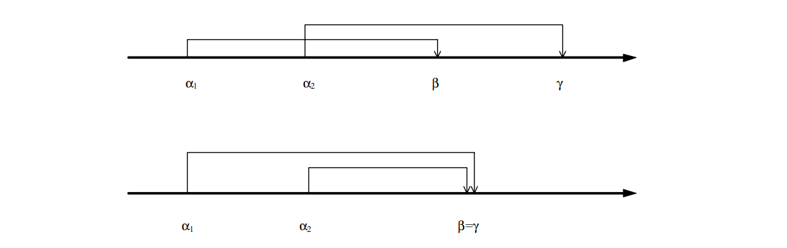

In principle, there are two cases of evaluation order that exclude the implementation of an affix position instance as a basement memory. Let _α~1~_ and _α~2~_ be two instances of the affix position _a^X^_ and _β_, _γ_ the instances of two other affix positions. If now β is calculated from _α~1~_ and γ from _α~2~_, then _β_ must not be calculated before _γ_ if _a^X^_ is to be implemented as a basement memory (see Figure 7-1, first drawing; the thick line symbolises the chronological order of the computations, the thin arrows indicate the data flow dependencies). For if the values of _α~1~_ and _α~2~_ are located on the basement memory, so that _α~2~_ is on top, then the value of _α~1~_ cannot be accessed when calculating _β_. The same applies in the case (see Figure 7-1, second drawing) that _β_ and _γ_ are identical. To calculation of _β_ = _γ_, both the highest and the lowest value of the basement storage would have to be used. However, on a cellar storage only the uppermost value is always accessible, and it is not clear in which order the two values are needed in the calculation. All other sequences do not interfere with the use of a cellar memory. Particularly interesting in this context are the Particularly interesting in this context are the "embedded" calculation sequences as shown in Figure 7-2.

."Embedded" calculation sequences

In order to be able to express the above-mentioned problem in a theorem that unambiguously determines whether an affix position _a^X^_ can be implemented as a cellar memory, the set of ^_visit dependencies_ _VDS_(_a^X^_), which is defined as follows: 

Definition 7-1(_VDS_(_a^X^_))::
_VDS_(_a~m~^X^_) contains all tuples (_Y_,(_i,j_)) with _Y_ ∈ _HN_, _i,j_ ∈ [_1,n_(_Y_)] and _i_ < _j_, for which there exists a decorated derivation tree _t_ and a subtree _t~0~_ whose root is marked with _Y_ exist, so that for adependency (_a~l~_(_r,k_)^, _b_^(_r_)^) ∈ _DP_(_r_) with _m_=_l_ and _X_=_X~k~^r^_ the affix parameter _a~l~_^(_r,k_)^ during the _i_-th visitof the node marked with _Y_ and _b_^(_r_)^ during the jth visit.

For the investigation of an affix position, only those direct dependencies are of interest that are determined by an affix parameter corresponding to the affix position. The calculation of the quantity _VDS_ can be abstractly described as follows:

Step 1: For all hyper-rules _r_=_X~0~_: _X~1~_..._X~#S_(_r_)~ and all direct dependencies (_a~l~_^(_r,k_)^, _b_^(_r_)^) ∈ _D_(_r_), for which _a~l~_^(_r,k_)^ is the corresponding affix parameter to the affix position _a^X^_ the tuple (_X~0~_, (_i,j_)) is transformed into _VDS_(_a^X^_) if _a~l~_^(_r,k_)^ during the plan _VS~i~^r^_ and _b_^(_r_)^ during schedule _VS~j~^r^_ and _i_ < _j_ is calculated.

Step 2: For all tuples (_Y_,(_i,j_)) of the set _VDS_(_a^X^_), each hyper-rule _r_=_X~0~_: _X~1~_..._X~#S_(_r_)~ and each _m_ ∈ [1,_#S_(_r_)] with _X~m~_=_Y_, the tuple (_X~0~_,(_p,q_)) is inserted into the set _VDS_(_a^X^_) if the visit instructions _VISIT_(_X~m~,i_) in the plan _VS~p~^r^_ and _VISIT_(_X~m~,j_) in the schedule _VS~q~^r^_ occur. This is repeated until no more tuples are added to _VDS_(_a^X^_).

// -------------------------------------------------------------------------------
// Page 54

Theorem 7-1::
The instance of an affix position _a_ cannot be implemented as a cellar memory in the generated SOAG evaluator if a hyper-rule _r_=_X~0~_: _X~1~_..._X~#S_(_r_)~ exists. such that (at least) one of the following four conditions applies: 

. there exist two direct dependencies (_b,c_) ∈ _DP_(_r_) and (_d,e_) ∈ _DP_(_r_), such that _b_ and _d_ are corresponding affix parameters to the affix position _a_ and +
 +
_set~r~_(_b_) < _set~r~_(_d_) < _set~r~_(_c_) < _set~r~_(_e_) in _EVS~r~_. 

. there is a direct dependence (_b,c_) ∈ _DP_(_r_) where _b_ is a corresponding affix parameter to the affix position _a_. affix parameter to the affix position a and there exists a tuple (_X~m~_, (_i,j_)) in _VDS_(_a_) with _m_ ∈ [1,_#S_(_r_)], such that +
 +
_set~r~_(_b_) < _VISIT_(_X~m~,i_) < _set~r~_(_c_) < _VISIT_(_X~m~,j_) holds in _EVS~r~_.

. as in 2., except that +
 +
_VISIT_(_X~m~,i_) < _set~r~_(_b_) < _VISIT_(_X~m~,j_) < _set~r~_(_c_) in _EVS~r~_ holds.

. there exist two tuples (Xk, (i,j)) and (Xm,(p,q)) in VDS(a) with k,m ∈ [1,#S(r)] and k≠m such that +
 +
_VISIT_(_X~k~_,_i_) < _VISIT_(_X~m~_,_p_) < _VISIT_(_X~k~_,_j_) < _VISIT_(_X~m~_,_q_) holds in _EVS~r~_.

The proof of this theorem can be found in <<EngJong>>. 

=== Optimization through global variables

If the lifetimes of instances of affix positions implemented as basement memories do not overlap each other or, in other words, if there is always at most one value in the cellar then the affix position can also be implemented as a global variable. 

In order to be able to formulate a theorem that unambiguously states whether an affix position can be implemented as a global variable, the _set of visits_ _VS_(_a^X^_) of an affix position aX which is defined as follows.

Definition 7-2(_VS_(_a^X^_))::
The set of visits _VS_(_a^X^_) of an affix position _a^X^_ contains all pairs (_Y,i_) with _Y_ ∈ _HN_ and _i_ ∈[_1,n_(_Y_)], for which there exist a decorated derivation tree _t_ and a node _y_, marked with _Y_, such that at least one instance of _a^X^_ is computed during the _i_-th visit of _y_.

Theorem 7-2::
The instance of an affix position _a_ cannot be implemented as a global variable in the generated SOAG evaluator if there is a hyper-rule _r_=_X~0~_: _X~1~...X~#S_(_r_)~. variable such that (at least) one of the following four conditions holds is true:

. there exists a direct dependency (_b,c_) ∈ _DP_(_r_) and an affix parameter _d_, so that +
 +
_b_ and _d_ are corresponding affix parameters to the affix position _a_ and _set~r~_(_b_) < _set~r~_(_d_) < _set~r~_(_c_) in _EVS~r~_ is.

. there exists a direct dependence (_b,c_) ∈ _DP_(_r_) where _b_ is a corresponding affix parameter to the affix position _a_ and there exists a tuple (_X~m~, i_) in _VS_(_a_) with _m_ ∈ [_1,#S_(_r_)] such that +
  +
 _set~r~_(_b_) < _VISIT_(_X~m~,i_) < _set~r~_(_c_) in _EVS~r~_ holds.

. there exist a tuple (_X~m~_, (_i,j_)) in _VDS_(_a_) with _m_ ∈ [_1,#S_(_r_)] and an affix parameter _d_, where _d_ is the is the corresponding affix parameter to the affix position _a_, such that +
  +
 _VISIT_(_X~m~,i_) < _set~r~_(_b_) < _VISIT_(_X~m~,j_) holds in _EVS~r~_.

. there exist a tuple (_X~k~_, (_i,j_)) in _VDS_(_a_) and a pair (_X~m~,q_) in _VS_(_a_) with _k,m_ ∈ [_1,#S_(_r_)] and _k_≠_m_ such that +
  +
 _VISIT_(_X~k~,i_) < _VISIT_(_X~m~,q_) < _VISIT_(_X~k~,j_) in _EVS~r~_ holds. 

The proof of this theorem can be found in <<EngJong>>.

=== Implementation details

The algorithms for calculating the optimization possibilities of affix position storage are implemented in the
`SOAGOptimizer` module. It contains the following module-global data structures:
----
    VAR
        PN: SOAG.OpenInteger;
        VDS, VS: ALists.AList;
        admissible, disjoint: BOOLEAN;
        GlobalVar, StackVar: INTEGER;
----
// -------------------------------------------------------------------------------
// Page 55

The `PN` field extends the list of visit sequences `SOAG.VS`. By the initialization procedure `Init` the number of the each entry in `SOAG.VS` is assigned the number of the visit plan in which the entry is contained. This is necessary to avoid having to calculate the visit number dynamically. The possibly in the entry cannot be used, because it refers to the node to be visited.

The sets _VDS_(_a_) and _VS_(_a_) introduced in the upper chapters are implemented by the two lists `VDS` and `VS` implemented. In order to ensure the set property, the two include operations check `IncludeVDS` and `IncludeVS` check by linear search that no elements are inserted twice into the lists. are inserted twice. The calculation of the two sets is done by the procedures `InitVDSandVS` and `CompleteVDS`, where the first procedure uses the 1st step of the abstract algorithm from section 7.1 "Optimization by basement storage" as well as the calculation of the set `VS`. The second procedure completes the set `VDS` according to the 2nd step of the abstract algorithm from the mentioned section. The function `GetPlanNo` returns the number of the visit plan in which the value of the passed affix is stored. in which the value of the passed affix parameter is determined.

The boolean variables `admissible` and `disjoint` contain the optimization properties of the current affix position. If `disjoint` is valid, the affix position can be implemented as a global variable. If `admissible` is set to `TRUE`, then storage in a basement memory is possible. If both variables are not set, then no optimization is possible for the current affix position. The two module-global variables `StackVar` and `GlobalVar` respectively indicate the number of the next cellar memory to be assigned or the next global variable to be assigned.

Theorems 7-1 and 7-2 require the realization of relations "<" and "≤" on the set of each extended visit sequence, but these are not concretely present in the implementation. Since the two relations practically refer to positions to be compared within the extended visit sequence, they can be mapped for visit instructions to a comparison of the positions within the "simple" visit sequence. for visit instructions. In order to avoid the subsequent realization of the extended visit sequence for the _set~r~_(_a_) function, the "simple" visit sequence is symbolically stretched so that an additional position is added before and after each visit instruction is freed before and after each visit instruction. The two functions `GetEVSPosforAffOcc` and `GetEVSPosforVisit` realize this symbolic stretching. The function `GetEVSPosforVisit` function determines the position of the given visit instruction in the "simple" visit sequence, multiplies it by three and adds two to place it in the center of the expanded area. Let V be the position of the visit instruction in the "simple" visit sequence, then we get the position of the visit instruction in the extended visit sequence is given by 

position in _EVS_ = _V_ * 3 + 2.

The function `GetEVSPosforAffOcc` determines for an affix parameter the position of the visit instruction before or after which the value of the affix parameter will be calculated, and positions the set containing the affix parameter before or after the corresponding visit instruction. In Depending on whether the affix parameter corresponds to an inherited or synthesized affix position, the position in the extended visit sequence is calculated as 

inherited:: 
position in _EVS_ = (_V_ * 3 + 2) - 1 = _V_ * 3 + 1,

synthesized::
position in _EVS_ = (_V_ * 3 + 2) + 1 = _V_ * 3 + 3.

The procedure `CheckStorageType` performs the actual calculation of the optimization properties for a given affix position. for a given affix position. It implements in its subprocedures `CheckT2P1andT1P1`, `CheckT1P2andP3`, `CheckT1P4`, `CheckT2P2`, `CheckT2P3` and `CheckT2P4` it implements the single conditions formulated in the Theorems formulated conditions. If one of the conditions is true, one of the global variables `admissible` and `disjoint` are set to `FALSE`. The optimization properties will be set to FALSE for all Affixposition in evaluator rules and all inherited Affixposition in predicates are computed.  

The exported `Optimize` procedure performs the optimization calculation for all necessary affix positions. for all necessary affix positions. The optimization properties of an affix position are stored in the data structure `SOAG.StorageName` data structure. If zero is entered in this field for an affix position, no optimization can be performed. A negative entry means that the affix position can be implemented as a global variable. the absolute value specifies the number of the variable from which a unique name is generated for the evaluator. unique name is generated for the evaluator. A positive entry indicates the number of the cellar memory to be used for the affix position is to be used.

// -------------------------------------------------------------------------------
// Page 56

=== Implementation

Please note that the links below are targeting the actual implementation in D, the original implementation referenced in the original German version was done in Modual-2.

- link:https://github.com/linkrope/epsilon/blob/v0.2.1/src/soag/eSOAGOptimizer.d[src/soag/eSOAGOptimizer.Mod]

// -------------------------------------------------------------------------------
// Page 62

== Effort analysis

First, in order to be able to express the total effort to be investigated for the approximating SOAG procedure the following quantities are introduced: 

_x_ = _max_{|_A_(_X_)| : _X_ ∈ _HN_} max. number of affix positions per symbol and 

_p_ = _max_{ _#S_(_r_)+1 : _r_ ∈ _HR_} max. number of symbol occurrences per hyper-rule. 

The initialization step _TDP_ = (_D^-1^_)^+^ is trivial, since due to the Bochmann normal form _D^-1^_ is already transitive is.

The implementation of the transitive closed _ind_-operator requires transitive insertions in _TDP_.  It should be noted that in the case of backtracking (see Section 5.3 "Two heuristic subclasses of the SOEAGen") additional overhead has to be considered. For leads for an arrangement to be determined between two affix positions _a_ and _b_, the adoption of the preferred dependence (_a,b_) on corresponding _TDP_ including inducing leads to a cycle, the newly added dependencies must first be removed from _TDP_ again. dependencies must first be removed from _TDP_ before the reverse dependency (_b,a_) can be adopted. can be taken over. Therefore, the extensions of _TDP_ are accounted for with corresponding effort. is kept. 

To determine a box completion _DS~j~_(_X_), a modified topological sorting of the affix positions _A_(_X_) according to the set of affix positions derived from _TDP_ = _IDP~j-1~^+^_ projected dependencies is performed. 

Finally, the generation of visit sequences requires a topological sorting of the affix parameters of a rule according to the final dependencies on each rule in _TDP_ = _IDP~m~^+^_. 

In summary, then, with respect to the implementation of the method, two characteristic algorithms are essential for the overall effort:

- _topological sorting_ of affix positions or affix parameters and
- _transitive insertion_ of dependencies between affix parameters.

A topological sort of affix positions _A_(_X_) for determining a box completion _DS~j~_(_X_) for an _X_ ∈ _HN_ is of effort _O_(_x^2^_); a topological sorting of the affix parameters at most _p x_ belonging to a rule _r_ in the course of generating a visit sequence for _r_ is of effort _O_(_p^2^ x^2^_).

As explained in Section 5.4 "Dynamic transitive closure", the stepwise transitive expansion requires of an arbitrary relation R+ over a finite carrier set _S_ by the dependencies from a set _R′_ ⊆ _S^2^_ requires an overhead of _O_(|_S_|^3^). Assume that the elementary orientation order determined by the described procedure for the present EAG determined by the described procedure for the EAG at hand (_C~1~,...,C~m~_) is immediately successful, then successively all _m_ affix position orders can be transferred to the corresponding affix parameters in _TDP_ and induced without causing a cycle. And cumulatively, all transitive insertions in _TDP_ then cause the effort _O_(|_HR_| _p^3^ x^3^_), because in _TDP_ only dependencies between at most _p x_    affix parameters of one hyper-rule can arise.

In the case of a successful instead of an _immediately_ successful orientation sequence, a certain number of affix arrangements will not be generated with the preferred affix parameter, but only with the reverse affix parameter dependence expanded to an acyclic _TDP_. Let this number be denoted by β then an additional β-times further effort of _O_(|_HR_| _p^3^ x^3^_) for transitive insertions into _TDP_ to be calculated, which led to one cycle. This effort also covers the necessary retractions of the _TDP_ extensions made. For the effort of the entire procedure, the following results thus provisionally 

_O_(|_HN_| _x^2^ x^2^_ + |_HR_| _p^2^ x^2^_ + |_HR_| _p^3^ x^3^_ (1 + β)) = _O_(|_HN_| _x^4^_ + |_HR_| _p^3^ x^3^_(1 + β)). 

The summand |_HN_| _x^4^_ is a consequence of the assumption that for the _j_-th (1 ≤ _j_ ≤ _m_ ≤ |_HN_| _x^2^_) to be defined arrangement of two affix positions from _I_(_X_) * _S_(_X_), a complete topological sorting of _A_(_X_) according to the projection of _IDP~j-1~_+ onto _A_(_X_) with the result _DS~j~_(_X_) is necessary, although the validity of _IDP~j-1~_+ ⊆ _IDP~j~_+ is guaranteed and thus information from the (_j_-1)-th topological sorting process could flow into the _j_-th one could flow into it. The algorithm presented in section 5.5 "Dynamic topological sorting" processes the effects of the extension of _TDP_ = _IDP~j-1~+_ to _TDP_ = _IDP~j~+_ on the projection of _TDP_ on _A_(_X_) in such a way that when sorting _A_(_X_) topologically according to this projection, all the

// -------------------------------------------------------------------------------
// Page 63

affix positions to a symbol _X_ in a single _dynamic_ topological sorting process. can be defined. The order of affix positions results from this topological sorting process. Of course, only such affix parameter dependencies lead to real extensions of _TDP_ which were previously unrelated in the projection. 

Thus, for the approximate SOEAG method, an effort results which is given by

_O_(|_HN_| _x^2^_+ |_HR_| _p^3^ x^3^_ (1 + β)) 

where β ≤ _m_ ≤ |_HN_| _x^2^_ is.

For the special case β = 0, which comprises even OEAGen, the effort is given by.

_O_(|_HN_| _x^2^_ + |_HR_| _p^3^ x^3^_).

Thus, the approximate SOEAG method is not only more powerful, but moreover not more costly than a clever implementation of the OEAG method.

For the effort of the optimization procedure determining is the computation of the quantity VDS. The first step in the abstract algorithm from section 7.1 "Optimization by basement storage" p. 52 has for the calculation of the properties of an affix position an asymptotic effort of _O_(|_HR_| _p^2^ x_), because acorresponding affix parameter could be contained in any hyper-nonterminal of a rule and have a dependence on all other affix parameters of the rule. Under the assumption that in each partition set contains at most two affix positions, the combinatorial cardinality of the set _VDS_ from |_HN_|*((_x_/2)^2^+1), which asymptotically corresponds to _O_(|_HN_| _x^2^_). The second step therefore has an effort of

_O_(|_HN_| _x^2^_ * |_HR_| _p_) = _O_(|_HR_|_HN_| _p x^2^_).

The test of the optimization property is restricted to point 4 (the most costly point) of the first theorem of section 7.1 to an asymptotic cost of

_O_((|_HN_| _x^2^_)^2^ * |_HR_|) = _O_(|_HR_|_HN_|^2^ _x^4^_),

because the set _VDS_ is traversed once in each of two interleaved loops. Since the optimization for must be computed for all affix positions of the grammar, the whole optimization algorithm is asymptotic. optimization algorithm results in an asymptotic overhead of

_O_(|_HR_||_HN_|^3^ _x^5^_).

// -------------------------------------------------------------------------------
// Page 64

== Generation of evaluation code

=== The generated evaluators

To make the compiler generator Epsilon as uniform as possible and to be able to reuse already existing implementations, the evaluators of the SOAG evaluator generator were developed in based on the concepts presented in [DeWe]. Since the generated Compiler as comprehensively and completely represented, some passages from <<DeWe>> were taken over.

==== Data structures

Since the derivation tree generated by the parser cannot be directly extended by the necessary instances of the affix parameters the necessary instances of the affix parameters, a first, "syntactic" pass of an evaluator is used to generate a parallel to the context-free derivation tree, which contains the semantic information of the evaluation, i.e. the computed information of the evaluation, i.e. the calculated affix values. Each node of this "semantic" or _decorated_ derivation tree contains the following data structure:
----
    TYPE
        IndexType = LONGINT;
        
        SemTreeEntry = POINTER TO RECORD
            Rule: LONGINT;
            Pos: IO.Position;
            Adr, VarInd: IndexType
        END;
----
The `Rule` entry marks each node with the rule whose structure corresponds to the subtree formed by the node and its sons. The entry `Pos` contains the position in the input text to be output in case of an error. input text. To save memory, each node is both a symbol of the right side of the rule and a symbol of the left side of the rule with which it is marked. Therefore, the `Adr` entry contains a reference to the first symbol of the corresponding right rule page is stored in the `Adr` entry. The symbols of a right rule page are stored contiguously one after the other in the `SemTree` field, which contains the decorated derivation tree field. The context-free derivation tree is no longer necessary after the complete construction of the decorated derivation tree. derivation tree is no longer necessary, its memory could be freed.
----
    TYPE
        OpenSemTree = POINTER TO ARRAY OF SemTreeEntry;
    VAR
        SemTree: OpenSemTree;
----
Figure 9-1 shows an example of the structure of a decorated derivation tree.

.Structure of the decorated derivation tree
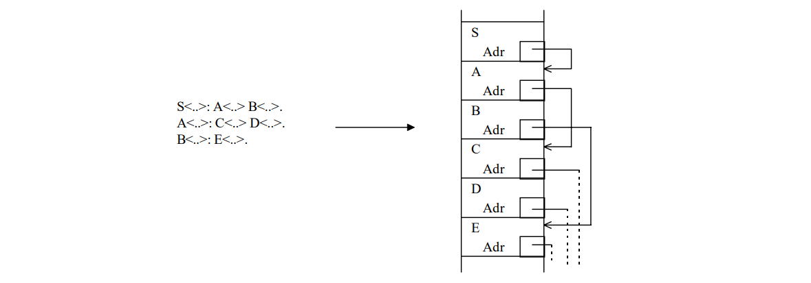

// -------------------------------------------------------------------------------
// Page 65
----
    TYPE
        OpenVar = POINTER TO ARRAY OF HeapType;
        OpenAffPos = POINTER TO ARRAY OF HeapType;
    
    VAR
        Var: OpenVar;
        AffPos: OpenAffPos;
        NextSemTree,
        NextVar,
        NextAffPos: IndexType;
----
The `Var` field represents the actual decoration of the derivation tree. It contains the affix variables of all rules. The entry `VarInd` in the data structure `SemTreeEntry` points to the first affix variable of the rule with which the node is marked. The affix variables of a rule are stored in the `Var` field in one contiguous block. The variables `NextSemTree` and `NextVar` refer to the first free entry of the respective field.

As affix parameter values, the records for the value range symbol are represented by their derivation trees are represented. This allows an efficient realization of analyses and syntheses, comparisons can be easily realized structurally. The uniqueness of the representations is ensured by the well-formedness constraints.

The `AffPos` field contains the associated affix positions for each symbol of the grammar. It is a globally declared field, which is used as an interface between the rules. For the affix parameters of the symbol occurrences in the rules, since the parameter transfer is done via the parameter transfer is realized via the field entries of the associated symbol in the `AffPos` field. The start of the affix positions belonging to a symbol in the `AffPos` field is marked by a constant `S _n_` which is used to simplify indexing.
----
    VAR
        Heap: OpenHeap;
        NextHeap: HeapType;
----
In order to be able to reuse the problem solutions found in <<DeWe>>, a high-level language replica of the a high-level representation of the memory, the _heap_, is implemented in the evaluators generated here. In this field, the nodes of the derivation trees are stored in consecutive entries. Let `Heap[V]` be a node identifier, then `Heap[V+i]` refers to the ith subtree (an example is illustrated in Figure 9-2). illustrates). Conceptually, the node identifier is a pair of alternate number and digitness of the rule, with which the node is marked. The digitness corresponds to the number of subtrees. In order to save memory these pairs are encoded by one number each. The constant `arityConst` is used as follows for the reconstruction of the components:
----
        Stellarity    = node identifier DIV arityConst,
     alternate number = node identifier MOD arityConst.
----

.Representation of the sentence '2'  '1' for the value range symbol N
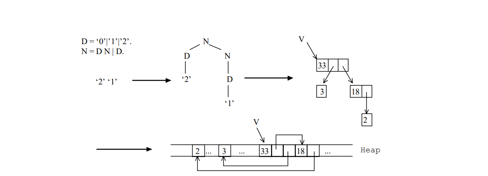

// -------------------------------------------------------------------------------
// Page 66

==== Code schemes

For each evaluator rule of the grammar, the generated compiler contains an _evaluator procedure_ uniquely identified by the number of the rule. The procedure has two parameters: the first points to a node in the decorated derivation tree, the second specifies the number of the current visit. This is followed by follow the declaration of the local variables. The variables `TreeAdr`, `VI` and `S` are declared in each procedure and are used for the abbreviated indexing of global fields and for the construction of the decorated derivation tree. Variables of the form `Vn` represent temporary variables for analysis.
----
    PROCEDURE VisitRuleN(Symbol: LONGINT; VisitNo: INTEGER);
    VAR TreeAdr, VI: IndexType; S: SemTreeEntry;
    VAR V1,..,Vn: HeapType; (* temporary variables of the analysis *)

    BEGIN
        IF VisitNo = syntacticPart THEN
            Structure of the decorated derivation tree
        ELSE
            (* Calculation of the variables for the shortened indexing *)
            TreeAdr := SemTree[Symbol].Adr;
            VI := SemTree[Symbol].VarInd;

            (* Conversion of the visit sequence of rule N *)
            CASE VisitNo OF
            1:
                Conversion of the first schedule VS1N of the visit sequence of the rule N
                ...
                Visit(TreeAdr+i, m);
                ...
                CheckP(...);
                ...
            | 2:
                Implementation of the 2nd plan VS2N of the visit sequence of the rule N
            | n:
                Implementation of the nth plan VSnN of the visit sequence of the rule N
            END
        END
    END VisitRuleN;
----
The body of the procedure is divided into two parts. In the first one the data structure of the decorated derivation tree is built. The second part contains a flow control that corresponds to the visit sequence of the evaluator rule. A CASE statement distinguishes the different possible visits of the node from each other. Each case of the CASE statement takes a schedule of the visit sequence of a rule. The visit of a son is triggered by the call of the Visit procedure. The execution of a predicate is initiated by procedures of the form CheckP. At the beginning of each visit the variables for abbreviated indexing of global fields must be calculated at the beginning.
----
    PROCEDURE Visit(Symbol: LONGINT; VisitNo: INTEGER);
    BEGIN
        CASE SemTree[Symbol].Rule OF
          0: VisitRule0(Symbol, VisitNo);
        | 1: VisitRule1(Symbol, VisitNo);
        | 2: VisitRule2(Symbol, VisitNo);
        ...
        | k: VisitRulek(Symbol, VisitNo);
        END
    END Visit;
----
The procedure `Visit` is necessary, since on the basis the rule, with which a node is marked, is decided, which evaluator procedure must be called. This is only possible at runtime.

// -------------------------------------------------------------------------------
// Page 67

==== Syntheses

In a synthesis, for the instance of an affix parameter, its value is calculated. This is done with the help of the affixes of the current rule, which are arranged according to the affix form of the affix parameter. The affixes occurring in the affix form are placeholders for synthesized subtrees. The SOAG property of the Grammar ensures that these are already fully computed. By creating new nodes a new tree is constructed step by step from these subtrees (an example of this is shown in Figure 9-3). can be seen).

.Synthesis of the sentence '2' N  for the value range symbol N
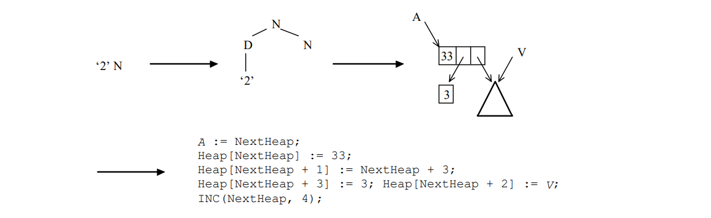

==== Analyses 

In an analysis, the value of an affix parameter instance is compared with the structure given by the affix form of the affix parameter. is compared with the structure given by the affix form of the affix parameter. Since this value is available as a derivation tree, the node identifiers are checked during a preorder traversal at compiler runtime. If the tree structure corresponds to the affix form, the corresponding subtrees are determined for the affixes occurring in it. In order to nested indexing when accessing the subtrees, temporary variables are used for the elimination of common subexpressions (an example is shown in Figure 9-4). This additionally optimizes the runtime of the compiler.

.Analysis of the sentence '2' D for the value range symbol N
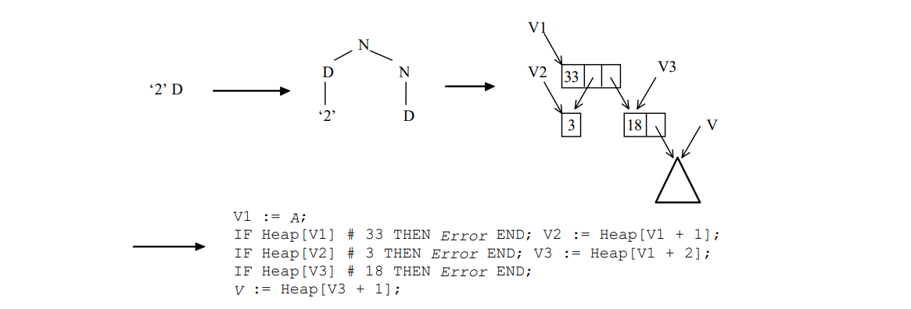

==== Compare

If an affix _M_ occurs more than once in affix forms defining affix parameters of an evaluator rule, then the values of the affix instances must be equal due to the requirement of consistent substitution. In contrast the values of two affix instances _M_ and _#M_ must be different. The occurrence of an affix is

// -------------------------------------------------------------------------------
// Page 68

is always compared with the defining occurrence of the affix whose content was recorded in the affix variable. was recorded. The check is simply realized by comparing the derivation trees of the affix instance and the affix variable. For this purpose the boolean function `Equal` is called, which performs a recursive traversal of both derivation trees and terminates in case of unequal references. To check whether two trees are different, the result is negated. A call of this procedure takes place during the analysis, directly after determination of the corresponding subtree.

==== Predicates

Predicates can only be derived to the empty word, they contribute nothing to the context-free definitions of the source language. In the specification of a compiler, they rather serve to isolate "computations". Because of the ambiguity intentionally allowed for predicates, they must be treated specially. For the generation of the predicates the procedure `GenPredProcs` of the module `SLEAG` is used. 

During the evaluation of a predicate a derivation of the empty word must be found on the basis of the parameterization in general by backtracking. generally be found by backtracking. The failure of an analysis and/or a comparison shows here not an error but a dead end, the selection of the appropriate alternative is essential here. For this all alternatives are tried out one after the other:
----
    PROCEDURE P (formal parameters): BOOLEAN;
    ...
    BEGIN
        failed := TRUE;
        Code to check the first alternative
        IF failed THEN
            Code to check the second alternative
            ...
        END;
        RETURN ~ failed
    END P;
----
For an alternative, the analyses and comparisons as well as the procedure calls of the corresponding predicates control the further flow of control. This is appropriately formulated by nested IF statements. Thereby the analyses not formulated in the following scheme, in particular the verification of the single node identifier, must also be converted into nested IF statements.
----
    (* Start of an alternative *)
    IF Analysis of the input parameters of the left side (possibly comparisons)
        successful THEN
        ...
        Synthesis of the input parameters to P'
        IF P'(current parameters) THEN
            IF Analysis of the output parameters for P' (possibly comparisons)
                successful THEN
                ...
                Synthesis of the output parameters of the left side
                (possibly transfer)
                failed := FALSE;
                ...
            END
        END;
        ...
    END;
    (* End of alternative *)
----
Only the call of a predicate procedure from an evaluator procedure leads on failure to an error message.
----
    Synthesis of the input parameters to P
    IF ~ P (current parameters) THEN Error handling END;
    Analysis of the output parameters to P (possibly comparisons)
----
Before a predicate procedure is called in the generated compiler, the input parameters are synthesized. input parameters. After execution the output parameters are analyzed and possibly comparisons are made.

// -------------------------------------------------------------------------------
// Page 69

is performed. As parameters of predicates the affix positions belonging to the symbol of the predicate are used in the field `AffPos`. affix positions in the `AffPos` field. Exceptions to this are parameters that directly result in affix variables result.

==== Error handling

Analyses, comparisons and predicates can fail. This indicates context errors and prevents correct translation. However, an abort of the generated compiler is not acceptable, instead the Instead, the program flow should be continued in order to be able to find and report further context errors. Thereby subsequent errors are to be suppressed.

Differently than with failing comparisons the program sequence cannot be continued with failing analyses without because, in general, the subtrees of the corresponding affix form are not checked against the affixes of the affix form are assigned values. These affixes, like the output parameters of failing predicates to defined values.

It is a good idea to create a special error node which has the maximum stellarity of all rules occurring in the MetaGrammar. Each of its subtrees in turn points to the error node. A reference to this node is used as error value in case of context errors. Subsequent errors can then be detected and suppressed using this value. In the implementation the first entries of the heap form the error node. The error value is denoted by the constant `errVal` and refers to this node.

If the check of a node identifier fails in an analysis, the reference to the node is replaced by the error value. When the analysis is continued, the structure of the error node then results in, which was constructed with maximum significance, the error value also results for all subtrees. Thus also all temporary variables and affixes are set to this value. The reporting of subsequent errors is
suppressed if the error value is already examined:
----
    IF V # errVal THEN error message; V := errVal END;
----
If a predicate fails, all its output parameters are set to the error value. Error messages are only issued in this case if none of the input parameters has the error value. If the comparison of two trees fails, the error message is suppressed if for at least one the error value is present:
----
    IF (V1 # errVal) & (V2 # errVal) THEN error message END;
----
To reduce the size of the generated code, the error handlings in the procedures `AnalyseError`, `Eq`, `UnEq` as well as `CheckP` for a predicate _P_ are combined. 

The texts of the error messages are created automatically by the generator from the identifiers occurring in the specification. in the specification. Together with the error message a position in the input text is output. Analysis error messages for hyper non-terminal _N_ have the form "analysis in _N_ failed". For failed comparisons the name of the affix _M_ is combined with the name of the corresponding hyper-non-terminal to the error message "_M_ failed in _N_". If a predicate _P_ fails, the error message "predicate _P_ failed" is output.

.Explanation of the memory structure in the generated evaluators
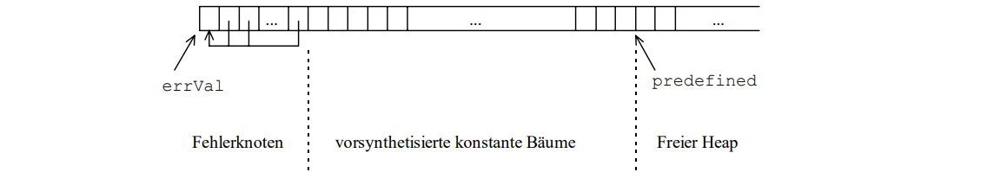

==== Optimization of terminal affix forms 

Terminal affix forms are constant in the sense that they are always represented in the evaluator by the same trees. in the evaluator. In principle, a synthesis has to be done only once; later it is sufficient to supply a reference to the tree. Likewise, for each final rule (without non-terminals) a leaf must be used only once in the heap.

// -------------------------------------------------------------------------------
// Page 70

are present. By such a _constant convolution_ the memory requirement can be lowered, and naturally a shorter and faster program results. In the implementation all leaves and the trees of terminal affix forms are presynthesized in a reserved part of the heap. The references are thus known and can be used in syntheses. The end of this reserved area, as shown in Figure 9-5, is marked by the constant `predefined`. The example of a synthesis from Figure 9-3 thus changes to:
----
    (* synthesis of the set '2'N to the value range symbol N *)
    A := NextHeap;
    Heap[NextHeap] := 33;
    Heap[NextHeap + 1] := 4;
    Heap[NextHeap + 2] := V;
    INC(NextHeap, 3);
----
In general, terminal affix forms cannot be used in analyses, since the trees to be analyzed can be trees to be analyzed may have arisen in many different ways. However, since leaves are present exactly once in the heap the verification of the node identifier can be abbreviated by a verification of the reference. can be abbreviated. This changes the example in Figure 9-4 to:
----
    (* analysis of the set '2'D to the value range symbol N *)
    V1 := A;
    IF Heap[V1] # 33 THEN error handling END; V2 := Heap[V1 + 1];
    IF V2 # 4 (* reference to a sheet *) THEN error handling END;
    V3 := Heap[V1 + 2];
    IF Heap[V3] # 18 THEN Error handling END;
    V := Heap[V3 + 1];
----

==== Free space management

Since memory for nodes is explicitly requested during syntheses but never explicitly freed, and since a large part of the heap is potentially used for the representation of intermediate results with temporary meaning. the evaluator should be able to be supplemented optionally by a free memory management. Thereby a reference counter procedure is used in the generated evaluator, in which the references to roots in temporary variables are logged to the roots of trees at runtime, which does not allow an immediate reuse. immediate reuse of no longer referenced nodes.

The reference to a tree is expressed by incrementing the counter of the root node. Through Collapsing, multiple references to subtrees are created. If the last reference loses its validity the root node as well as all nodes of its subtrees, to which no further reference exists, are released by entering them in free memory lists. Requested heap memory is then  primarily taken from these lists.

New references are created when evaluating instances of applying affix parameters according to their affix form. They result from the references to the subtrees described by affixes in the affix form subtrees during synthesis of the derivation trees and from the assignment of the synthesized trees to the affix parameters. It is only with the last visit of a rule that the reference to a tree representing the parameter value of a defining item loses its validity and is released.

For the error node and for presynthesized trees of terminal affix forms, the procedure works accordingly. When setting the error value, the faulty (sub)tree loses its reference, the error node gets another one to prevent a release without special treatment. Through a synthesis results in an additional reference to a presynthesized tree. In the implementation, the node identifier is conceptually extended by the reference counter to a triple extended. The additional constant `refConst` is used for the reconstruction of the components as follows. used:
----
    Reference counter = node identifier DIV refConst,
    Digit = (node identifier MOD refConst) DIV arityConst,
    alternative number = node identifier MOD arityConst.
----
In the reference counter, only the number of additional references to a node is counted.

Special features arise for the parameters of a predicate call. Originally the predicate procedures were designed for one-pass compilers whose reference counting also includes procedure parameters as references.

// -------------------------------------------------------------------------------
// Page 71

and thus also includes the release of parameter contents. If the procedure parameter is an affix variable, the derivation tree to which it refers loses a referencing by the Predicate call a reference count. In order to compensate for the reference count within the predicate, all affix variables that are used as input parameters in the predicate call are incremented by one reference. by one reference. This ensures that the content of the affix variables is not yet released after the predicate call. After a predicate call, the reference counters of all derivation trees referenced by the return variables refer to (affix variables excluded) are increased by one reference to high. Therefore these variables must be explicitly released after the analysis has been completed.

A separate free list is created for each node position. Released nodes are managed according to their according to their position in these lists. The entries of the field `FreeList` refer to the first node of such a list. first node of such a list. The concatenation is realized in the first entry of the released nodes is realized. 

In syntheses, the request for memory is now made node by node by the procedure `GetHeap`. The deletion of a reference as well as a possible release of the storage space takes place by the procedure `FreeHeap`.

By application of the reference counter procedure and under the condition that no optimization  of terminal affix forms and the synthesis does not occur in a predicate procedure, the example of the synthesis changes from Example of synthesis changes from Figure 9-3 to:
----
    (* Synthesis of the sentence '2'N to the value range symbol N *)
    GetHeap(2, V1); A := V1; Heap[V1] := 33;
    GetHeap(0, V2);
    Heap[V1 + 1] := V2; INC(Heap[V2], refConst);
    Heap[V2] := 3;
    Heap[V1 + 2] := V; INC(Heap[V, refConst);
----
Complementary reference counter operations are resolved and thus the code continues to be optimized.

The example from Figure 9-4 changes under the assumption that no optimization of terminal affix forms occurs and the analysis occurs in an evaluator procedure, to:
----
    (* analysis of the sentence '2'D to the value range symbol N *)
    V1 := A;
    IF Heap[V1] MOD refConst # 33 THEN Error handling END;
    V2 := Heap[V1 + 1];
    IF Heap[V2] MOD refConst # 3 THEN Error handling END;
    V3 := Heap[V1 + 2];
    IF Heap[V3] MOD refConst # 18 THEN Error handling END;
    V := Heap[V3 + 1];
----
==== Optimization of affix variable storage

Optimization of affix variable storage is possible in two forms. Either the affix variable is used as a global variable or as a cellar memory. In the case of the cellar memory, the three known procedures `Push` for value storage, `Top` for return and `Pop` for release of the top cellar element. cellar element are used. Only affix variables with special properties can be optimized in their storage. can be optimized. These properties are calculated by the `SOAGOptimizer` module and are described in the Chapter 7 "Optimization of affix variable storage" in more detail.

Assuming that the affix variable _V_ to the affix _N_ possesses the required properties, so that its storage can be optimized by the cellar storage `Stack1`, the code fragment of the example of a synthesis from Figure 9-3 changes under the assumption that no optimization of terminal affix forms and no reference counting takes place, to:
----
    (* synthesis of the set '2'N to the value range symbol N *)
    A := NextHeap;
    Heap[NextHeap] := 33;
    Heap[NextHeap + 1] := NextHeap + 3;
    Heap[NextHeap + 3] := 3;
    Heap[NextHeap + 2] := Stacks.Top(Stack1);
    INC(NextHeap, 4);
----
// -------------------------------------------------------------------------------
// Page 72

The example of an analysis from Figure 9-4 adapts under the same conditions to:
----
    (* analysis of the set '2'D to the value range symbol N *)
    V1 := A;
    IF Heap[V1] # 33 THEN Error END; V2 := Heap[V1 + 1];
    IF Heap[V2] # 3 THEN Error END; V3 := Heap[V1 + 2];
    IF Heap[V3] # 18 THEN Error END;
    Stacks.Push(Stack1, Heap[V3 + 1]);
----
The `Pop` operation is always executed when the lifetime of an affix variable has expired. That is, when there is no longer an affix parameter for which the affix variable can be synthesized or compared in the remaining visit sequence of the rule.

If the value of an affix variable, which is implemented as a cellar store, is defined by calling a predicate procedure, this call must first be parsed with the global variable associated with the predicate symbol from the variable from the `AffPos` field. After the predicate call the content of the used interface variable used is placed on the cellar memory by a `push` operation.

==== Storage of position information

The context-free derivation tree built by the parser is enriched by the parallel field `PosTree` with positional information. During the construction of the decorated derivation tree in the evaluator the necessary position information is transferred to the `Pos` data element of the tree data structure. The field `PosTree` field is not accessed afterwards, it is no longer needed.

==== Output of the translation

In the generated compiler, the values of the output parameters of the start symbol calculated by the evaluator represent calculated by the evaluator represent the translation. The EmitGen module generates code that outputs this translation. Internally the translation is represented by the evaluator by a derivation tree to the meta grammar. The output is therefore by a traversal of this derivation tree.

It should be noted that the output of alternatives of a non-terminal which is marked with a token (a so-called token) should be done flush like their subtrees, i.e. without the output of a separator between the individual terminals; in the other case, however, a separator is to be output after each terminal. terminal a separator is to be output. This results in the situation that a non-terminal can be a subtoken, i.e. it can occur in a subtree of a token as well as in a subtree not starting from a token. subtree. With the output of alternatives of a subtoken therefore must be be output or not output depending on the context in the derivation tree.

The meta-nonterminals can now be divided into two sets according to this output property. In the set Type3 there shall be the tokens as well as the non-terminals reachable by tokens. In the set Type2 shall contain the non-terminals which can be reached from the start symbol of the meta grammar, but without the tokens and without the non-terminals which can only be reached by tokens. Thus the subtokens form exactly the intersection of these two sets.

The output takes place in the implementation by procedures, in which a case distinction over alternatives of a nonterminal takes place. Separate procedures are generated for output with and without separators. procedures are generated. For subtokens in particular two procedures are generated. In the procedures  the size of the output tree is calculated, i.e. the number of required heap entries for a non-collapsed memory mode. non-collapsed memory mode. The generated procedures can be represented by the following code scheme code scheme:

// -------------------------------------------------------------------------------
// Page 73
----
    (* meta non-terminal M *)
    PROCEDURE EmitMType2/3 (Ptr: HeapType);
    BEGIN
        CASE Heap[Ptr] MOD arityConst OF
          | 1: Code for the first alternative
          .
          .
          | n: Code for the nth alternative
        END
    END EmitMType2/3;
    
    (* Output of meta terminal T *)
    IO.WriteText(Out, T); (possibly IO.Write(separator); )
    
    (* Procedure call for meta non-terminal N *)
    EmitNType2/3(Heap[Ptr + i]);
----
The generation of the output procedures is done by the procedure `GenEmitProc`. In this procedure the computation of the sets `Type2` and `Type3` by traversing the meta grammar.

=== The generator

==== Assignment of variable names

Local variables are used in the evaluator procedures of the generated compiler for the analysis of defining affix parameters. Affix parameters, they take the references of the subtrees to be analyzed. Thereby the variable contents are only needed during the analysis and have no meaning afterwards. Since the individual analyses run independently, the same variables can be used in all analyses of an evaluator procedure. evaluator procedure. The number of the variables orients itself thereby at the most extensive analysis of the evaluator procedure. Further local variables are used for applying affix parameters in case of the use of the reference counter procedure for the memory association.
----
    VAR
        LocalVars: SOAG.OpenInteger;
        NodeName: SOAG.OpenInteger;
----
The local variables of an analysis are numbered in ascending order. The name of a variable results from its number supplemented by the prefix `V`. For the declaration of the variables only their maximum number must be known must be known in the most extensive analysis; this is stored for each rule in the `LocalVars` field. For each affix tree node of an analysis, the number of the local variable, which takes the reference of the node is stored in the `NodeName` field, which is parallel to `EAG.Node`. The calculation of the variable names in the above data structures is done by an evaluation-anticipating traversing all affix forms in the procedure `ComputeNodeNames`.

==== Generation of the evaluator procedures

The `GenVisitRul` procedure generates an evaluator procedure for each rule analogous to the code schemes given in Section 9.1.2. given code schemes. The procedure header is followed by the declaration of the local variables by the procedure `GenVarDecls`. As already mentioned, the body of the evaluator procedure is divided into two parts. In the first one the structure of the decorated derivation tree is coded. This is followed by the generation of the memory association for affix variables. Then the creation of the node and the calculation of the rule number with which it is to be marked. At the end of this part for all visit is generated for all base null terminals of the current rule, so that the construction of the decorated derivation tree can be continued recursively. 

In the second part, the visit sequence of a rule is converted into corresponding Oberon statements. If the entry requires the visit of a son, it is generated by the procedure `GenVisitCall`. If the entry consists of a predicate call, the procedure `GenPredCall` generates it. Before the predicate call, the procedure `GenPredPos` assigns a position for error handling in case the predicate in case of failure of the predicate. For this purpose, the position of the preceding basic nonterminal of the current rule is used.

// -------------------------------------------------------------------------------
// Page 74

For all entries just mentioned, the synthesis of the applying affix parameters must be performed before the visit or call. and afterwards the analysis of the defining affix parameters of the current visit. be performed. The generation of these code components is done by the procedures `GenSynPred` and `GenAnalPred`, respectively. To ensure that only the necessary affix parameters are analyzed, the corresponding visit number is passed to the two procedures are passed the corresponding visit number. A predicate call is not bound to any visit number, therefore the procedures are parameterized with -1 in this case.

Each LEAVE entry in the visit sequence of a rule indicates the end of a plan. In this case the syntheses concluding the visit are generated, and after the output of the next visit number the generation of the analyses with which the new visit begins takes place. The `GenVisit` procedure generates the `Visit` procedure explained in section 9.1.2.

==== Calculation of the anonymous predicates

The analyses and syntheses of the affix parameter instances of a generated compiler are immediate components (inline code) of each implemented visit sequence. They are not executed via the detour of a procedure call, for this reason they are also called _anonymous_ predicates.

The procedure `GenSynPred` generates for all applying affix parameters depending on the passed visit number the code of the synthesis of the instance value. In the synthesis, from the affix variable values of the affixes occurring in the affix form, the structure of which corresponds to the affix form of the affix parameter. Since the affix forms are also available as derivation trees at generation time, the generation of the synthesis code in the procedure `GenSynTraverse` takes place by a recursive traversal of this derivation tree, during which the corresponding synthesis actions are output. are output. As reference parameter in this procedure the next free entry in the heap is carried along as offset so that after complete traversal of a subtree the code for the creation of the next subtree can be generated. subtree can be generated. In the case of the use of the reference counter procedure this reference parameter is not necessary, since new memory is requested in the generated compiler via the procedure `GetHeap` procedure. Therefore, in this case the traversal is done by the procedure
`GenSynTraverseRefCnt`.

The access to an affix variable is generated by the procedure `GenAffix`. It distinguishes automatically whether an affix variable is to be output as a global variable, cellar memory or part of the  `Var` field. The procedure `GenAffixAssign`, which generates the left part of an assignment to an affix variable, behaves analogously. assignment to an affix variable. It is always called in combination with the procedure `GenClose` procedure. If an affix variable is implemented as a cellar store, then `GenClose` generates the closing parenthesis of the `push` operation. The information whether a closing parenthesis should be generated is provided by the by the global boolean variable `Close`. The statements in the generator
----
    GenAffixAssign(V); GenAffPos(S, AN); GenClose;
----
result in the generated compiler in the code sequence
----
    Stacks.Push(Stack1, AffPos[Sn+AN]),
----
if `V` is implemented as cellar memory `stack1`, and
----
    Var[V] := AffPos[Sn+AN]
----
if `V` is not optimizable.

The `GenAnalPred` procedure generates the code for the analysis of all affix parameters to be evaluated in a visit as a function of the number for the analysis of all affix parameters to be evaluated in one visit. affix parameters to be evaluated in a visit. The coding is again performed during a traversal of the derivation tree of the affix parameters belonging to an affix parameter. affix form belonging to an affix parameter in the `GenAnalTraverse` procedure.

The comparisons necessitated by the requirement for consistent substitution are performed by the two generation procedures `GenEqualPred` and `GenUnequalPred` directly into the analysis code.

If the lifetime of an affix variable has expired, its release is generated by the procedure `GenFreeAffix`. is generated. If it is optimized as a cellar memory, the procedure `GenPopAffix` generates the release of the top cellar element.

// -------------------------------------------------------------------------------
// Page 75

==== Data structures for the generation

For the generation of a compiler the following data structures are needed:
----
    VAR
        AffixOffset: SOAG.OpenInteger;
        AffixAppls: SOAG.OpenInteger;
        AffixVarCount: SOAG.OpenInteger;
----
The `AffixAppls` field is used during generation to calculate the lifetime of affix variables. For this purpose it is initialized with the values of the parallel field `SOAG.AffixApplCnt`, which contains the number of applications of the affix belonging to the affix variable. During the generation of the evaluator procedures, the value in `AffixAppls[A]` is decremented by one for each application of the affix variable `A`. If after one application of an affix variable the value is zero, then the lifetime of the affix variable has expired and it can be released. If the affix variable is implemented as a cellar memory  then the topmost value of the cellar memory can be removed.

`AffixOffset` is a data structure extension of the `EAG.Var` field and takes for each affix the offset number of the corresponding variable in the `Var` field of the generated compiler. If an affix variable is optimized, its field entry contains the value `optimizedStorage`. If the value of an affix variable is not used in any synthesis and comparison, i.e. if it has no applications, its value must not be stored in any variable. must not be stored in any variable. In this case the entry in `AffixOffset` has the value `notApplied`. Value assignments to this affix variable are suppressed in the generation. The procedure `ComputeAffixOffset` calculates the content of the `AffixOffset` field for a rule.

The `AffixVarCount` field records for each evaluator rule the number of affix variables to be generated in the `Var` field of the generated compiler.
----
    VAR
        SubTreeOffset: SOAG.OpenInteger;
----
Since there are no predicates in the decorated derivation tree, in contrast to the evaluator rules, the offsets of the basic non-terminals in the tree must be calculated in the `SubTreeOffset` field. This field is parallel to `SOAG.SymOcc`.
----
    VAR
        FirstRule: SOAG.OpenInteger;
----
The context-free derivation tree provided by the parser contains in each of its nodes the number of the rule applied to it. applied to it. The rules belonging to a non-terminal are always numbered starting at one. thus forming a kind of offset to the non-terminal. In the decorated derivation tree, however, the nodes are marked with the rule numbers of the SOAG data structure, which are numbered are numbered consecutively. Since rules to a non-terminal are contiguous and in the same order as in the EAG data structure, the rule offset of a non-terminal can be used in the context-free derivation tree and the number of the first rule of the non-terminal in the SOAG data structure. the corresponding rule number can be calculated. For this purpose the number of the first rule of each symbol is calculated in the `FirstRule` field, which is parallel to `SOAG.Sym`. This field is used to calculate the rule number with which each node of the decorated derivation tree is marked.
----
    VAR
        UseConst: BOOLEAN;
        UseRefCnt: BOOLEAN;
        Optimize: BOOLEAN;
----
The `UseConst`, `UseRefCnt` and `Optimize` switches control generation of a compiler using using the constant convolution, the reference counter method and the optimization of the affix variable storage. The contents of the data structures described above are calculated in the procedure `Init` procedure. 

The `GenerateModule` procedure performs the actual textual generation of the compiler source file. The constant file `eSOAG.Fix` is read in and successively extended. It contains at the positions to be positions, up to which the operation `InclFix` reads the contents of the file. reads in the contents of the file. Then the required extensions are entered. The procedure Generate controls the entire generation process and is also exported.

=== Implementation

Please note that the links below are targeting the actual implementation in D, the original implementation referenced in the original German version was done in Modual-2.

- link:https://github.com/linkrope/epsilon/blob/v0.2.1/src/soag/eSOAGGen.d[src/soag/eSOAGGen.d]
- link:https://github.com/linkrope/epsilon/blob/v0.2.1/fix/eSOAG.fix.d[fix/eSOAG.Fix]

// -------------------------------------------------------------------------------
// Page 91

== Appendix A: Examples of Non-OEAGs

Based on the fragment of a non-OEAG shown in <<KröpKann>>, a SOEAG was constructed, which is not an OEAG. The scheme of a grammar given there resulted in the following specification.

Grammar G1:

.Dependency subgraph of a non-OEAG
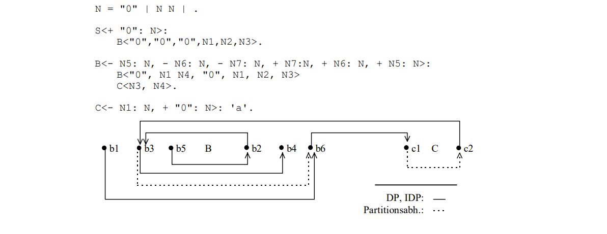

Figure A-1 represents part of the dependency graph of the hyper-rule for symbol _B_ of this grammar. Affix positions to a symbol are written in lower case, odd indices symbolize inherited-affix positions, even indices synthesized-affix positions.  An evaluator generator that arranges affix positions in an affix partition as late as possible ("lazy"), would determine the following two partitions for the symbols _B_ and _C_ according to <<KröpKann>>:

_A_(_B_) = ({_b1,b2_}, {_b3, b4, b5, b6_}),

_A_(_C_) = ({_c1, c2_}).

If the affix positions are arranged as early as possible ("greedy"), the partitions result in

_A_(_B_) = ({_b2, b5_}, {_b1, b3, b4, b6_}) and

_A_(_C_) = ({_c1, c2_}).

In order to manifest the order of calculation of the affix positions given by the partition sets in the rule dependency graph, additional dependencies, called partition dependencies, are inserted. For the grammar G~1~, a "lazy" as well as a "greedy" partition the dependencies _b3_ → _b6_ and _c1_ → _c2_, which are given by

_b3_ → _b6_ → _c1_ → _c2_ → _b3_

form a cycle, as can be seen in the graph in Figure A-1. The SOEAGEvaluator presented in this paper no longer computes the affix partitions independently and the affix positions are arranged as early as possible, so that the evaluator for G~1~ calculates the partitions

_A_(_B_) = ({_b2,b5_}, {_b1, b3, b4, b6_}) and

_A_(_C_) = ({_c2_}, {_c1_})

is calculated. Instead of the original dependence between _c1_ and _c2, c2_ → _c1_ is inserted into the dependence graph, and no cycle is created anymore. This results mainly from the fact that the affix partition of symbol _B_ is computed before that of _C_ and all resulting dependencies, unlike the original in the rule dependency graph immediately, in contrast to the original OEAG method.

// -------------------------------------------------------------------------------
// Page 92

and thus influence the subsequent calculation of the affix partition of the symbol _C_. The
grammar G~1~ is therefore not an OEAG, but a SOEAG.

Grammar G~2~:
----
    N = "0" .
    S<+"0": N>: 'a'.
    B<- N1: N, - N2: N, + N2: N, + N1: N>:
        B<"0", N6, N3, N4>
        C<N4,N5>C<N5,N6>.
    C<- N1: N, + "0": N>: 'a'.
----
The grammar G~2~ was created by a modification of the grammar G~1~ and is also not an OEAG. The presented SOEAG method calculates first again the affix partition of the symbol _B_ and afterwards the affix partition of the symbol _C_:

.Dependency subgraph of a non-OEAG
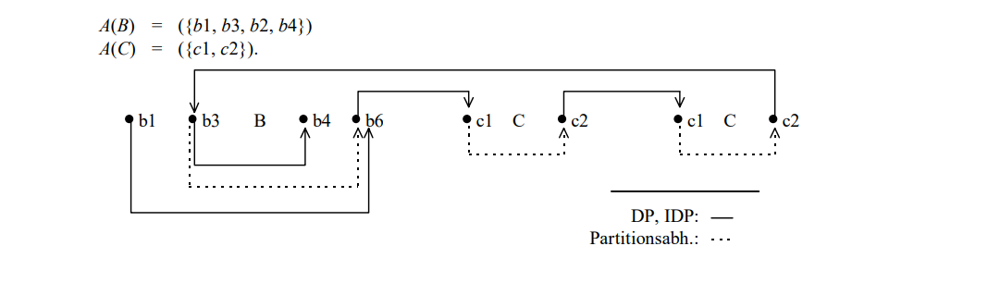

As can be seen inFigure A-2, which again shows only the relevant part of the dependence graph for the hyper-rule of symbol _B_, inserting the dependency _c1_ → _c2_ results in the cycle

_b3_ → _b4_ → _c1_ → _c2_ → _c1_ → _c2_ → _b3_.

In this situation, the dependency _c1_ → _c2_ is removed from the graph again and the inverse dependence _c2_ → _c1_ is inserted. A cycle is thus avoided and an evaluator can be generated. The new affix partition for the symbol _C_ is:

_A_(_C_) = ({_c2_}, {_c1_}).

Thus the given grammar is not an OEAG, but a SOEAG, which can be determined with local backtracking. can be determined.

Further specification giving typical examples of "non"-OAGs from the literature (<<RepTei>> p.275,<<GySiMa>>) can be found in the `NotOEAGn.Eps` files. For all grammar examples found in the literature grammar examples, SOEAG can be computed without backtracking.

// -------------------------------------------------------------------------------
// Page 93

== Appendix B: Using the SOEAG Evaluator Generator

The generation of a compiler is done in four steps, which are initiated by calling the appropriate commands. are initiated.

1. internalization of the specification (command: `eAnalyser.Analyse`)
2. generation of the scanner (command: `eScanGen.Generate`)
3. generation of the SOEAG evaluator (command: `eSOAGGen.Generate`)
4. generation of the parser (command: `eELL1Gen.GenerateParser`)

The generation of the parser must absolutely be done last in the Epsilon compiler generator, because the parser generator changes the internalized data structure irreversibly.

A corresponding Oberon tool file with the commands necessary for the generation, as well as their description, can be found under the name `eSOAG.Tool`.

// -------------------------------------------------------------------------------
// Page 94

== Appendix C: A Simple Example

The following example specification reads in a list of a's and an equal-length list of b's. As "translation" the number of b's is output as a number.
----
    N = "i" N | .
    Z* = Z "0"|Z "1"|Z "2"|Z "3"|Z "4"|Z "5"|Z "6"|Z "7"|Z "8"|Z "9"| .
    S:<+Z: Z>
        A<N> B<N,Z>.
    A: <+"i" N: N> 'a' A<N> | <+ :N>.
    B: <-"i" N: N, + Z1: Z> 'b' B<N,Z> INC<Z,Z1> | <- : N, + "0": Z>.
    
    INC:
    - Z "0":Z, + Z "1":Z>|.
    <- Z "1":Z, + Z "2":Z>|.
    <- Z "2":Z, + Z "3":Z>|
    <- Z "3":Z, + Z "4":Z>|
    <- Z "4":Z, + Z "5":Z>|
    <- Z "5":Z, + Z "6":Z>|
    <- Z "6":Z, + Z "7":Z>|
    <- Z "7":Z, + Z "8":Z>|
    <- Z "8":Z, + Z "9":Z>|
    <- Z "9":Z, + Z1 "0":Z> INC<Z, Z1>|
    <- :Z, + "1": Z>.
----
The evaluator generator produces from the above specification, using constant convolution and the reference counter method, as well as with optimization of the affix variable storage the following Oberon program:

// -------------------------------------------------------------------------------
// Page 103 References

[bibliography]
== References

[[[COMA]]] Wagner, Ripphausen-Lipa, Scheffler: Computerorientierte Mathematik II, Skript zur LV, SS 1991

[[[DeWe]]] Jochen Demuth, Stephan Weber: Eine konzeptionelle Revision des Eta-Compilergenerators und ihre Implementierung, Diplomarbeit TU Berlin, Fachbereich Informatik, Institut für Angewandte Informatik,
Dezember 1996

[[[DeWeKaKr]]] Jochen Demuth, Stephan Weber, Sönke Kannapinn, Mario Kröplin: Echte Compilergenerierung - Effiziente Implementierung einer abgeschlossenen Theorie  aus der Reihe Forschungsberichte des FB Informatik, Bericht 1997/6

[[[Engelfriet]]] J. Engelfriet: Attribute grammars: Attribute evaluation methods In B.Lorho, editor, Methods and Tools for Compiler Construction, pages 103-138, Cambridge University Press 1984

[[[EngFil]]] J. Engelfriet, G.Filé: Simple multi-visit attribute grammars, Journal of Computer and System Sciences, 24(3):283-314, June 1982

[[[EngJong]]] Joost Engelfriet, Willem de Jong: Attribute Storage Optimization by Stacks, Acta Informatica 27, 568-581, 1990

[[[GySiMa]]] Gyimoth, Simon, Makey, An implementation of the HLP. in Acta Informatica 1983, 06/83

[[[IbaKat]]] T.Ibaraki, N.Katoh: On-line computation of transitive closures of graphs, Information Processing Letters, 16:95-97, 1983

[[[Kastens]]] U.Kastens: Ordered Attribute Grammars.
Acta Informatica, 13(3): 229-256, 1980

[[[KaHuZi]]] U.Kastens, B.Hutten, E.Zimmermann: GAG: A Practical Compiler Generator, Volume 141 of Lecture Notes in Computer Science
Springer Verlag 1982

[[[KröpKann]]] Mario Kröplin, Sönke Kannapinn:  Sequentiell orientierbare Attributgrammatiken Vorabdruck, TU Berlin, Fachbereich Informatik, Institut für Angewandte Informatik, 25. Januar 1995

[[[Kutza]]] Karsten Kutza:  Evaluation geordneter EAGen im eta-Compiler-Generator, Bericht 1989/2 TU Berlin, Fachbereich Informatik, 1989

[[[Mehlhorn]]] Kurt Mehlhorn: Graph Algorithms and NP-Completeness
ETACS Series in Computer Science, Springer Verlag

[[[ReiWi]]] Martin Reiser, Niklaus Wirth: Programmieren in Oberon: Das neue Pascal, Bonn-Paris, Addison-Wesley 1994

[[[RepTei]]] T.W.Reps, T.Teitelbaum: The Synthesizer Generator: A System for Constructing Language-Bases Editors Texts and Monographs in Computer Science, Springer-Verlag, 1988

[[[Schröer]]] F.W. Schröer: Eta: Ein Compiler-Generator auf Basis zweistufiger Grammatiken, Bericht 84/2, TU Berlin, Fachbereich Informatik, März 1984, 104

[[[Watt]]] D.A. Watt: Analysis Oriented Two Level Grammars, Ph. D. thesis, Galsgow 1974

[[[ZiVoKüNa]]] B.Zimmermann, K.Voßloh, D.Kürbis, N.Nayeri: Compiler-Generierung II: Spezifikationskalküle und Implementierungskonzepte, Skript einer Lehrveranstaltung an der TU Berlin WS94/95
